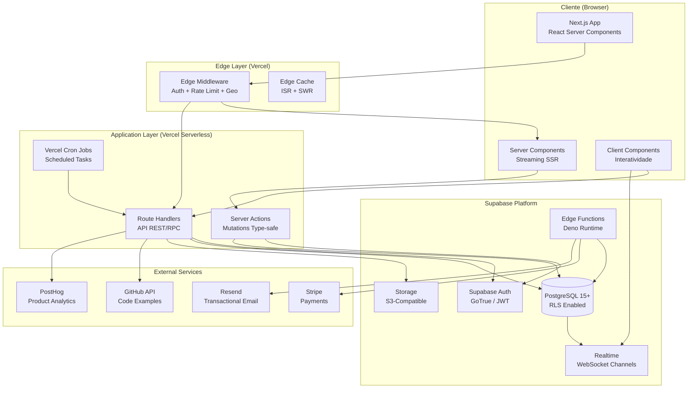
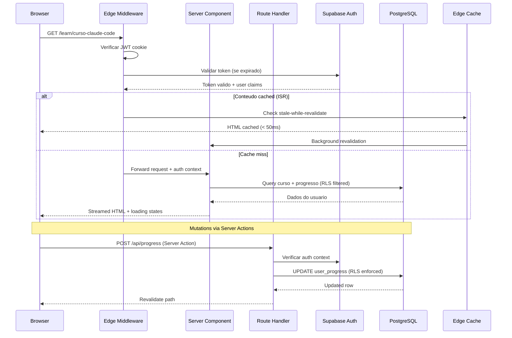
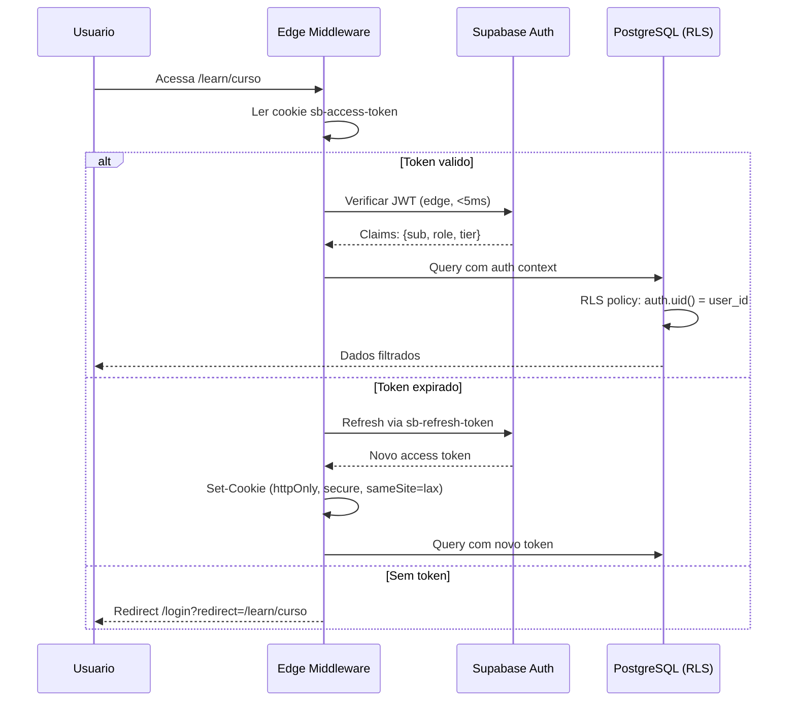
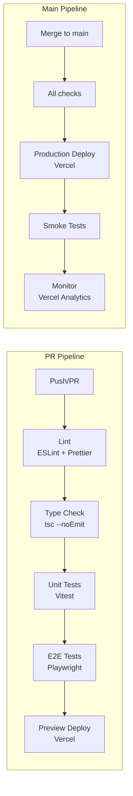

# AutomatikLabs — Arquitetura Tecnica Completa

> **Versao:** 1.0.0
> **Data:** 2026-04-01
> **Status:** Aprovado
> **Autor:** Arquiteto-Chefe AutomatikLabs

---

## Sumario Executivo

AutomatikLabs e uma plataforma de membership educacional focada em ensinar monetizacao com IA. A arquitetura segue principios de **Clean Architecture**, priorizando separacao de concerns, testabilidade, e escalabilidade progressiva. O design visual e inspirado no Circle.so (tri-panel layout).

---

## 1. Decisao de Stack

### 1.1 Frontend: Next.js 15 (App Router) + TypeScript + Tailwind CSS 4

| Tecnologia | Versao | Justificativa |
|---|---|---|
| **Next.js 15** | 15.x (App Router) | Server Components reduzem JS no cliente em ~40%. Streaming SSR com Suspense permite carregamento progressivo do tri-panel. Partial Prerendering (PPR) combina static shell + dynamic content — perfeito para sidebar estatica + feed dinamico. Turbopack em dev reduz HMR para <200ms. |
| **TypeScript** | 5.x (strict mode) | Type safety end-to-end com Supabase CLI gerando tipos do schema. Elimina classe inteira de bugs em runtime. |
| **Tailwind CSS 4** | 4.x | Engine reescrita em Rust (Lightning CSS) — build 10x mais rapido. CSS-first config via `@theme` elimina tailwind.config. Composable variants nativas. Container queries built-in para o tri-panel responsivo. |

**Alternativas descartadas:**
- **Remix**: Excelente para forms e mutations, mas menor ecossistema de componentes e sem equivalente ao PPR para o modelo de content delivery educacional.
- **SvelteKit**: Performance superior no cliente, mas ecossistema menor para integracao com Supabase e menor pool de desenvolvedores.
- **Vite + React SPA**: Sem SSR nativo. SEO para landing pages e conteudo publico seria comprometido.

### 1.2 Backend: Next.js API Routes + Supabase Edge Functions

| Camada | Tecnologia | Justificativa |
|---|---|---|
| **API principal** | Next.js Route Handlers (App Router) | Co-locacao com frontend elimina CORS. Server Actions para mutations type-safe. Middleware chain nativo para auth/rate-limiting. Deploy atomico na Vercel. |
| **Funcoes assincronas** | Supabase Edge Functions (Deno) | Webhooks de pagamento, processamento de video, notificacoes. Isolamento do processo principal. Cold start <50ms. |
| **Realtime** | Supabase Realtime | WebSocket gerenciado para chat da comunidade, presenca online, notificacoes live. Sem infra adicional. |

**Por que NAO Node/Express separado:**
- Adiciona complexidade de deploy (2 servicos, 2 pipelines CI/CD, CORS, service discovery)
- Next.js Route Handlers cobrem 95% dos casos (CRUD, auth, webhooks)
- Supabase Edge Functions cobrem os 5% restantes (background jobs, processamento pesado)
- Unico cenario para separar: se throughput ultrapassar 10k req/s sustained — improvavel no primeiro ano

### 1.3 Database: Supabase (PostgreSQL 15+) com RLS

| Aspecto | Escolha | Justificativa |
|---|---|---|
| **Engine** | PostgreSQL 15+ (via Supabase) | JSONB para metadata flexivel de cursos. Full-text search nativo para busca de conteudo. pg_cron para jobs agendados. Extensoes: pgvector (busca semantica futura), pg_stat_statements (query monitoring). |
| **Seguranca** | Row Level Security (RLS) | Policies no nivel do banco garantem que usuario X nunca acessa dados do usuario Y, mesmo com bug no backend. Defense-in-depth. |
| **Migrations** | Supabase CLI (`supabase db diff`) | Migrations versionadas, rollback automatico, seed data para dev. |

### 1.4 Auth: Supabase Auth

| Aspecto | Escolha | Justificativa |
|---|---|---|
| **Provider** | Supabase Auth (GoTrue) | Integrado nativamente com RLS — `auth.uid()` nas policies. Social login (Google, GitHub) built-in. Magic link para onboarding sem fricao. JWT customizavel com claims de role/tier. |

**Por que NAO NextAuth (Auth.js):**
- NextAuth requer adapter para Supabase e nao integra nativamente com RLS
- Session management adicional no servidor — duplicacao de estado
- Supabase Auth ja resolve magic link, OAuth, MFA

**Por que NAO Clerk:**
- Vendor lock-in significativo
- Custo por MAU escala rapido ($0.02/MAU apos free tier)
- Supabase Auth e gratuito ate 50k MAU e self-hostable

### 1.5 Storage: Supabase Storage

| Aspecto | Escolha | Justificativa |
|---|---|---|
| **Files** | Supabase Storage (S3-compatible) | Policies de acesso reutilizam RLS patterns. Transformacoes de imagem on-the-fly. CDN integrado. Resumable uploads para videos grandes. |
| **Video delivery** | Supabase Storage + CDN (ou Mux futuro) | V1 usa Supabase Storage com streaming progressivo. Se escalar alem de 1TB/mes bandwidth, migrar para Mux (HLS adaptive bitrate). |

### 1.6 Hosting: Vercel + Supabase Cloud

| Servico | Responsabilidade | Justificativa |
|---|---|---|
| **Vercel** | Frontend + API Routes + Edge Middleware | Deploy atomico via Git push. Preview deployments por PR. Edge Network global (CDN). Analytics e Web Vitals integrados. |
| **Supabase Cloud** | Database + Auth + Storage + Realtime + Edge Functions | Managed PostgreSQL com backups automaticos. Dashboard de monitoramento. Logs estruturados. Free tier generoso para MVP. |

---

## 2. Arquitetura de Sistema

### 2.1 Diagrama de Alto Nivel



### 2.2 Fluxo de Dados — Request Lifecycle



### 2.3 Camadas da Arquitetura

```
┌─────────────────────────────────────────────────────────────┐
│                    PRESENTATION LAYER                        │
│  React Server Components │ Client Components │ Layouts       │
│  Streaming SSR │ Suspense Boundaries │ Error Boundaries      │
├─────────────────────────────────────────────────────────────┤
│                    APPLICATION LAYER                         │
│  Server Actions │ Route Handlers │ Middleware                │
│  Use Cases │ DTOs │ Input Validation (Zod)                   │
├─────────────────────────────────────────────────────────────┤
│                      DOMAIN LAYER                            │
│  Entities │ Value Objects │ Domain Events                    │
│  Business Rules │ Interfaces (Ports)                         │
├─────────────────────────────────────────────────────────────┤
│                   INFRASTRUCTURE LAYER                       │
│  Supabase Client │ Repositories │ External APIs              │
│  Cache Adapters │ Email Service │ Storage Service            │
└─────────────────────────────────────────────────────────────┘
```

**Regra de dependencia:** Camadas internas NUNCA importam camadas externas. Domain nao conhece Supabase. Application orquestra Domain via interfaces.

### 2.4 Middleware Chain

```typescript
// Ordem de execucao no Edge Middleware
const middlewareChain = [
  rateLimiter,       // 1. Rate limit por IP (sliding window)
  securityHeaders,   // 2. CSP, HSTS, X-Frame-Options
  authValidator,     // 3. Validar/refresh JWT
  roleGuard,         // 4. Verificar tier de acesso (free/pro/premium)
  geoRedirect,       // 5. Redirect por locale (futuro i18n)
  analyticsTracker,  // 6. Track page view (non-blocking)
];
```

---

## 3. Estrutura de Pastas

### 3.1 Decisao: Monorepo ou Nao

**Escolha: Monorepo simples (sem Turborepo no V1)**

Justificativa:
- Um unico app Next.js — nao ha packages compartilhados entre multiplos apps
- Turborepo adiciona complexidade sem beneficio ate existir um segundo app (mobile, admin)
- Se necessario no futuro, migrar para Turborepo e trivial com a estrutura feature-based

### 3.2 Estrutura: Feature-Based (Hybrid)

```
automatiklabs/
├── .github/
│   ├── workflows/
│   │   ├── ci.yml                    # Lint + Type check + Tests
│   │   ├── preview.yml               # Deploy preview por PR
│   │   └── production.yml            # Deploy producao
│   └── CODEOWNERS
│
├── docs/                             # Documentacao do projeto
│   ├── architecture/
│   │   └── ARCHITECTURE.md           # Este documento
│   ├── database/
│   │   └── SCHEMA.md
│   ├── epics/
│   ├── prd/
│   └── ...
│
├── public/
│   ├── fonts/                        # Self-hosted fonts (performance)
│   ├── images/
│   └── og/                           # Open Graph images
│
├── src/
│   ├── app/                          # Next.js App Router
│   │   ├── (auth)/                   # Route group: paginas de auth
│   │   │   ├── login/
│   │   │   │   └── page.tsx
│   │   │   ├── register/
│   │   │   │   └── page.tsx
│   │   │   └── layout.tsx            # Layout sem sidebar
│   │   │
│   │   ├── (marketing)/              # Route group: paginas publicas
│   │   │   ├── page.tsx              # Landing page
│   │   │   ├── pricing/
│   │   │   └── layout.tsx            # Layout marketing
│   │   │
│   │   ├── (platform)/               # Route group: area logada
│   │   │   ├── layout.tsx            # Tri-panel layout (Circle.so)
│   │   │   ├── feed/
│   │   │   │   └── page.tsx          # Feed da comunidade
│   │   │   ├── learn/
│   │   │   │   ├── page.tsx          # Catalogo de cursos
│   │   │   │   └── [courseSlug]/
│   │   │   │       ├── page.tsx      # Overview do curso
│   │   │   │       └── [lessonSlug]/
│   │   │   │           └── page.tsx  # Player de licao
│   │   │   ├── community/
│   │   │   │   ├── page.tsx          # Spaces
│   │   │   │   └── [spaceSlug]/
│   │   │   │       └── page.tsx
│   │   │   ├── events/
│   │   │   │   └── page.tsx
│   │   │   ├── members/
│   │   │   │   └── page.tsx
│   │   │   └── settings/
│   │   │       └── page.tsx
│   │   │
│   │   ├── admin/                    # Area administrativa
│   │   │   ├── layout.tsx
│   │   │   ├── courses/
│   │   │   ├── members/
│   │   │   ├── analytics/
│   │   │   └── settings/
│   │   │
│   │   ├── api/                      # Route Handlers
│   │   │   ├── auth/
│   │   │   │   └── callback/
│   │   │   │       └── route.ts      # OAuth callback
│   │   │   ├── webhooks/
│   │   │   │   ├── stripe/
│   │   │   │   │   └── route.ts
│   │   │   │   └── supabase/
│   │   │   │       └── route.ts
│   │   │   ├── courses/
│   │   │   │   └── route.ts
│   │   │   ├── progress/
│   │   │   │   └── route.ts
│   │   │   └── upload/
│   │   │       └── route.ts
│   │   │
│   │   ├── error.tsx                 # Global error boundary
│   │   ├── not-found.tsx
│   │   ├── layout.tsx                # Root layout
│   │   └── globals.css               # Tailwind 4 imports + theme
│   │
│   ├── features/                     # Feature modules (core business)
│   │   ├── auth/
│   │   │   ├── actions/              # Server Actions
│   │   │   │   ├── login.ts
│   │   │   │   ├── register.ts
│   │   │   │   └── logout.ts
│   │   │   ├── components/
│   │   │   │   ├── login-form.tsx
│   │   │   │   ├── social-buttons.tsx
│   │   │   │   └── auth-guard.tsx
│   │   │   ├── hooks/
│   │   │   │   └── use-auth.ts
│   │   │   └── types.ts
│   │   │
│   │   ├── courses/
│   │   │   ├── actions/
│   │   │   │   ├── get-courses.ts
│   │   │   │   ├── get-lesson.ts
│   │   │   │   └── update-progress.ts
│   │   │   ├── components/
│   │   │   │   ├── course-card.tsx
│   │   │   │   ├── lesson-player.tsx
│   │   │   │   ├── progress-bar.tsx
│   │   │   │   └── curriculum-sidebar.tsx
│   │   │   ├── hooks/
│   │   │   │   ├── use-course.ts
│   │   │   │   └── use-progress.ts
│   │   │   ├── services/
│   │   │   │   └── course-service.ts
│   │   │   └── types.ts
│   │   │
│   │   ├── community/
│   │   │   ├── actions/
│   │   │   ├── components/
│   │   │   │   ├── post-composer.tsx
│   │   │   │   ├── post-feed.tsx
│   │   │   │   ├── comment-thread.tsx
│   │   │   │   └── space-sidebar.tsx
│   │   │   ├── hooks/
│   │   │   │   ├── use-realtime-posts.ts
│   │   │   │   └── use-presence.ts
│   │   │   └── types.ts
│   │   │
│   │   ├── gamification/
│   │   │   ├── actions/
│   │   │   ├── components/
│   │   │   │   ├── xp-badge.tsx
│   │   │   │   ├── streak-counter.tsx
│   │   │   │   └── leaderboard.tsx
│   │   │   ├── services/
│   │   │   │   └── xp-engine.ts
│   │   │   └── types.ts
│   │   │
│   │   ├── billing/
│   │   │   ├── actions/
│   │   │   │   ├── create-checkout.ts
│   │   │   │   └── manage-subscription.ts
│   │   │   ├── components/
│   │   │   │   ├── pricing-table.tsx
│   │   │   │   └── billing-portal.tsx
│   │   │   └── types.ts
│   │   │
│   │   └── admin/
│   │       ├── actions/
│   │       ├── components/
│   │       └── types.ts
│   │
│   ├── shared/                       # Shared utilities (nao business logic)
│   │   ├── components/
│   │   │   ├── ui/                   # Primitivos de UI (shadcn/ui base)
│   │   │   │   ├── button.tsx
│   │   │   │   ├── input.tsx
│   │   │   │   ├── dialog.tsx
│   │   │   │   ├── avatar.tsx
│   │   │   │   ├── badge.tsx
│   │   │   │   ├── dropdown-menu.tsx
│   │   │   │   ├── tooltip.tsx
│   │   │   │   └── ...
│   │   │   ├── layouts/
│   │   │   │   ├── tri-panel.tsx     # Circle.so-style layout
│   │   │   │   ├── left-sidebar.tsx
│   │   │   │   ├── center-panel.tsx
│   │   │   │   └── right-panel.tsx
│   │   │   ├── markdown-renderer.tsx
│   │   │   ├── code-block.tsx
│   │   │   └── loading-skeleton.tsx
│   │   │
│   │   ├── hooks/
│   │   │   ├── use-debounce.ts
│   │   │   ├── use-media-query.ts
│   │   │   └── use-intersection.ts
│   │   │
│   │   ├── lib/
│   │   │   ├── supabase/
│   │   │   │   ├── client.ts         # Browser client (singleton)
│   │   │   │   ├── server.ts         # Server client (per-request)
│   │   │   │   ├── admin.ts          # Service role client (admin only)
│   │   │   │   └── middleware.ts     # Auth refresh helper
│   │   │   ├── stripe.ts             # Stripe SDK instance
│   │   │   ├── resend.ts             # Email client
│   │   │   └── posthog.ts            # Analytics client
│   │   │
│   │   ├── utils/
│   │   │   ├── cn.ts                 # clsx + tailwind-merge
│   │   │   ├── format-date.ts
│   │   │   ├── slugify.ts
│   │   │   └── constants.ts
│   │   │
│   │   └── types/
│   │       ├── database.ts           # Auto-generated by Supabase CLI
│   │       └── globals.ts            # Shared app types
│   │
│   └── middleware.ts                 # Edge Middleware (auth + redirects)
│
├── supabase/
│   ├── config.toml                   # Supabase local config
│   ├── migrations/                   # SQL migrations (versioned)
│   │   ├── 00001_initial_schema.sql
│   │   ├── 00002_rls_policies.sql
│   │   └── ...
│   ├── seed.sql                      # Dev seed data
│   └── functions/                    # Edge Functions (Deno)
│       ├── stripe-webhook/
│       │   └── index.ts
│       ├── send-notification/
│       │   └── index.ts
│       └── process-video/
│           └── index.ts
│
├── tests/
│   ├── unit/                         # Vitest unit tests
│   ├── integration/                  # API integration tests
│   └── e2e/                          # Playwright E2E tests
│       ├── auth.spec.ts
│       ├── course-flow.spec.ts
│       └── billing.spec.ts
│
├── .env.local.example                # Template de env vars
├── .eslintrc.json
├── .prettierrc
├── components.json                   # shadcn/ui config
├── next.config.ts
├── package.json
├── postcss.config.ts
├── tailwind.config.ts                # Minimal — Tailwind 4 usa CSS-first
├── tsconfig.json
├── vitest.config.ts
└── playwright.config.ts
```

### 3.3 Naming Conventions

| Elemento | Convencao | Exemplo |
|---|---|---|
| Arquivos de componente | `kebab-case.tsx` | `course-card.tsx` |
| Componentes React | `PascalCase` | `CourseCard` |
| Hooks | `camelCase` com prefixo `use` | `useCourse` |
| Server Actions | `camelCase` | `updateProgress` |
| Route Handlers | `route.ts` (Next.js convention) | `api/courses/route.ts` |
| Types/Interfaces | `PascalCase` | `CourseWithLessons` |
| Constantes | `UPPER_SNAKE_CASE` | `MAX_FILE_SIZE` |
| Database tables | `snake_case` (plural) | `user_profiles` |
| Database columns | `snake_case` | `created_at` |
| CSS classes | Tailwind utilities | `className="flex items-center"` |

### 3.4 Import Aliases

```json
// tsconfig.json paths
{
  "compilerOptions": {
    "paths": {
      "@/*": ["./src/*"],
      "@/features/*": ["./src/features/*"],
      "@/shared/*": ["./src/shared/*"],
      "@/ui/*": ["./src/shared/components/ui/*"]
    }
  }
}
```

---

## 4. Padroes Arquiteturais

### 4.1 Clean Architecture — Adaptada para Next.js

A Clean Architecture classica e adaptada para o modelo Server Components do Next.js:

```
Classica                    Next.js Adaptation
─────────                   ──────────────────
Controller          →       Server Component / Route Handler
Use Case            →       Server Action / Service function
Entity              →       TypeScript type + validation (Zod)
Repository          →       Supabase query module
```

**Exemplo de fluxo — "Marcar licao como completa":**

```typescript
// 1. PRESENTATION — Server Action chamada pelo Client Component
// src/features/courses/actions/update-progress.ts
'use server'

import { z } from 'zod'
import { createServerClient } from '@/shared/lib/supabase/server'
import { revalidatePath } from 'next/cache'
import { completeLesson } from '../services/course-service'

const schema = z.object({
  lessonId: z.string().uuid(),
  courseId: z.string().uuid(),
})

export async function updateProgress(formData: FormData) {
  const parsed = schema.safeParse({
    lessonId: formData.get('lessonId'),
    courseId: formData.get('courseId'),
  })

  if (!parsed.success) {
    return { error: 'Invalid input' }
  }

  const supabase = await createServerClient()
  const { data: { user } } = await supabase.auth.getUser()

  if (!user) {
    return { error: 'Unauthorized' }
  }

  // 2. APPLICATION — Service orquestra domain logic
  const result = await completeLesson(supabase, {
    userId: user.id,
    lessonId: parsed.data.lessonId,
    courseId: parsed.data.courseId,
  })

  if (result.error) {
    return { error: result.error }
  }

  // 3. Revalidar cache do Next.js
  revalidatePath(`/learn/${parsed.data.courseId}`)

  return { success: true, xpGained: result.xpGained }
}
```

```typescript
// 2. APPLICATION — Service Layer
// src/features/courses/services/course-service.ts

import type { SupabaseClient } from '@supabase/supabase-js'
import type { Database } from '@/shared/types/database'
import { calculateXP } from '@/features/gamification/services/xp-engine'

type Client = SupabaseClient<Database>

export async function completeLesson(
  supabase: Client,
  params: { userId: string; lessonId: string; courseId: string }
) {
  // Check if already completed (idempotency)
  const { data: existing } = await supabase
    .from('lesson_completions')
    .select('id')
    .eq('user_id', params.userId)
    .eq('lesson_id', params.lessonId)
    .single()

  if (existing) {
    return { error: null, xpGained: 0 }
  }

  // Domain logic: calculate XP
  const xpGained = calculateXP('lesson_complete')

  // Transaction: insert completion + update XP
  const { error } = await supabase.rpc('complete_lesson_with_xp', {
    p_user_id: params.userId,
    p_lesson_id: params.lessonId,
    p_course_id: params.courseId,
    p_xp: xpGained,
  })

  if (error) {
    return { error: 'Failed to save progress' }
  }

  return { error: null, xpGained }
}
```

### 4.2 Repository Pattern — Via Supabase

Em vez de repositorios abstratos (over-engineering para V1), usamos **query modules** tipados:

```typescript
// src/features/courses/queries.ts
import type { SupabaseClient } from '@supabase/supabase-js'
import type { Database } from '@/shared/types/database'

type Client = SupabaseClient<Database>

export function getCourseWithLessons(supabase: Client, slug: string) {
  return supabase
    .from('courses')
    .select(`
      id, title, slug, description, thumbnail_url,
      modules:course_modules(
        id, title, order,
        lessons(id, title, slug, duration_minutes, order)
      )
    `)
    .eq('slug', slug)
    .eq('published', true)
    .single()
}

export function getUserProgress(supabase: Client, userId: string, courseId: string) {
  return supabase
    .from('lesson_completions')
    .select('lesson_id, completed_at')
    .eq('user_id', userId)
    .eq('course_id', courseId)
}
```

**Quando evoluir para Repository Pattern formal:** Se o projeto precisar de multiplos data sources (ex: cache Redis + PostgreSQL) ou se testes unitarios exigirem mocks do banco.

### 4.3 Error Handling Strategy

#### Camadas de erro:

```typescript
// src/shared/lib/errors.ts

// Base error para o dominio
export class AppError extends Error {
  constructor(
    message: string,
    public code: string,
    public statusCode: number = 500,
    public isOperational: boolean = true
  ) {
    super(message)
    this.name = 'AppError'
  }
}

// Erros especificos
export class NotFoundError extends AppError {
  constructor(resource: string) {
    super(`${resource} not found`, 'NOT_FOUND', 404)
  }
}

export class UnauthorizedError extends AppError {
  constructor(message = 'Authentication required') {
    super(message, 'UNAUTHORIZED', 401)
  }
}

export class ForbiddenError extends AppError {
  constructor(message = 'Insufficient permissions') {
    super(message, 'FORBIDDEN', 403)
  }
}

export class ValidationError extends AppError {
  constructor(
    message: string,
    public fields: Record<string, string[]>
  ) {
    super(message, 'VALIDATION_ERROR', 422)
  }
}
```

#### Error boundaries no React:

```typescript
// src/app/error.tsx — Global error boundary
'use client'

import { useEffect } from 'react'

export default function GlobalError({
  error,
  reset,
}: {
  error: Error & { digest?: string }
  reset: () => void
}) {
  useEffect(() => {
    // Log to monitoring service (Sentry/PostHog)
    console.error('Unhandled error:', error)
  }, [error])

  return (
    <div className="flex min-h-screen items-center justify-center">
      <div className="text-center">
        <h2>Algo deu errado</h2>
        <button onClick={reset}>Tentar novamente</button>
      </div>
    </div>
  )
}
```

#### Pattern para Server Actions:

```typescript
// Retorno padronizado para todas as Server Actions
type ActionResult<T = void> =
  | { success: true; data: T }
  | { success: false; error: string; fieldErrors?: Record<string, string[]> }
```

### 4.4 Logging Strategy

```typescript
// src/shared/lib/logger.ts
// Structured logging — JSON em producao, pretty em dev

type LogLevel = 'debug' | 'info' | 'warn' | 'error'

interface LogEntry {
  level: LogLevel
  message: string
  timestamp: string
  context?: Record<string, unknown>
  userId?: string
  requestId?: string
}

function createLogger() {
  const isDev = process.env.NODE_ENV === 'development'

  return {
    info(message: string, context?: Record<string, unknown>) {
      const entry: LogEntry = {
        level: 'info',
        message,
        timestamp: new Date().toISOString(),
        context,
      }
      if (isDev) {
        console.log(`[INFO] ${message}`, context ?? '')
      } else {
        console.log(JSON.stringify(entry))
      }
    },
    error(message: string, error?: Error, context?: Record<string, unknown>) {
      const entry: LogEntry = {
        level: 'error',
        message,
        timestamp: new Date().toISOString(),
        context: {
          ...context,
          stack: error?.stack,
          errorName: error?.name,
        },
      }
      if (isDev) {
        console.error(`[ERROR] ${message}`, error, context ?? '')
      } else {
        console.error(JSON.stringify(entry))
      }
    },
  }
}

export const logger = createLogger()
```

**Onde loggar:**
- Route Handlers: request/response lifecycle
- Server Actions: mutations e erros de validacao
- Supabase Edge Functions: webhook processing, jobs
- **NAO loggar:** dados sensiveis (tokens, senhas, PII)

### 4.5 Validation Pattern — Zod Everywhere

```typescript
// src/features/courses/schemas.ts
import { z } from 'zod'

export const createCourseSchema = z.object({
  title: z.string().min(3).max(200),
  description: z.string().min(10).max(2000),
  slug: z.string().regex(/^[a-z0-9-]+$/),
  modules: z.array(z.object({
    title: z.string().min(1),
    lessons: z.array(z.object({
      title: z.string().min(1),
      contentType: z.enum(['video', 'text', 'code']),
      duration: z.number().positive().optional(),
    })).min(1),
  })).min(1),
})

export type CreateCourseInput = z.infer<typeof createCourseSchema>
```

---

## 5. Integracoes

### 5.1 GitHub API — Code Examples

**Caso de uso:** Exibir code snippets atualizados de repositorios do AutomatikLabs nas licoes.

```typescript
// src/shared/lib/github.ts
import { Octokit } from '@octokit/rest'

const octokit = new Octokit({
  auth: process.env.GITHUB_TOKEN,
})

export async function getFileContent(
  owner: string,
  repo: string,
  path: string,
  ref?: string
) {
  const { data } = await octokit.repos.getContent({
    owner,
    repo,
    path,
    ref: ref ?? 'main',
  })

  if ('content' in data) {
    return Buffer.from(data.content, 'base64').toString('utf-8')
  }

  throw new Error('Path is not a file')
}
```

**Cache strategy:** ISR com revalidacao a cada 1 hora. Code examples nao mudam frequentemente.

### 5.2 File Uploads — Supabase Storage

```typescript
// src/features/admin/actions/upload-video.ts
'use server'

import { createServerClient } from '@/shared/lib/supabase/server'

const MAX_FILE_SIZE = 500 * 1024 * 1024 // 500MB
const ALLOWED_TYPES = ['video/mp4', 'video/webm', 'video/quicktime']

export async function uploadVideo(formData: FormData) {
  const file = formData.get('file') as File
  const courseId = formData.get('courseId') as string

  if (!file || file.size > MAX_FILE_SIZE) {
    return { error: 'File too large (max 500MB)' }
  }

  if (!ALLOWED_TYPES.includes(file.type)) {
    return { error: 'Invalid file type' }
  }

  const supabase = await createServerClient()

  // Gerar path unico
  const ext = file.name.split('.').pop()
  const path = `courses/${courseId}/${crypto.randomUUID()}.${ext}`

  const { error } = await supabase.storage
    .from('videos')
    .upload(path, file, {
      cacheControl: '31536000', // 1 year (immutable content)
      upsert: false,
    })

  if (error) {
    return { error: 'Upload failed' }
  }

  const { data: { publicUrl } } = supabase.storage
    .from('videos')
    .getPublicUrl(path)

  return { success: true, url: publicUrl }
}
```

### 5.3 Markdown Rendering — Server-Side

```typescript
// src/shared/components/markdown-renderer.tsx
import { unified } from 'unified'
import remarkParse from 'remark-parse'
import remarkGfm from 'remark-gfm'
import remarkRehype from 'remark-rehype'
import rehypeHighlight from 'rehype-highlight'
import rehypeSanitize from 'rehype-sanitize'
import rehypeStringify from 'rehype-stringify'

// Processado no servidor — zero JS no cliente
export async function renderMarkdown(content: string): Promise<string> {
  const result = await unified()
    .use(remarkParse)
    .use(remarkGfm)                  // Tables, strikethrough, task lists
    .use(remarkRehype)
    .use(rehypeSanitize)             // XSS protection — sanitizes BEFORE render
    .use(rehypeHighlight)            // Syntax highlighting
    .use(rehypeStringify)
    .process(content)

  return String(result)
}

// Usage in Server Component:
// const html = await renderMarkdown(lesson.content)
// <div className="prose" dangerouslySetInnerHTML={{ __html: html }} />
// NOTE: Safe because rehype-sanitize strips all dangerous HTML before output
```

### 5.4 Supabase Realtime — Community Features

```typescript
// src/features/community/hooks/use-realtime-posts.ts
'use client'

import { useEffect, useState } from 'react'
import { createBrowserClient } from '@/shared/lib/supabase/client'
import type { Post } from '../types'

export function useRealtimePosts(spaceId: string, initialPosts: Post[]) {
  const [posts, setPosts] = useState<Post[]>(initialPosts)
  const supabase = createBrowserClient()

  useEffect(() => {
    const channel = supabase
      .channel(`space:${spaceId}`)
      .on(
        'postgres_changes',
        {
          event: 'INSERT',
          schema: 'public',
          table: 'posts',
          filter: `space_id=eq.${spaceId}`,
        },
        (payload) => {
          setPosts((prev) => [payload.new as Post, ...prev])
        }
      )
      .on(
        'postgres_changes',
        {
          event: 'UPDATE',
          schema: 'public',
          table: 'posts',
          filter: `space_id=eq.${spaceId}`,
        },
        (payload) => {
          setPosts((prev) =>
            prev.map((p) =>
              p.id === payload.new.id ? (payload.new as Post) : p
            )
          )
        }
      )
      .subscribe()

    return () => {
      supabase.removeChannel(channel)
    }
  }, [spaceId, supabase])

  return posts
}
```

### 5.5 Presence — Online Members

```typescript
// src/features/community/hooks/use-presence.ts
'use client'

import { useEffect, useState } from 'react'
import { createBrowserClient } from '@/shared/lib/supabase/client'

interface PresenceState {
  userId: string
  displayName: string
  avatarUrl: string
  lastSeen: string
}

export function usePresence(channelName: string, currentUser: PresenceState) {
  const [onlineUsers, setOnlineUsers] = useState<PresenceState[]>([])
  const supabase = createBrowserClient()

  useEffect(() => {
    const channel = supabase.channel(channelName, {
      config: { presence: { key: currentUser.userId } },
    })

    channel
      .on('presence', { event: 'sync' }, () => {
        const state = channel.presenceState<PresenceState>()
        const users = Object.values(state).flat()
        setOnlineUsers(users)
      })
      .subscribe(async (status) => {
        if (status === 'SUBSCRIBED') {
          await channel.track(currentUser)
        }
      })

    return () => {
      supabase.removeChannel(channel)
    }
  }, [channelName, currentUser, supabase])

  return onlineUsers
}
```

---

## 6. Performance Strategy

### 6.1 Rendering Strategy por Rota

| Rota | Estrategia | Justificativa | Revalidacao |
|---|---|---|---|
| `/` (landing) | **SSG** | Conteudo estatico, muda raramente | On-demand (webhook de CMS) |
| `/pricing` | **SSG** | Planos mudam raramente | On-demand |
| `/learn` (catalogo) | **ISR** | Lista de cursos muda semanalmente | 3600s (1 hora) |
| `/learn/[course]` (overview) | **ISR** | Descricao do curso e semi-estatica | 3600s |
| `/learn/[course]/[lesson]` | **Dynamic SSR** | Depende do progresso do usuario (auth) | Per-request |
| `/feed` | **Dynamic SSR + Streaming** | Feed personalizado + realtime | Per-request com Suspense |
| `/community/[space]` | **Dynamic SSR + Streaming** | Posts em tempo real | Per-request com Suspense |
| `/admin/*` | **Dynamic SSR** | Sempre dados frescos | Per-request |
| `/settings` | **Dynamic SSR** | Dados do usuario | Per-request |

### 6.2 Caching Strategy (Multi-Layer)

```
Layer 1: Browser Cache
  └── Cache-Control headers para assets estaticos (1 year immutable)
  └── SWR pattern para dados do usuario (stale-while-revalidate)

Layer 2: Vercel Edge Cache
  └── ISR pages cached no edge mais proximo do usuario
  └── Revalidacao on-demand via webhook (admin atualiza curso)

Layer 3: Next.js Data Cache
  └── fetch() com { next: { revalidate: 3600 } }
  └── unstable_cache para queries customizadas ao Supabase

Layer 4: Supabase Connection Pooling
  └── PgBouncer built-in (transaction mode)
  └── Prepared statements para queries frequentes
```

**Cache invalidation explicitamente:**

```typescript
// Quando admin publica novo conteudo:
import { revalidatePath, revalidateTag } from 'next/cache'

// Invalida pagina especifica
revalidatePath('/learn/curso-claude-code')

// Invalida todas as queries com esta tag
revalidateTag('courses')
```

### 6.3 Bundle Optimization

| Tecnica | Implementacao |
|---|---|
| **Tree-shaking** | Imports nomeados sempre (`import { Button } from`, nunca `import *`) |
| **Dynamic imports** | `next/dynamic` para componentes pesados (editor de codigo, video player) |
| **Route-based splitting** | Automatico pelo App Router (cada `page.tsx` e um chunk) |
| **Server Components** | Markdown rendering, syntax highlighting, data fetching — zero JS no cliente |
| **Package optimization** | `next.config.ts` → `optimizePackageImports: ['lucide-react', '@supabase/supabase-js']` |

```typescript
// next.config.ts
import type { NextConfig } from 'next'

const config: NextConfig = {
  experimental: {
    optimizePackageImports: [
      'lucide-react',
      '@supabase/supabase-js',
      'date-fns',
    ],
  },
  images: {
    formats: ['image/avif', 'image/webp'],
    remotePatterns: [
      {
        protocol: 'https',
        hostname: '*.supabase.co',
        pathname: '/storage/v1/object/public/**',
      },
    ],
  },
}

export default config
```

### 6.4 Image Optimization

| Contexto | Solucao |
|---|---|
| **Thumbnails de curso** | `next/image` com `sizes` responsivos + Supabase Storage transformations |
| **Avatars** | `next/image` com `width={40}` fixo + formato AVIF |
| **Screenshots em licoes** | `next/image` com `loading="lazy"` + placeholder blur |
| **OG Images** | `next/og` (Vercel OG) — geradas no edge em runtime |

```typescript
// Exemplo: thumbnail otimizado
import Image from 'next/image'

export function CourseThumbnail({ src, title }: { src: string; title: string }) {
  return (
    <Image
      src={src}
      alt={title}
      width={400}
      height={225}
      sizes="(max-width: 768px) 100vw, (max-width: 1200px) 50vw, 400px"
      className="rounded-lg object-cover"
    />
  )
}
```

### 6.5 Core Web Vitals Targets

| Metric | Target | Estrategia |
|---|---|---|
| **LCP** | < 2.0s | SSR streaming + ISR + font preload + image priority |
| **FID/INP** | < 100ms | Server Components (menos JS) + code splitting + `useTransition` |
| **CLS** | < 0.05 | Explicit width/height em imagens + font `size-adjust` + skeleton loaders |
| **TTFB** | < 200ms | Edge caching (Vercel) + Supabase connection pooling |

### 6.6 Lazy Loading Strategy

```typescript
// Componentes pesados carregados on-demand
import dynamic from 'next/dynamic'

// Video player — ~150KB JS
const VideoPlayer = dynamic(
  () => import('@/features/courses/components/video-player'),
  {
    loading: () => <VideoPlayerSkeleton />,
    ssr: false, // Player precisa de browser APIs
  }
)

// Code editor (admin) — ~500KB JS
const CodeEditor = dynamic(
  () => import('@/features/admin/components/code-editor'),
  {
    loading: () => <CodeEditorSkeleton />,
    ssr: false,
  }
)

// Rich text editor (community posts) — ~200KB JS
const PostComposer = dynamic(
  () => import('@/features/community/components/post-composer'),
  {
    loading: () => <ComposerSkeleton />,
  }
)
```

---

## 7. Security Architecture

### 7.1 Authentication Flow



### 7.2 RLS Policies (Exemplos)

```sql
-- Usuarios so veem seus proprios dados
CREATE POLICY "users_own_data" ON user_profiles
  FOR ALL USING (auth.uid() = id);

-- Cursos publicados sao visiveis; rascunhos so para admins
CREATE POLICY "courses_visibility" ON courses
  FOR SELECT USING (
    published = true
    OR auth.uid() IN (SELECT id FROM user_profiles WHERE role = 'admin')
  );

-- Progresso e privado por usuario
CREATE POLICY "progress_own_data" ON lesson_completions
  FOR ALL USING (auth.uid() = user_id);

-- Posts da comunidade: visiveis para membros do space
CREATE POLICY "posts_space_members" ON posts
  FOR SELECT USING (
    space_id IN (
      SELECT space_id FROM space_memberships
      WHERE user_id = auth.uid()
    )
  );
```

### 7.3 Security Headers (Edge Middleware)

```typescript
// src/middleware.ts
const securityHeaders = {
  'Strict-Transport-Security': 'max-age=63072000; includeSubDomains; preload',
  'X-Content-Type-Options': 'nosniff',
  'X-Frame-Options': 'DENY',
  'X-XSS-Protection': '0', // Desabilitado — CSP e mais eficaz
  'Referrer-Policy': 'strict-origin-when-cross-origin',
  'Permissions-Policy': 'camera=(), microphone=(), geolocation=()',
  'Content-Security-Policy': [
    "default-src 'self'",
    "script-src 'self' 'unsafe-inline' https://js.stripe.com",
    "style-src 'self' 'unsafe-inline'",
    "img-src 'self' data: https://*.supabase.co",
    "connect-src 'self' https://*.supabase.co wss://*.supabase.co https://api.stripe.com",
    "frame-src https://js.stripe.com",
    "font-src 'self'",
  ].join('; '),
}
```

### 7.4 Rate Limiting

```typescript
// Edge Middleware — Sliding window rate limit
// Usa Vercel KV (Redis) para state distribuido

const RATE_LIMITS = {
  api: { window: 60, max: 100 },      // 100 req/min para API
  auth: { window: 300, max: 10 },      // 10 tentativas/5min para auth
  upload: { window: 3600, max: 20 },   // 20 uploads/hora
}
```

---

## 8. Environment Variables

```bash
# .env.local.example

# --- Supabase ---
NEXT_PUBLIC_SUPABASE_URL=https://xxxxx.supabase.co
NEXT_PUBLIC_SUPABASE_ANON_KEY=eyJ...
SUPABASE_SERVICE_ROLE_KEY=eyJ...       # NEVER expose to client

# --- Stripe ---
STRIPE_SECRET_KEY=sk_live_...
STRIPE_WEBHOOK_SECRET=whsec_...
NEXT_PUBLIC_STRIPE_PUBLISHABLE_KEY=pk_live_...

# --- GitHub ---
GITHUB_TOKEN=ghp_...

# --- Email (Resend) ---
RESEND_API_KEY=re_...

# --- Analytics ---
NEXT_PUBLIC_POSTHOG_KEY=phc_...
NEXT_PUBLIC_POSTHOG_HOST=https://us.i.posthog.com

# --- App ---
NEXT_PUBLIC_APP_URL=https://app.automatiklabs.com
```

---

## 9. DevOps & CI/CD

### 9.1 Pipeline



### 9.2 Branching Strategy

```
main          ─────●─────●─────●─────●─────>  (producao)
                  /       /       /
feature/xyz  ──●─●───────/       /
                        /       /
fix/abc      ─────●────●───────/
```

- `main`: sempre deployable
- `feature/*`: features novas, PR required
- `fix/*`: bug fixes, PR required
- Sem branch `develop` — trunk-based development simplificado

---

## 10. Decisoes Tecnicas Pendentes (ADRs Futuros)

| # | Decisao | Status | Trigger |
|---|---|---|---|
| ADR-001 | Migrar video delivery para Mux (HLS) | Pendente | Bandwidth > 1TB/mes |
| ADR-002 | Adicionar Redis (Upstash) para cache | Pendente | Latencia DB > 100ms p95 |
| ADR-003 | Turborepo monorepo | Pendente | Segundo app (mobile/admin separado) |
| ADR-004 | i18n com next-intl | Pendente | Expansao para mercado internacional |
| ADR-005 | Search com pgvector + embeddings | Pendente | Catalogo > 50 cursos |

---

## 11. Tri-Panel Layout Architecture (Circle.so Style)

### 11.1 Layout Structure

```
┌──────────┬───────────────────────────┬──────────────┐
│          │                           │              │
│  LEFT    │     CENTER PANEL          │   RIGHT      │
│  SIDEBAR │                           │   PANEL      │
│          │  ┌─────────────────────┐  │              │
│  Nav     │  │  Content Area       │  │  Context     │
│  Spaces  │  │  (scrollable)       │  │  Details     │
│  DMs     │  │                     │  │  Members     │
│  Profile │  │                     │  │  Related     │
│          │  │                     │  │              │
│  240px   │  │  flex-1             │  │  320px       │
│  fixed   │  │  min-w-0            │  │  collapsible │
│          │  └─────────────────────┘  │              │
└──────────┴───────────────────────────┴──────────────┘
```

### 11.2 Responsive Behavior

| Breakpoint | Left Sidebar | Center | Right Panel |
|---|---|---|---|
| `>= 1280px` (xl) | Visible (240px) | Flex grow | Visible (320px) |
| `>= 768px` (md) | Collapsed (64px icons) | Flex grow | Hidden (toggle) |
| `< 768px` (sm) | Overlay drawer | Full width | Overlay drawer |

```typescript
// src/shared/components/layouts/tri-panel.tsx
export function TriPanelLayout({
  sidebar,
  children,
  rightPanel,
}: {
  sidebar: React.ReactNode
  children: React.ReactNode
  rightPanel?: React.ReactNode
}) {
  return (
    <div className="flex h-screen overflow-hidden">
      {/* Left Sidebar — fixed width */}
      <aside className="hidden w-60 shrink-0 border-r md:block">
        <div className="flex h-full flex-col overflow-y-auto">
          {sidebar}
        </div>
      </aside>

      {/* Center Panel — flexible */}
      <main className="flex min-w-0 flex-1 flex-col overflow-y-auto">
        {children}
      </main>

      {/* Right Panel — collapsible */}
      {rightPanel && (
        <aside className="hidden w-80 shrink-0 border-l xl:block">
          <div className="flex h-full flex-col overflow-y-auto">
            {rightPanel}
          </div>
        </aside>
      )}
    </div>
  )
}
```

---

## Apendice A — Tech Stack Summary

```
Frontend:     Next.js 15 (App Router) + TypeScript 5 + Tailwind CSS 4
UI Library:   shadcn/ui (Radix primitives)
State:        React Server Components + URL state + Zustand (minimal client)
Forms:        React Hook Form + Zod
Database:     PostgreSQL 15+ (Supabase) + RLS
Auth:         Supabase Auth (GoTrue)
Storage:      Supabase Storage (S3-compatible)
Realtime:     Supabase Realtime (WebSocket)
Payments:     Stripe (Checkout + Billing Portal)
Email:        Resend
Analytics:    PostHog (self-hosted option)
Testing:      Vitest + Playwright + Testing Library
CI/CD:        GitHub Actions + Vercel
Monitoring:   Vercel Analytics + Sentry (errors)
Linting:      ESLint + Prettier + typescript-eslint
```
