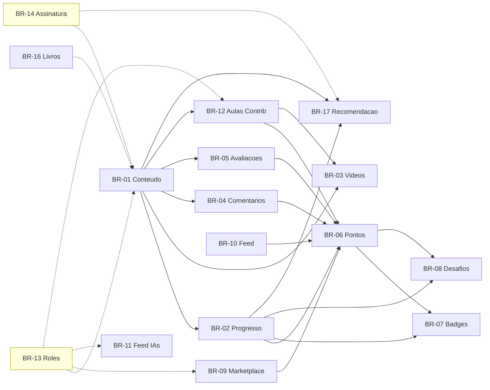
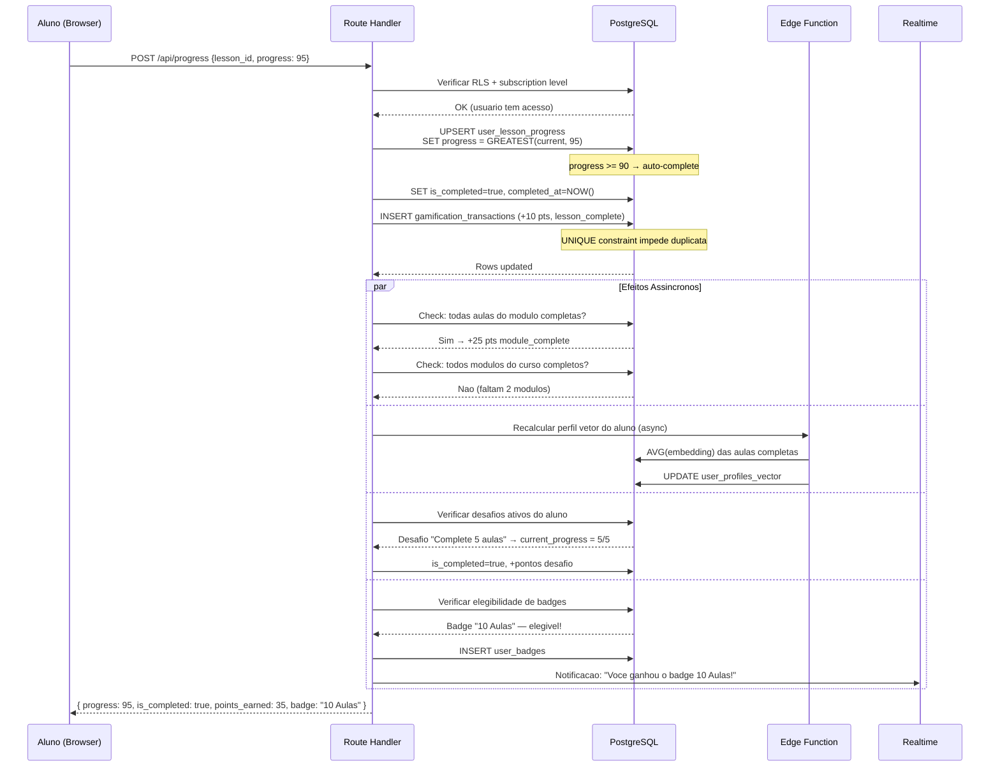
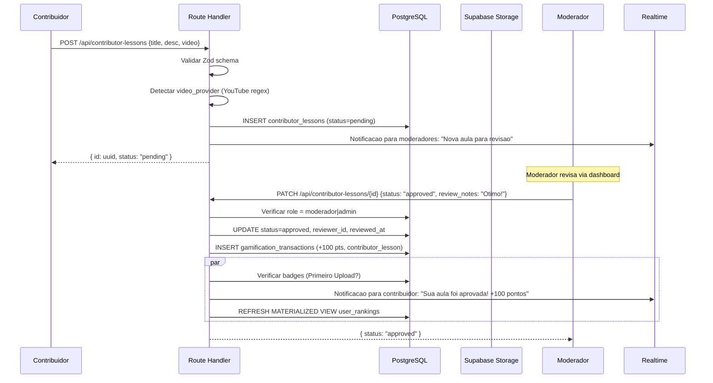
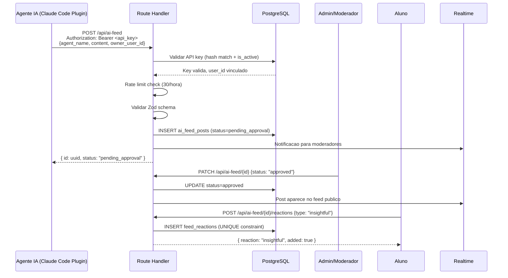
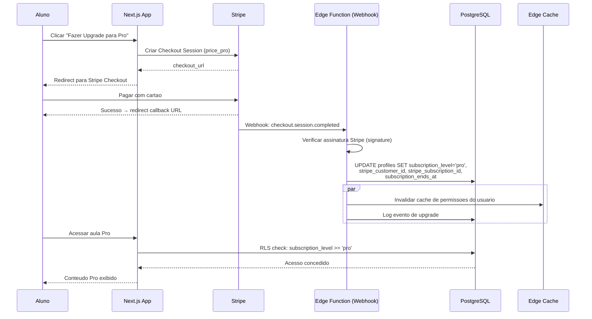
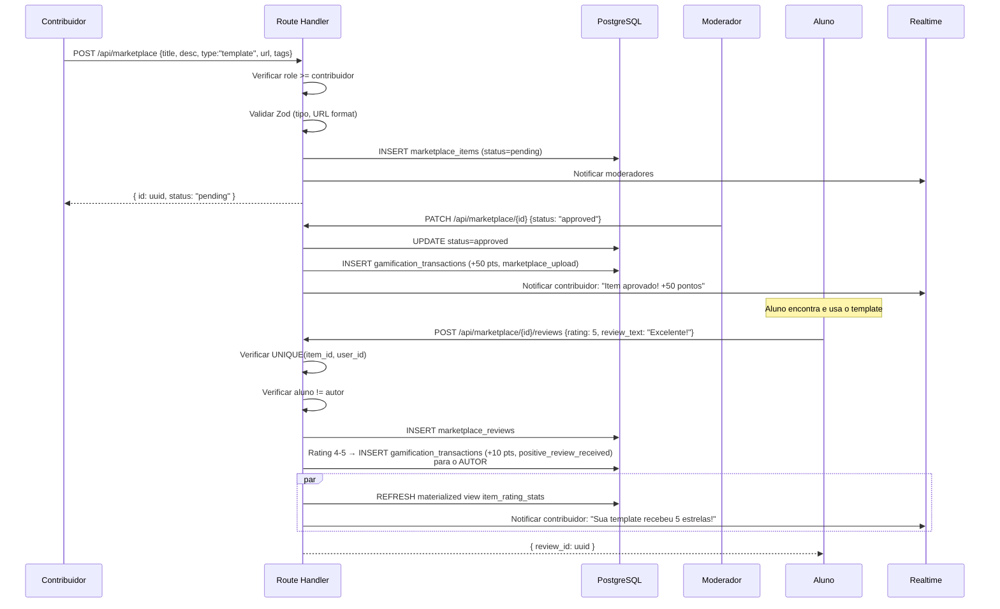

# AutomatikLabs — Biblia de Regras de Negocio

> **Versao:** 1.0.0
> **Data:** 2026-04-01
> **Status:** Aprovado
> **Autor:** Business Rules Architect — AutomatikLabs
> **Referencia:** [ARCHITECTURE.md](../architecture/ARCHITECTURE.md)

---

## Convencoes deste Documento

- **ID**: Cada regra tem identificador unico `BR-XX` para rastreabilidade
- **Validacoes Zod**: Schemas conceituais em TypeScript/Zod — traduzir diretamente para codigo
- **Efeitos Colaterais**: Tudo que muda alem da operacao principal (pontos, notificacoes, caches)
- **Edge Cases**: Cenarios limites com resolucao explicita — zero ambiguidade
- **Roles**: `aluno` | `contribuidor` | `moderador` | `admin`
- **Niveis de Assinatura**: `free` < `pro` < `premium` (ordem hierarquica estrita)
- **Timestamps**: Todos em UTC, formato ISO 8601
- **Soft Delete**: Entidades nunca sao removidas fisicamente; usam campo `deleted_at` (nullable timestamp)
- **Slugs**: Gerados automaticamente via `slugify(titulo)`, com collision handling

---

## Indice de Regras

| ID | Dominio | Descricao |
|----|---------|-----------|
| BR-01 | Hierarquia de Conteudo | Estrutura Trilha > Curso > Modulo > Aula |
| BR-02 | Progresso de Aprendizado | Tracking de progresso por aula/modulo/curso/trilha |
| BR-03 | Videos | Upload, deteccao de provider, validacao |
| BR-04 | Comentarios | Hierarquia, moderacao, IA, rate limiting |
| BR-05 | Avaliacao de Aulas | Rating 1-5, rolling average, unicidade |
| BR-06 | Gamificacao — Pontos | Sistema de pontuacao com anti-gaming |
| BR-07 | Badges | Marcos e conquistas automaticas |
| BR-08 | Desafios | Desafios criados por admin com prazo |
| BR-09 | Marketplace | Submissao, aprovacao, avaliacao de itens |
| BR-10 | Feed da Comunidade | Posts, canais, abas, reacoes, moderacao |
| BR-11 | Feed de IAs | Posts exclusivos de IAs via API REST |
| BR-12 | Aulas de Contribuidores | Submissao e aprovacao de aulas |
| BR-13 | Roles e Permissoes | Matriz de autorizacao por role |
| BR-14 | Niveis de Assinatura | Controle de acesso por tier |
| BR-15 | Newsletter | Criacao, envio, opt-in/opt-out |
| BR-16 | Recomendacao de Livros | CRUD de livros com associacao a conteudo |
| BR-17 | Recomendacao de Aulas | Sistema baseado em pgvector |

---

## BR-01: Hierarquia de Conteudo

### Regra

A plataforma organiza conteudo educacional em uma hierarquia de 4 niveis, estritamente ordenada:

```
Trilha (1) ──contains──> Curso (N, ordered)
Curso (1) ──contains──> Modulo (N, ordered)
Modulo (1) ──contains──> Aula (N, ordered)
```

Cada entidade filha pertence a exatamente 1 entidade pai. A ordem e definida pelo campo `sort_order` (integer, 0-indexed). Nao existem entidades orfas — toda aula pertence a um modulo, todo modulo a um curso, todo curso a uma trilha.

### Campos Comuns

| Campo | Tipo | Obrigatorio | Descricao |
|-------|------|------------|-----------|
| `id` | UUID v4 | Auto | PK |
| `title` | string (3-200 chars) | Sim | Titulo visivel |
| `description` | text (max 5000 chars) | Sim | Descricao em markdown |
| `slug` | string (max 250 chars) | Auto | Gerado do titulo, unique por tipo |
| `status` | enum | Sim | `draft` \| `published` \| `archived` |
| `min_subscription_level` | enum | Sim | `free` \| `pro` \| `premium` |
| `sort_order` | integer >= 0 | Sim | Posicao dentro do pai |
| `created_at` | timestamp | Auto | UTC |
| `updated_at` | timestamp | Auto | UTC |
| `deleted_at` | timestamp | Auto | Nullable, soft delete |

### Campos Adicionais — Aula

| Campo | Tipo | Obrigatorio | Descricao |
|-------|------|------------|-----------|
| `video_url` | string (URL) | Nao | URL do video (YouTube/Vimeo) |
| `video_provider` | enum | Condicional | `youtube` \| `vimeo` \| `upload` — obrigatorio se video_url presente |
| `video_file_id` | UUID | Condicional | Ref Supabase Storage — obrigatorio se provider = `upload` |
| `tags` | string[] (max 20 items, max 50 chars cada) | Nao | Tags para busca e recomendacao |
| `estimated_duration` | integer (minutos, 1-600) | Nao | Duracao estimada em minutos |
| `embedding_vector` | vector(1536) | Auto | pgvector, gerado do conteudo |

### Validacao Zod — Trilha/Curso/Modulo

```typescript
const ContentEntitySchema = z.object({
  title: z.string().min(3).max(200),
  description: z.string().min(1).max(5000),
  status: z.enum(['draft', 'published', 'archived']),
  min_subscription_level: z.enum(['free', 'pro', 'premium']),
  sort_order: z.number().int().min(0),
});
```

### Validacao Zod — Aula

```typescript
const LessonSchema = ContentEntitySchema.extend({
  video_url: z.string().url().nullable().optional(),
  video_provider: z.enum(['youtube', 'vimeo', 'upload']).nullable().optional(),
  video_file_id: z.string().uuid().nullable().optional(),
  tags: z.array(z.string().max(50)).max(20).default([]),
  estimated_duration: z.number().int().min(1).max(600).nullable().optional(),
}).refine(
  (data) => {
    if (data.video_url && !data.video_provider) return false;
    if (data.video_provider === 'upload' && !data.video_file_id) return false;
    if (data.video_provider !== 'upload' && !data.video_url) return false;
    return true;
  },
  { message: 'Video fields must be consistent: provider required with URL, file_id required for upload' }
);
```

### Geracao de Slug

```typescript
function generateSlug(title: string, existingSlugs: string[]): string {
  const base = slugify(title, { lower: true, strict: true, locale: 'pt' });
  if (!existingSlugs.includes(base)) return base;
  let counter = 1;
  while (existingSlugs.includes(`${base}-${counter}`)) counter++;
  return `${base}-${counter}`;
}
```

- Slug e gerado automaticamente na criacao
- Slug e imutavel apos publicacao (`status = published`) para nao quebrar URLs
- Slug e unique por tipo de entidade (trilhas, cursos, modulos, aulas tem namespaces separados)
- Colisao resolvida com sufixo numerico incremental: `-1`, `-2`, etc.

### Efeitos Colaterais

| Operacao | Efeito |
|----------|--------|
| Criar entidade | Gerar slug, definir `sort_order` = max(sort_order) + 1 do pai |
| Publicar aula | Gerar embedding_vector (async via Edge Function) |
| Arquivar curso | Todas as aulas e modulos filhos mudam para `archived` (cascade) |
| Deletar (soft) trilha | Cascade soft delete em cursos > modulos > aulas |
| Reordenar | Atualizar `sort_order` de todos os siblings afetados |

### Entidades (Tabelas)

`tracks`, `courses`, `modules`, `lessons`, `track_courses` (pivot com sort_order), `course_modules` (pivot), `module_lessons` (pivot)

### Roles Autorizados

| Operacao | Roles |
|----------|-------|
| Ler (published) | Todos (respeitando min_subscription_level) |
| Ler (draft/archived) | admin |
| Criar/Editar/Deletar | admin |
| Reordenar | admin |

### Edge Cases

| Cenario | Resolucao |
|---------|-----------|
| Titulo com caracteres especiais no slug | `slugify` remove acentos e caracteres nao-alfanumericos |
| Slug colide com slug existente | Append `-N` (incremental) |
| Deletar modulo com aulas que tem progresso | Soft delete; progresso existente e preservado mas aula nao aparece mais |
| Aula sem video | Permitido — aula pode ser apenas texto |
| Reordenar para sort_order negativo | Rejeitar — min 0 |
| Publicar aula com campos obrigatorios faltando | Rejeitar; draft pode ter campos incompletos, published nao |
| Trilha vazia (sem cursos) | Permitido em draft; publicacao exige pelo menos 1 curso com 1 modulo com 1 aula published |

---

## BR-02: Progresso de Aprendizado

### Regra

O progresso de cada aluno e rastreado individualmente por aula. Progresso e **monotonicamente crescente** — nunca regride, independente da acao do usuario.

### Campos — `user_lesson_progress`

| Campo | Tipo | Descricao |
|-------|------|-----------|
| `id` | UUID v4 | PK |
| `user_id` | UUID | FK → auth.users |
| `lesson_id` | UUID | FK → lessons |
| `progress_percentage` | integer (0-100) | Porcentagem assistida |
| `is_completed` | boolean | Se a aula foi concluida |
| `completed_at` | timestamp | Nullable, preenchido na conclusao |
| `last_watched_at` | timestamp | Ultima interacao |
| `created_at` | timestamp | Primeira interacao |

**Constraint UNIQUE**: `(user_id, lesson_id)` — no maximo 1 registro por par.

### Regras de Calculo

**Conclusao de Aula:**
Uma aula e considerada completa (`is_completed = true`) quando:
1. `progress_percentage >= 90` (automatico), OU
2. Aluno marca manualmente como completa (via UI)

Ao completar: `completed_at = NOW()`, `is_completed = true`.

**Progresso Agregado:**

```
progresso_modulo = (aulas_completas_no_modulo / total_aulas_no_modulo) * 100
progresso_curso  = (modulos_completos_no_curso / total_modulos_no_curso) * 100
progresso_trilha = (cursos_completos_na_trilha / total_cursos_na_trilha) * 100
```

Um modulo e completo quando 100% das suas aulas estao completas.
Um curso e completo quando 100% dos seus modulos estao completos.
Uma trilha e completa quando 100% dos seus cursos estao completos.

**Monotonicidade:**
```typescript
// Na atualizacao de progresso:
new_percentage = Math.max(current_percentage, incoming_percentage);
// Nunca: new_percentage = incoming_percentage (poderia regredir)
```

Se `is_completed = true`, qualquer update subsequente e ignorado para esse campo.

### Validacao Zod

```typescript
const ProgressUpdateSchema = z.object({
  lesson_id: z.string().uuid(),
  progress_percentage: z.number().int().min(0).max(100),
  mark_complete: z.boolean().optional().default(false),
});
```

### Efeitos Colaterais

| Trigger | Efeito |
|---------|--------|
| `progress_percentage >= 90` | Auto-complete aula, atribuir pontos (+10) se primeira vez |
| `mark_complete = true` | Setar `is_completed = true`, `completed_at = NOW()`, atribuir pontos (+10) se primeira vez |
| Todas aulas do modulo completas | Atribuir bonus modulo (+25 pontos) |
| Todos modulos do curso completos | Atribuir bonus curso (+100 pontos) |
| Todos cursos da trilha completos | Atribuir bonus trilha (+500 pontos) |
| Aula completada | Recalcular vetor de perfil do aluno (BR-17) |
| Progresso atualizado | Verificar criterios de desafios ativos (BR-08) |
| Progresso atualizado | Verificar elegibilidade de badges (BR-07) |

### Entidades

`user_lesson_progress`, `lessons`, `modules`, `courses`, `tracks`

### Roles Autorizados

| Operacao | Roles |
|----------|-------|
| Atualizar proprio progresso | aluno, contribuidor, moderador, admin |
| Ler proprio progresso | aluno, contribuidor, moderador, admin |
| Ler progresso de qualquer aluno | admin |
| Resetar progresso | Nenhum (progresso nunca regride) |

### Edge Cases

| Cenario | Resolucao |
|---------|-----------|
| Aluno tenta regredir progresso | Ignorar — manter valor maximo |
| Aula removida (soft delete) apos aluno completar | Progresso permanece; aula nao conta mais para calculo agregado de modulos futuros |
| Nova aula adicionada a modulo ja completo | Modulo volta a ser incompleto; progresso do modulo recalculado |
| Aluno marca complete em aula que ja e complete | Idempotente — nenhuma mudanca, nao gera pontos duplicados |
| Aula sem video (apenas texto) | Progresso comeca em 0; aluno deve marcar manualmente como complete |
| Progresso recebido com percentage > 100 | Rejeitar via Zod (max 100) |
| Concorrencia: 2 updates simultaneos | Usar `GREATEST(progress_percentage, $new_value)` no SQL |

---

## BR-03: Videos

### Regra

Aulas podem ter video de 3 fontes: YouTube, Vimeo, ou upload direto. A deteccao do provider e automatica baseada na URL fornecida.

### Deteccao de Provider

```typescript
const YOUTUBE_REGEX = /^(https?:\/\/)?(www\.)?(youtube\.com\/watch\?v=|youtu\.be\/|youtube\.com\/embed\/)[\w-]{11}/;
const VIMEO_REGEX = /^(https?:\/\/)?(www\.)?vimeo\.com\/\d+/;

function detectProvider(url: string): 'youtube' | 'vimeo' | null {
  if (YOUTUBE_REGEX.test(url)) return 'youtube';
  if (VIMEO_REGEX.test(url)) return 'vimeo';
  return null;
}
```

Se `detectProvider` retorna `null` e a URL nao e um upload, rejeitar com erro de validacao.

### Validacao — Upload Direto

| Restricao | Valor |
|-----------|-------|
| Tamanho maximo | 2 GB (2.147.483.648 bytes) |
| Formatos aceitos | `video/mp4`, `video/quicktime` (.mov), `video/webm` |
| Storage | Supabase Storage, bucket `lesson-videos` |
| Naming | `{lesson_id}/{uuid}.{ext}` |
| Resumable upload | Obrigatorio (via tus protocol no Supabase) |

### Validacao Zod

```typescript
const VideoUrlSchema = z.object({
  video_url: z.string().url(),
}).refine(
  (data) => YOUTUBE_REGEX.test(data.video_url) || VIMEO_REGEX.test(data.video_url),
  { message: 'URL must be a valid YouTube or Vimeo link' }
);

const VideoUploadSchema = z.object({
  file_size: z.number().max(2_147_483_648, 'Max file size is 2GB'),
  mime_type: z.enum(['video/mp4', 'video/quicktime', 'video/webm']),
  file_name: z.string().min(1),
});
```

### Fluxo — Upload Direto

1. Cliente solicita URL de upload: `POST /api/lessons/{id}/video/upload-url`
2. Backend valida: mime_type, file_size, permissao
3. Backend retorna URL de upload resumable (Supabase Storage)
4. Cliente faz upload direto para Storage (tus protocol)
5. Ao completar upload, Storage dispara webhook
6. Edge Function processa: atualiza `video_file_id` e `video_provider = 'upload'` na aula

### Efeitos Colaterais

| Operacao | Efeito |
|----------|--------|
| Video URL salva | `video_provider` atualizado automaticamente |
| Upload concluido | `video_file_id` e `video_provider` atualizados |
| Video removido | `video_url`, `video_provider`, `video_file_id` setados para null; arquivo Storage deletado |
| Video atualizado (troca URL) | Video anterior removido do Storage se era upload |

### Entidades

`lessons`, Supabase Storage bucket `lesson-videos`

### Roles Autorizados

| Operacao | Roles |
|----------|-------|
| Adicionar/editar video em aula oficial | admin |
| Adicionar video em aula de contribuidor | contribuidor (propria), admin |
| Assistir video | aluno+ (respeitando min_subscription_level) |

### Edge Cases

| Cenario | Resolucao |
|---------|-----------|
| URL YouTube invalida (ex: playlist) | Rejeitar — regex so aceita videos individuais |
| Upload interrompido | Resumable upload — cliente retoma de onde parou |
| Arquivo corrompido | Validacao de mime type no upload; se streaming falha, marcar video como `error` |
| Video privado no YouTube/Vimeo | Plataforma nao valida acessibilidade em runtime; responsabilidade do admin |
| Upload > 2GB | Rejeitar antes do upload iniciar (validacao client-side + server-side) |
| Formato nao suportado (.avi, .flv) | Rejeitar com mensagem explicando formatos aceitos |

---

## BR-04: Comentarios

### Regra

Alunos podem comentar em aulas nas quais tem acesso (nivel de assinatura compativel). Comentarios suportam hierarquia ate 3 niveis de profundidade. Todos os comentarios passam por moderacao, exceto quando `auto_approve_comments = true` na configuracao global.

### Campos — `comments`

| Campo | Tipo | Descricao |
|-------|------|-----------|
| `id` | UUID v4 | PK |
| `lesson_id` | UUID | FK → lessons |
| `user_id` | UUID | FK → auth.users |
| `parent_id` | UUID | FK → comments (nullable, self-ref) |
| `content` | text (1-2000 chars) | Corpo do comentario |
| `status` | enum | `pending_approval` \| `approved` \| `rejected` \| `deleted` |
| `is_ai_response` | boolean | Default false |
| `ai_model` | string (max 100) | Nullable, ex: `claude-sonnet-4-6` |
| `depth` | integer (1-3) | Nivel de profundidade (calculado) |
| `created_at` | timestamp | UTC |
| `updated_at` | timestamp | UTC |

### Hierarquia

```
Comentario raiz (depth=1)
  └── Reply (depth=2)
       └── Reply do reply (depth=3)
            └── BLOQUEADO — max 3 niveis
```

`depth` e calculado automaticamente:
- Se `parent_id IS NULL` → `depth = 1`
- Senao → `depth = parent.depth + 1`
- Se `depth > 3` → rejeitar com erro

### Moderacao

| Configuracao | Comportamento |
|-------------|---------------|
| `auto_approve_comments = false` (default) | Novos comentarios entram como `pending_approval` |
| `auto_approve_comments = true` | Novos comentarios entram como `approved` |

Configuracao salva em: tabela `platform_settings`, chave `auto_approve_comments`.

### Resposta de IA

Endpoint dedicado: `POST /api/lessons/{lesson_id}/comments/{comment_id}/ai-reply`

```typescript
const AiReplySchema = z.object({
  content: z.string().min(1).max(5000), // IA pode ter respostas mais longas
  ai_model: z.string().min(1).max(100),
});
```

Resposta de IA sempre entra como `approved` (pre-aprovada). Flag `is_ai_response = true`.

### Rate Limiting

- **10 comentarios por hora por usuario** (sliding window)
- Contagem inclui todos os status (pending, approved, rejected)
- Nao inclui comentarios deletados
- IA nao tem rate limit

### Validacao Zod

```typescript
const CreateCommentSchema = z.object({
  lesson_id: z.string().uuid(),
  parent_id: z.string().uuid().nullable().optional(),
  content: z.string().min(1).max(2000).trim(),
});
```

### Efeitos Colaterais

| Operacao | Efeito |
|----------|--------|
| Comentario criado (approved) | +3 pontos gamificacao (max 5 pontuaveis/dia, BR-06) |
| Comentario aprovado (por moderador) | +3 pontos gamificacao (se ainda nao atingiu cap diario) |
| Comentario rejeitado | Nenhum efeito; se pontos foram dados (auto_approve), reverter pontos |
| Comentario deletado | Soft delete; replies ficam orfas mas visaveis com aviso "comentario removido" |
| IA responde | Nao gera pontos |

### Entidades

`comments`, `lessons`, `platform_settings`, `gamification_transactions`

### Roles Autorizados

| Operacao | Roles |
|----------|-------|
| Criar comentario | aluno, contribuidor, moderador, admin |
| Aprovar/rejeitar | moderador, admin |
| Deletar qualquer comentario | moderador, admin |
| Deletar proprio comentario | aluno, contribuidor, moderador, admin |
| Responder via IA | Sistema (API key auth) |

### Edge Cases

| Cenario | Resolucao |
|---------|-----------|
| Reply em comentario deletado | Rejeitar — nao pode responder comentario com status `deleted` |
| Reply em comentario `pending_approval` | Permitir — reply tambem fica pending |
| Depth > 3 | Rejeitar com erro: "Maximo 3 niveis de resposta" |
| Aluno sem nivel de assinatura para a aula | Rejeitar: aluno nao pode comentar onde nao tem acesso |
| Comentario com apenas espacos | Rejeitar via `.trim()` + `.min(1)` |
| Rate limit atingido | HTTP 429 com header `Retry-After` |
| Auto-approve muda de true para false | Comentarios ja aprovados permanecem; novos seguem nova regra |
| Comentario com conteudo ofensivo | Moderacao manual; futuro: filtro automatico pre-submissao |

---

## BR-05: Avaliacao de Aulas

### Regra

Alunos podem avaliar aulas com rating de 1 a 5 estrelas, opcionalmente com feedback textual. Cada aluno pode avaliar cada aula **no maximo 1 vez**, mas pode **editar** sua avaliacao existente.

### Campos — `lesson_ratings`

| Campo | Tipo | Descricao |
|-------|------|-----------|
| `id` | UUID v4 | PK |
| `lesson_id` | UUID | FK → lessons |
| `user_id` | UUID | FK → auth.users |
| `rating` | integer (1-5) | Estrelas |
| `feedback` | text (max 2000 chars) | Nullable |
| `created_at` | timestamp | UTC |
| `updated_at` | timestamp | UTC |

**Constraint UNIQUE**: `(user_id, lesson_id)`

### Media

A media e calculada via **materialized view** ou **trigger** no PostgreSQL:

```sql
-- Materialized View
CREATE MATERIALIZED VIEW lesson_rating_stats AS
SELECT
  lesson_id,
  COUNT(*) AS total_ratings,
  ROUND(AVG(rating)::numeric, 2) AS average_rating
FROM lesson_ratings
GROUP BY lesson_id;

-- Refresh via trigger ou pg_cron a cada 5 minutos
```

### Validacao Zod

```typescript
const LessonRatingSchema = z.object({
  lesson_id: z.string().uuid(),
  rating: z.number().int().min(1).max(5),
  feedback: z.string().max(2000).trim().nullable().optional(),
});
```

### Efeitos Colaterais

| Operacao | Efeito |
|----------|--------|
| Primeira avaliacao criada | +5 pontos gamificacao (BR-06), 1x por aula |
| Avaliacao editada | Nenhum efeito adicional de pontos (ja ganhou) |
| Avaliacao criada | Refresh da materialized view (async ou via trigger) |
| Avaliacao 4-5 estrelas em item marketplace | +10 pontos para o autor do item (BR-09) |

### Entidades

`lesson_ratings`, `lesson_rating_stats` (materialized view), `gamification_transactions`

### Roles Autorizados

| Operacao | Roles |
|----------|-------|
| Criar/editar propria avaliacao | aluno, contribuidor, moderador, admin |
| Ver avaliacoes | Todos |
| Deletar avaliacao de outro | admin |

### Edge Cases

| Cenario | Resolucao |
|---------|-----------|
| Aluno tenta avaliar 2x | Retornar avaliacao existente com sugestao de editar (HTTP 409) |
| Rating fora de 1-5 | Rejeitar via Zod |
| Aluno sem acesso a aula tenta avaliar | Rejeitar (verificar min_subscription_level) |
| Aula sem avaliacoes | `average_rating = null`, `total_ratings = 0` |
| Aluno edita rating de 5 para 1 | Permitido; media recalculada; nao reverte pontos do avaliador |

---

## BR-06: Gamificacao — Sistema de Pontos

### Regra

Toda acao relevante na plataforma gera pontos para o usuario. O sistema implementa **anti-gaming** via deduplicacao e caps diarios. Cada transacao e registrada para auditoria.

### Tabela de Pontuacao

| Acao | Pontos | Regra de Cap | action_type |
|------|--------|-------------|-------------|
| Completar aula | +10 | 1x por aula por usuario | `lesson_complete` |
| Completar modulo | +25 | 1x por modulo (bonus ao fechar todas aulas) | `module_complete` |
| Completar curso | +100 | 1x por curso | `course_complete` |
| Completar trilha | +500 | 1x por trilha | `track_complete` |
| Avaliar aula | +5 | 1x por aula | `lesson_rating` |
| Comentar em aula | +3 | Max 5 pontuaveis/dia | `comment_created` |
| Postar no feed | +5 | Max 3 pontuaveis/dia | `feed_post` |
| Upload marketplace (aprovado) | +50 | Por item aprovado | `marketplace_upload` |
| Avaliacao positiva recebida (4-5 estrelas) | +10 | Por avaliacao recebida | `positive_review_received` |
| Completar desafio | +variavel | Definido na criacao do desafio | `challenge_complete` |
| Upload aula contribuidor (aprovada) | +100 | Por aula aprovada | `contributor_lesson` |

### Campos — `gamification_transactions`

| Campo | Tipo | Descricao |
|-------|------|-----------|
| `id` | UUID v4 | PK |
| `user_id` | UUID | FK → auth.users |
| `action_type` | string | Tipo da acao (ver tabela acima) |
| `points` | integer | Pontos atribuidos (positivo) ou revertidos (negativo) |
| `entity_type` | string | `lesson` \| `module` \| `course` \| `track` \| `comment` \| `post` \| `marketplace_item` \| `challenge` |
| `entity_id` | UUID | FK para a entidade relacionada |
| `created_at` | timestamp | UTC |

### Anti-Gaming

**Deduplicacao:**
```sql
-- Constraint: impedir duplicata
UNIQUE(user_id, action_type, entity_id)
-- Excecao: acoes com cap diario nao usam entity_id no unique
-- Para essas, validar no application layer
```

**Caps Diarios:**
```typescript
async function canEarnPoints(userId: string, actionType: string): Promise<boolean> {
  const dailyCaps: Record<string, number> = {
    comment_created: 5,
    feed_post: 3,
  };
  const cap = dailyCaps[actionType];
  if (!cap) return true; // Sem cap diario

  const todayStart = startOfDay(new Date());
  const count = await db.gamification_transactions
    .count({ user_id: userId, action_type: actionType, created_at: { gte: todayStart } });
  return count < cap;
}
```

**Cooldown:** Para acoes com cap diario, intervalo minimo de 30 segundos entre acoes do mesmo tipo.

### Ranking

```sql
-- Materialized View: ranking global
CREATE MATERIALIZED VIEW user_rankings AS
SELECT
  user_id,
  SUM(points) AS total_points,
  RANK() OVER (ORDER BY SUM(points) DESC) AS rank_position
FROM gamification_transactions
GROUP BY user_id;

-- Refresh: pg_cron a cada 5 minutos OU trigger-based
```

### Validacao Zod

```typescript
const PointTransactionSchema = z.object({
  user_id: z.string().uuid(),
  action_type: z.enum([
    'lesson_complete', 'module_complete', 'course_complete', 'track_complete',
    'lesson_rating', 'comment_created', 'feed_post', 'marketplace_upload',
    'positive_review_received', 'challenge_complete', 'contributor_lesson'
  ]),
  points: z.number().int(),
  entity_type: z.string(),
  entity_id: z.string().uuid(),
});
```

### Efeitos Colaterais

| Operacao | Efeito |
|----------|--------|
| Pontos atribuidos | Refresh ranking (async) |
| Pontos atribuidos | Verificar elegibilidade de badges (BR-07) |
| Comentario rejeitado apos auto-approve | Transacao de pontos negativos (reverter +3) |
| Usuario atinge marco de pontos | Verificar badges por pontos (BR-07) |

### Entidades

`gamification_transactions`, `user_rankings` (materialized view)

### Roles Autorizados

| Operacao | Roles |
|----------|-------|
| Ganhar pontos (automatico) | Todos (via acoes) |
| Ver proprio saldo | aluno, contribuidor, moderador, admin |
| Ver ranking | Todos |
| Ajustar pontos manualmente | admin |
| Ver audit trail | admin |

### Edge Cases

| Cenario | Resolucao |
|---------|-----------|
| Aluno completa aula ja completada | Nao duplica pontos — UNIQUE(user_id, action_type, entity_id) |
| Aluno posta 6o comentario no dia | 6o nao gera pontos; comentario e criado normalmente |
| Aluno faz 2 comentarios em < 30s | Segundo nao gera pontos (cooldown) |
| Pontos negativos levam total abaixo de 0 | Permitido — total pode ser negativo (raro, apenas reversoes) |
| Ranking empate | Mesma posicao; proximo pula (RANK, nao DENSE_RANK) |
| Admin ajusta pontos | Cria transacao especial com `action_type = 'admin_adjustment'` |

---

## BR-07: Badges

### Regra

Badges sao conquistas automaticas atribuidas quando o usuario atinge marcos especificos. A verificacao de elegibilidade ocorre via trigger (ao ganhar pontos ou completar acoes) ou via cron job periodico.

### Campos — `badges`

| Campo | Tipo | Descricao |
|-------|------|-----------|
| `id` | UUID v4 | PK |
| `name` | string (3-100) | Nome do badge |
| `description` | string (max 500) | Descricao visivel |
| `icon` | string | URL ou emoji identifier |
| `criteria_type` | enum | `lessons_completed` \| `points_reached` \| `uploads_approved` \| `ranking_position` \| `courses_completed` \| `first_action` |
| `criteria_value` | integer | Valor numerico do criterio |
| `created_at` | timestamp | UTC |

### Campos — `user_badges`

| Campo | Tipo | Descricao |
|-------|------|-----------|
| `id` | UUID v4 | PK |
| `user_id` | UUID | FK → auth.users |
| `badge_id` | UUID | FK → badges |
| `earned_at` | timestamp | Quando ganhou |

**Constraint UNIQUE**: `(user_id, badge_id)`

### Badges Pre-definidos

| Badge | criteria_type | criteria_value | Descricao |
|-------|--------------|----------------|-----------|
| Primeira Aula | `first_action` | 1 | Completou primeira aula |
| 10 Aulas | `lessons_completed` | 10 | Completou 10 aulas |
| 50 Aulas | `lessons_completed` | 50 | Completou 50 aulas |
| 100 Pontos | `points_reached` | 100 | Atingiu 100 pontos |
| 1000 Pontos | `points_reached` | 1000 | Atingiu 1000 pontos |
| Primeiro Upload | `first_action` | 1 | Primeiro upload aprovado no marketplace |
| Top 10 Ranking | `ranking_position` | 10 | Esta entre os top 10 |
| Primeiro Curso | `courses_completed` | 1 | Completou primeiro curso |

### Validacao Zod

```typescript
const BadgeSchema = z.object({
  name: z.string().min(3).max(100),
  description: z.string().max(500),
  icon: z.string().min(1),
  criteria_type: z.enum([
    'lessons_completed', 'points_reached', 'uploads_approved',
    'ranking_position', 'courses_completed', 'first_action'
  ]),
  criteria_value: z.number().int().min(1),
});
```

### Efeitos Colaterais

| Operacao | Efeito |
|----------|--------|
| Badge atribuido | Notificacao in-app para o usuario |
| Badge atribuido | Registro em `user_badges` |
| Badge de ranking (Top 10) | Pode ser removido se usuario sai do top 10 (reavaliado no cron) |

### Entidades

`badges`, `user_badges`

### Roles Autorizados

| Operacao | Roles |
|----------|-------|
| Ver proprios badges | aluno, contribuidor, moderador, admin |
| Ver badges de outro usuario | Todos (perfil publico) |
| CRUD badges | admin |

### Edge Cases

| Cenario | Resolucao |
|---------|-----------|
| Badge de ranking perdido (saiu do top 10) | Remover de `user_badges`; notificar usuario |
| Badge concedido 2x | Impossivel — UNIQUE(user_id, badge_id) |
| Badge deletado pelo admin | Soft delete; usuarios que ja ganharam mantem historico |
| Criterio de badge alterado | Nao retroativo; usuarios existentes nao perdem badge |

---

## BR-08: Desafios

### Regra

Desafios sao criados exclusivamente por admins. Alunos participam explicitamente (inscricao). A conclusao e automatica quando o criterio e atingido dentro do prazo.

### Campos — `challenges`

| Campo | Tipo | Descricao |
|-------|------|-----------|
| `id` | UUID v4 | PK |
| `title` | string (3-200) | Titulo |
| `description` | text (max 5000) | Descricao com criterios |
| `criteria_type` | enum | `lessons_completed` \| `uploads_created` \| `points_earned` \| `comments_made` \| `courses_completed` |
| `criteria_value` | integer | Meta numerica |
| `points_reward` | integer (1-10000) | Pontos ao completar |
| `starts_at` | timestamp | Inicio do desafio |
| `ends_at` | timestamp | Prazo final |
| `status` | enum | `active` \| `completed` \| `expired` |
| `created_at` | timestamp | UTC |

### Campos — `challenge_participants`

| Campo | Tipo | Descricao |
|-------|------|-----------|
| `id` | UUID v4 | PK |
| `challenge_id` | UUID | FK → challenges |
| `user_id` | UUID | FK → auth.users |
| `current_progress` | integer | Progresso atual no criterio |
| `is_completed` | boolean | Se atingiu a meta |
| `completed_at` | timestamp | Nullable |
| `enrolled_at` | timestamp | Quando se inscreveu |

**Constraint UNIQUE**: `(challenge_id, user_id)`

### Ciclo de Vida

```
active (starts_at <= NOW < ends_at)
  → participante atinge criteria_value → is_completed = true, +pontos
  → NOW >= ends_at → status = expired (via pg_cron)
  → admin marca completed → status = completed
```

### Validacao Zod

```typescript
const CreateChallengeSchema = z.object({
  title: z.string().min(3).max(200),
  description: z.string().min(1).max(5000),
  criteria_type: z.enum([
    'lessons_completed', 'uploads_created', 'points_earned',
    'comments_made', 'courses_completed'
  ]),
  criteria_value: z.number().int().min(1),
  points_reward: z.number().int().min(1).max(10000),
  starts_at: z.string().datetime(),
  ends_at: z.string().datetime(),
}).refine(
  (data) => new Date(data.ends_at) > new Date(data.starts_at),
  { message: 'ends_at must be after starts_at' }
);

const EnrollChallengeSchema = z.object({
  challenge_id: z.string().uuid(),
});
```

### Efeitos Colaterais

| Operacao | Efeito |
|----------|--------|
| Inscricao | Criar registro em `challenge_participants` com `current_progress = 0` |
| Acao relevante do aluno | Atualizar `current_progress` de todos desafios ativos do aluno |
| `current_progress >= criteria_value` | `is_completed = true`, `completed_at = NOW()`, atribuir pontos |
| Desafio expira | pg_cron atualiza `status = expired`, nao atribui pontos a ninguem |

### Entidades

`challenges`, `challenge_participants`, `gamification_transactions`

### Roles Autorizados

| Operacao | Roles |
|----------|-------|
| Criar/editar/deletar desafio | admin |
| Ver desafios ativos | Todos |
| Inscrever-se | aluno, contribuidor, moderador, admin |
| Ver participantes | admin |

### Edge Cases

| Cenario | Resolucao |
|---------|-----------|
| Aluno se inscreve em desafio expirado | Rejeitar — so desafios `active` aceitam inscricao |
| Aluno ja tinha progresso antes de se inscrever | Contar apenas acoes APOS inscricao (`enrolled_at`) |
| Aluno atinge meta apos prazo | Nao conta — verificar `NOW() < ends_at` |
| Desafio sem participantes | Permitido; expira normalmente |
| Admin edita criteria_value de desafio ativo | Reavaliar todos participantes; quem ja atingiu novo valor, completar |

---

## BR-09: Marketplace

### Regra

O marketplace permite que contribuidores submetam itens (skills, projetos GitHub, templates) para avaliacao e uso pela comunidade. Todos os itens passam por aprovacao obrigatoria.

### Tipos de Item

| Tipo | Descricao | Conteudo |
|------|-----------|----------|
| `skill` | Habilidade/tecnica para monetizar com IA | URL + descricao |
| `github_project` | Repositorio GitHub | URL GitHub obrigatoria |
| `template` | Template reutilizavel | Upload de arquivo ou URL |

### Campos — `marketplace_items`

| Campo | Tipo | Descricao |
|-------|------|-----------|
| `id` | UUID v4 | PK |
| `title` | string (3-200) | Titulo |
| `description` | text (max 5000) | Descricao em markdown |
| `type` | enum | `skill` \| `github_project` \| `template` |
| `url` | string (URL) | URL do recurso (nullable se upload) |
| `file_id` | UUID | FK → Storage (nullable se URL) |
| `tags` | string[] (max 20) | Tags de busca |
| `author_id` | UUID | FK → auth.users |
| `status` | enum | `pending` \| `approved` \| `rejected` |
| `reviewer_id` | UUID | Nullable, FK → auth.users (quem aprovou/rejeitou) |
| `reviewed_at` | timestamp | Nullable |
| `created_at` | timestamp | UTC |
| `updated_at` | timestamp | UTC |
| `deleted_at` | timestamp | Nullable |

### Campos — `marketplace_reviews`

| Campo | Tipo | Descricao |
|-------|------|-----------|
| `id` | UUID v4 | PK |
| `item_id` | UUID | FK → marketplace_items |
| `user_id` | UUID | FK → auth.users |
| `rating` | integer (1-5) | Estrelas |
| `review_text` | text (max 2000) | Nullable |
| `created_at` | timestamp | UTC |

**Constraint UNIQUE**: `(item_id, user_id)`

### Validacao Zod

```typescript
const MarketplaceItemSchema = z.object({
  title: z.string().min(3).max(200),
  description: z.string().min(10).max(5000),
  type: z.enum(['skill', 'github_project', 'template']),
  url: z.string().url().nullable().optional(),
  tags: z.array(z.string().max(50)).max(20).default([]),
}).refine(
  (data) => {
    if (data.type === 'github_project') {
      return data.url && /^https:\/\/github\.com\/[\w-]+\/[\w.-]+/.test(data.url);
    }
    return true;
  },
  { message: 'github_project type requires a valid GitHub repository URL' }
);

const MarketplaceReviewSchema = z.object({
  item_id: z.string().uuid(),
  rating: z.number().int().min(1).max(5),
  review_text: z.string().max(2000).trim().nullable().optional(),
});
```

### Efeitos Colaterais

| Operacao | Efeito |
|----------|--------|
| Item aprovado | +50 pontos para autor (BR-06) |
| Item rejeitado | Nenhum efeito de pontos |
| Review 4-5 estrelas criada | +10 pontos para autor do item |
| Review 1-3 estrelas | Nenhum efeito de pontos |
| Item aprovado | Notificacao para autor |
| Item rejeitado | Notificacao para autor com motivo |

### Entidades

`marketplace_items`, `marketplace_reviews`, `gamification_transactions`

### Roles Autorizados

| Operacao | Roles |
|----------|-------|
| Submeter item | contribuidor, moderador, admin |
| Aprovar/rejeitar item | moderador, admin |
| Avaliar item | aluno, contribuidor, moderador, admin |
| Deletar item | admin, autor (proprio, se pending) |
| Ver items aprovados | Todos |
| Ver items pending/rejected | admin, moderador, autor (proprio) |

### Edge Cases

| Cenario | Resolucao |
|---------|-----------|
| Aluno (sem role contribuidor) tenta submeter | Rejeitar — requer role contribuidor+ |
| Item aprovado depois editado pelo autor | Status volta para `pending` — requer re-aprovacao |
| Review no proprio item | Rejeitar — autor nao pode avaliar proprio item |
| URL GitHub invalida | Rejeitar via regex no Zod refine |
| Item deletado com reviews | Soft delete; reviews permanecem no banco mas nao sao exibidas |

---

## BR-10: Feed da Comunidade

### Regra

A comunidade tem um sistema de feed com canais (criados por admin), abas dentro de canais, posts, e reacoes. Estrutura inspirada no Circle.so.

### Hierarquia

```
Canal (admin-created)
  └── Aba (admin-created, 1-N por canal)
       └── Post (user-created)
            └── Reacao (user-created)
```

### Campos — `feed_channels`

| Campo | Tipo | Descricao |
|-------|------|-----------|
| `id` | UUID v4 | PK |
| `name` | string (3-100) | Nome do canal |
| `slug` | string | Auto-generated, unique |
| `description` | text (max 1000) | Descricao |
| `icon` | string | Emoji ou URL |
| `sort_order` | integer | Ordem de exibicao |
| `is_active` | boolean | Default true |
| `created_at` | timestamp | UTC |

### Campos — `feed_tabs`

| Campo | Tipo | Descricao |
|-------|------|-----------|
| `id` | UUID v4 | PK |
| `channel_id` | UUID | FK → feed_channels |
| `name` | string (3-50) | Nome da aba |
| `type` | enum | `discussion` \| `resources` \| `events` |
| `sort_order` | integer | Ordem dentro do canal |
| `created_at` | timestamp | UTC |

### Campos — `feed_posts`

| Campo | Tipo | Descricao |
|-------|------|-----------|
| `id` | UUID v4 | PK |
| `title` | string (3-300) | Titulo |
| `content` | text (max 10000) | Corpo em markdown |
| `author_id` | UUID | FK → auth.users |
| `channel_id` | UUID | FK → feed_channels |
| `tab_id` | UUID | FK → feed_tabs |
| `is_pinned` | boolean | Default false |
| `created_at` | timestamp | UTC |
| `updated_at` | timestamp | UTC |
| `deleted_at` | timestamp | Nullable |

### Campos — `feed_reactions`

| Campo | Tipo | Descricao |
|-------|------|-----------|
| `id` | UUID v4 | PK |
| `post_id` | UUID | FK → feed_posts |
| `user_id` | UUID | FK → auth.users |
| `type` | enum | `like` \| `love` \| `insightful` \| `celebrate` \| `curious` |
| `created_at` | timestamp | UTC |

**Constraint UNIQUE**: `(post_id, user_id, type)` — 1 reacao por tipo por usuario por post.

### Validacao Zod

```typescript
const CreatePostSchema = z.object({
  title: z.string().min(3).max(300),
  content: z.string().min(1).max(10000),
  channel_id: z.string().uuid(),
  tab_id: z.string().uuid(),
});

const CreateReactionSchema = z.object({
  post_id: z.string().uuid(),
  type: z.enum(['like', 'love', 'insightful', 'celebrate', 'curious']),
});
```

### Efeitos Colaterais

| Operacao | Efeito |
|----------|--------|
| Post criado | +5 pontos (max 3 pontuaveis/dia, BR-06) |
| Post deletado (pelo autor) | Nao reverte pontos |
| Post deletado (por moderador) | Nao reverte pontos |
| Reacao criada | Nenhum efeito de pontos |
| Post criado | Notificacao Realtime para membros do canal |

### Entidades

`feed_channels`, `feed_tabs`, `feed_posts`, `feed_reactions`

### Roles Autorizados

| Operacao | Roles |
|----------|-------|
| Criar post | aluno, contribuidor, moderador, admin |
| Reagir a post | aluno, contribuidor, moderador, admin |
| Deletar proprio post | aluno, contribuidor, moderador, admin |
| Deletar qualquer post | moderador, admin |
| Pinar post | moderador, admin |
| CRUD canais/abas | admin |
| Banir usuario de canal | moderador, admin |

### Edge Cases

| Cenario | Resolucao |
|---------|-----------|
| Post em canal inativo | Rejeitar — canal deve ter `is_active = true` |
| Tab nao pertence ao canal | Rejeitar — validar `tab.channel_id === channel_id` |
| Usuario banido do canal tenta postar | Rejeitar com erro especifico |
| Remover reacao | Deletar registro de `feed_reactions` (hard delete) |
| Mesmo usuario reage 2x com mesmo tipo | Idempotente — toggle (adiciona/remove) |
| Post com apenas espacos em branco | Rejeitar via `.trim()` + `.min(1)` |

---

## BR-11: Feed de IAs (MoltBook-style)

### Regra

O Feed de IAs e um feed exclusivo onde **somente IAs publicam** via API REST. Alunos podem ler e reagir, mas **nao podem postar**. Todos os posts de IA passam por moderacao antes de serem publicados.

### Endpoint

```
POST /api/ai-feed
Authorization: Bearer <api_key>
Content-Type: application/json
```

### Campos — `ai_feed_posts`

| Campo | Tipo | Descricao |
|-------|------|-----------|
| `id` | UUID v4 | PK |
| `agent_name` | string (3-100) | Nome do agente de IA |
| `agent_owner_user_id` | UUID | FK → auth.users (dono do agente) |
| `content` | text (max 10000) | Corpo em markdown |
| `reply_to_post_id` | UUID | Nullable, FK → ai_feed_posts |
| `status` | enum | `pending_approval` \| `approved` \| `rejected` |
| `created_at` | timestamp | UTC |

### Validacao Zod

```typescript
const AiFeedPostSchema = z.object({
  agent_name: z.string().min(3).max(100),
  agent_owner_user_id: z.string().uuid(),
  content: z.string().min(1).max(10000).trim(),
  reply_to_post_id: z.string().uuid().nullable().optional(),
});
```

### Autenticacao

- Autenticacao via **API key** (nao JWT de usuario)
- API key vinculada a um `user_id` (dono do agente)
- API key salva em tabela `api_keys`: `id`, `user_id`, `key_hash` (bcrypt), `name`, `created_at`, `last_used_at`, `is_active`
- Rate limit: 30 posts/hora por API key

### Fluxo

1. IA envia POST com API key
2. Backend valida API key, identifica `agent_owner_user_id`
3. Post criado com `status = pending_approval`
4. Admin/moderador aprova via dashboard
5. Post aparece no feed publico

### Efeitos Colaterais

| Operacao | Efeito |
|----------|--------|
| Post aprovado | Aparece no feed publico |
| Post rejeitado | Notificacao para dono do agente |
| Reply criado | Validar que `reply_to_post_id` existe e esta `approved` |

### Entidades

`ai_feed_posts`, `api_keys`, `feed_reactions` (reacoes de alunos)

### Roles Autorizados

| Operacao | Roles |
|----------|-------|
| Publicar (via API) | Sistema (API key auth) |
| Ler feed | Todos |
| Reagir | aluno, contribuidor, moderador, admin |
| Postar | NINGUEM (somente IAs via API) |
| Aprovar/rejeitar | moderador, admin |

### Edge Cases

| Cenario | Resolucao |
|---------|-----------|
| Reply em post `pending_approval` | Rejeitar — so pode responder posts `approved` |
| API key desativada | Rejeitar com HTTP 401 |
| API key inexistente | Rejeitar com HTTP 401 (nao diferenciar de desativada) |
| Aluno tenta postar no feed de IAs | Rejeitar com HTTP 403 |
| `agent_owner_user_id` nao existe | Rejeitar com HTTP 400 |
| Rate limit (30/hora) atingido | HTTP 429 com `Retry-After` |

---

## BR-12: Aulas de Contribuidores

### Regra

Contribuidores podem submeter aulas para a comunidade. Todas as submissoes passam por aprovacao obrigatoria. Ao ser aprovada, a aula entra no catalogo comunitario e o contribuidor recebe pontos.

### Campos — `contributor_lessons`

| Campo | Tipo | Descricao |
|-------|------|-----------|
| `id` | UUID v4 | PK |
| `title` | string (3-200) | Titulo |
| `description` | text (max 5000) | Descricao |
| `video_url` | string (URL) | Nullable (se upload) |
| `video_provider` | enum | `youtube` \| `vimeo` \| `upload` |
| `video_file_id` | UUID | Nullable (ref Storage) |
| `tags` | string[] (max 20) | Tags |
| `author_id` | UUID | FK → auth.users |
| `status` | enum | `pending` \| `approved` \| `rejected` |
| `reviewer_id` | UUID | Nullable |
| `review_notes` | text | Nullable, feedback do reviewer |
| `reviewed_at` | timestamp | Nullable |
| `created_at` | timestamp | UTC |
| `updated_at` | timestamp | UTC |

### Validacao Zod

```typescript
const ContributorLessonSchema = z.object({
  title: z.string().min(3).max(200),
  description: z.string().min(10).max(5000),
  video_url: z.string().url().nullable().optional(),
  video_provider: z.enum(['youtube', 'vimeo', 'upload']),
  tags: z.array(z.string().max(50)).max(20).default([]),
}).refine(
  (data) => {
    if (data.video_provider === 'upload') return true; // file_id handled separately
    return data.video_url !== null && data.video_url !== undefined;
  },
  { message: 'video_url required for youtube/vimeo providers' }
);
```

Mesmas regras de video se aplicam (BR-03): regex YouTube/Vimeo, upload max 2GB, formatos mp4/mov/webm.

### Efeitos Colaterais

| Operacao | Efeito |
|----------|--------|
| Aula submetida | Status `pending`, notificacao para moderadores |
| Aula aprovada | +100 pontos para contribuidor (BR-06) |
| Aula aprovada | Entra no catalogo comunitario |
| Aula rejeitada | Notificacao para contribuidor com `review_notes` |
| Aula aprovada | Verificar badges (BR-07) |

### Entidades

`contributor_lessons`, `gamification_transactions`

### Roles Autorizados

| Operacao | Roles |
|----------|-------|
| Submeter aula | contribuidor, moderador, admin |
| Editar propria aula (pending) | contribuidor, moderador, admin |
| Aprovar/rejeitar | moderador, admin |
| Deletar | admin, autor (proprio, se pending) |

### Edge Cases

| Cenario | Resolucao |
|---------|-----------|
| Contribuidor edita aula aprovada | Status volta para `pending` — requer re-aprovacao |
| Video upload falha | Aula permanece em `pending` sem video; contribuidor pode re-tentar |
| Aluno (sem role contribuidor) tenta submeter | Rejeitar — HTTP 403 |
| Aula aprovada e depois video fica indisponivel | Responsabilidade do contribuidor; admin pode arquivar |

---

## BR-13: Roles e Permissoes

### Regra

O sistema usa 4 roles hierarquicos. Um usuario tem exatamente 1 role. Roles superiores herdam todas as permissoes de roles inferiores.

### Hierarquia

```
admin > moderador > contribuidor > aluno
```

### Armazenamento

Role salvo no campo `role` da tabela `profiles`:

```typescript
type UserRole = 'aluno' | 'contribuidor' | 'moderador' | 'admin';
```

Role tambem incluido como custom claim no JWT do Supabase Auth para uso em RLS policies.

### Matriz Completa de Permissoes

| Acao | aluno | contribuidor | moderador | admin |
|------|-------|-------------|-----------|-------|
| Ver conteudo (por nivel assinatura) | ✅ | ✅ | ✅ | ✅ |
| Comentar em aulas | ✅ | ✅ | ✅ | ✅ |
| Postar no feed da comunidade | ✅ | ✅ | ✅ | ✅ |
| Reagir a posts | ✅ | ✅ | ✅ | ✅ |
| Avaliar aulas | ✅ | ✅ | ✅ | ✅ |
| Avaliar itens marketplace | ✅ | ✅ | ✅ | ✅ |
| Participar de desafios | ✅ | ✅ | ✅ | ✅ |
| Deletar proprio conteudo | ✅ | ✅ | ✅ | ✅ |
| Upload marketplace | ❌ | ✅ | ✅ | ✅ |
| Upload aula contribuidor | ❌ | ✅ | ✅ | ✅ |
| Aprovar/rejeitar conteudo | ❌ | ❌ | ✅ | ✅ |
| Deletar comentarios de outros | ❌ | ❌ | ✅ | ✅ |
| Deletar posts de outros | ❌ | ❌ | ✅ | ✅ |
| Banir usuarios de canais | ❌ | ❌ | ✅ | ✅ |
| Pinar posts | ❌ | ❌ | ✅ | ✅ |
| Aprovar AI feed posts | ❌ | ❌ | ✅ | ✅ |
| Gerenciar usuarios (role change) | ❌ | ❌ | ❌ | ✅ |
| CRUD aulas oficiais | ❌ | ❌ | ❌ | ✅ |
| CRUD trilhas/cursos/modulos | ❌ | ❌ | ❌ | ✅ |
| Criar newsletter | ❌ | ❌ | ❌ | ✅ |
| CRUD canais/abas do feed | ❌ | ❌ | ❌ | ✅ |
| CRUD badges/desafios | ❌ | ❌ | ❌ | ✅ |
| CRUD livros recomendados | ❌ | ❌ | ❌ | ✅ |
| Configuracao da plataforma | ❌ | ❌ | ❌ | ✅ |
| Ver audit trail gamificacao | ❌ | ❌ | ❌ | ✅ |
| Ajustar pontos manualmente | ❌ | ❌ | ❌ | ✅ |
| Gerenciar API keys | ❌ | ❌ | ❌ | ✅ |

### Implementacao — RLS

```sql
-- Exemplo: policy para aulas
CREATE POLICY "Users can view published lessons matching their subscription"
ON lessons FOR SELECT
USING (
  status = 'published'
  AND min_subscription_level <= get_user_subscription_level(auth.uid())
);

-- Exemplo: policy para admin
CREATE POLICY "Admins can do everything on lessons"
ON lessons FOR ALL
USING (get_user_role(auth.uid()) = 'admin');
```

### Validacao Zod

```typescript
const RoleChangeSchema = z.object({
  target_user_id: z.string().uuid(),
  new_role: z.enum(['aluno', 'contribuidor', 'moderador', 'admin']),
});
```

### Edge Cases

| Cenario | Resolucao |
|---------|-----------|
| Admin tenta se rebaixar | Permitido, mas exigir que exista pelo menos 1 admin restante |
| Moderador tenta promover a admin | Rejeitar — apenas admin pode promover a admin |
| Usuario sem role (corrupcao de dados) | Default para `aluno` |
| JWT com role desatualizado (apos role change) | Invalidar sessao; forcar re-login |

---

## BR-14: Niveis de Assinatura

### Regra

O acesso ao conteudo e controlado por 3 niveis de assinatura com hierarquia estrita. O nivel do usuario e gerenciado via Stripe (BR externa) e sincronizado com o campo `subscription_level` na tabela `profiles`.

### Hierarquia

```
free (0) < pro (1) < premium (2)
```

Comparacao: `user.subscription_level >= content.min_subscription_level`

### Campos — `profiles` (relevantes)

| Campo | Tipo | Descricao |
|-------|------|-----------|
| `subscription_level` | enum | `free` \| `pro` \| `premium` |
| `stripe_customer_id` | string | Nullable |
| `stripe_subscription_id` | string | Nullable |
| `subscription_ends_at` | timestamp | Nullable, fim do periodo pago |

### Regras de Acesso

```typescript
const LEVEL_HIERARCHY: Record<SubscriptionLevel, number> = {
  free: 0,
  pro: 1,
  premium: 2,
};

function hasAccess(userLevel: SubscriptionLevel, requiredLevel: SubscriptionLevel): boolean {
  return LEVEL_HIERARCHY[userLevel] >= LEVEL_HIERARCHY[requiredLevel];
}
```

### Upgrade/Downgrade

| Acao | Comportamento |
|------|---------------|
| **Upgrade** (free→pro, pro→premium, free→premium) | Acesso imediato ao novo conteudo |
| **Downgrade** (premium→pro, pro→free) | Acesso mantido ate `subscription_ends_at` |
| **Cancelamento** | Equivalente a downgrade para free ao fim do periodo |
| **Expiracao** | `subscription_ends_at < NOW()` → `subscription_level = free` |

### Sincronizacao com Stripe

Webhook Stripe → Supabase Edge Function:

```typescript
// Eventos relevantes:
// checkout.session.completed → upgrade
// customer.subscription.updated → mudanca de plano
// customer.subscription.deleted → cancelamento
// invoice.payment_failed → marcar como em risco
```

### Validacao Zod

```typescript
const SubscriptionLevelSchema = z.enum(['free', 'pro', 'premium']);
```

### Efeitos Colaterais

| Operacao | Efeito |
|----------|--------|
| Upgrade | Atualizar `subscription_level` imediatamente |
| Upgrade | Invalidar cache de permissoes |
| Downgrade | Agendar mudanca para `subscription_ends_at` |
| Expiracao | pg_cron verifica diariamente e rebaixa |
| Upgrade | Novas aulas podem aparecer em recomendacoes (BR-17) |

### Entidades

`profiles`, Stripe (externo)

### Roles Autorizados

| Operacao | Roles |
|----------|-------|
| Ver proprio nivel | Todos |
| Fazer upgrade/downgrade | Todos (via Stripe Checkout) |
| Atribuir nivel manualmente | admin |

### Edge Cases

| Cenario | Resolucao |
|---------|-----------|
| Pagamento falha no Stripe | Manter nivel atual por periodo de graca (3 dias); depois rebaixar |
| Stripe webhook duplicado | Idempotente — verificar estado atual antes de atualizar |
| Usuario sem Stripe customer ID (free organico) | `subscription_level = free`, sem `stripe_customer_id` |
| Admin atribui premium sem Stripe | Permitido; `subscription_ends_at = null` (sem expiracao) |
| Conteudo muda de free para pro | Usuarios free que ja tinham progresso perdem acesso; progresso preservado |

---

## BR-15: Newsletter

### Regra

Admins criam e enviam newsletters para alunos que optaram por receber (`newsletter_subscribed = true`). Envio via Resend API. Newsletters enviadas ficam disponiveis em arquivo publico.

### Campos — `newsletters`

| Campo | Tipo | Descricao |
|-------|------|-----------|
| `id` | UUID v4 | PK |
| `title` | string (3-200) | Assunto do email |
| `body` | text (max 50000) | Corpo em markdown/rich text |
| `status` | enum | `draft` \| `scheduled` \| `sent` \| `failed` |
| `scheduled_at` | timestamp | Nullable, data/hora de envio |
| `sent_at` | timestamp | Nullable, quando foi enviado |
| `recipients_count` | integer | Numero de destinatarios no momento do envio |
| `created_by` | UUID | FK → auth.users |
| `created_at` | timestamp | UTC |
| `updated_at` | timestamp | UTC |

### Campos — `profiles` (relevantes)

| Campo | Tipo | Descricao |
|-------|------|-----------|
| `newsletter_subscribed` | boolean | Default true (opt-out model) |

### Fluxo de Envio

1. Admin cria newsletter (status = `draft`)
2. Admin agenda ou envia imediatamente
3. Se agendada: pg_cron ou Vercel Cron dispara no horario
4. Backend busca todos `profiles` com `newsletter_subscribed = true` e email verificado
5. Envio via Resend API em batch (max 100 emails/batch, com retry)
6. Status atualizado para `sent` com `sent_at` e `recipients_count`
7. Se falha critica: status = `failed`

### Validacao Zod

```typescript
const CreateNewsletterSchema = z.object({
  title: z.string().min(3).max(200),
  body: z.string().min(1).max(50000),
  scheduled_at: z.string().datetime().nullable().optional(),
});
```

### Efeitos Colaterais

| Operacao | Efeito |
|----------|--------|
| Newsletter enviada | `recipients_count` registrado |
| Newsletter enviada | Disponivel no arquivo publico |
| Usuario faz opt-out | `newsletter_subscribed = false`; nao recebe proximas |

### Entidades

`newsletters`, `profiles`, Resend API (externo)

### Roles Autorizados

| Operacao | Roles |
|----------|-------|
| Criar/editar/enviar newsletter | admin |
| Ver arquivo publico | Todos |
| Opt-in/opt-out | Todos (proprio perfil) |

### Edge Cases

| Cenario | Resolucao |
|---------|-----------|
| Envio falha parcialmente (alguns emails) | Registrar falhas individuais; status geral = `sent` se maioria foi |
| Newsletter agendada para o passado | Enviar imediatamente |
| Nenhum destinatario (todos opt-out) | Manter status `draft` com aviso |
| Email bounce (Resend webhook) | Desativar `newsletter_subscribed` do usuario apos 3 bounces |

---

## BR-16: Recomendacao de Livros

### Regra

Admins gerenciam um catalogo de livros recomendados, opcionalmente associados a trilhas ou cursos.

### Campos — `recommended_books`

| Campo | Tipo | Descricao |
|-------|------|-----------|
| `id` | UUID v4 | PK |
| `title` | string (3-300) | Titulo do livro |
| `author` | string (3-200) | Autor(es) |
| `description` | text (max 5000) | Descricao |
| `cover_url` | string (URL) | URL da capa |
| `purchase_url` | string (URL) | Link de compra (Amazon, etc.) |
| `tags` | string[] (max 20) | Tags para filtragem |
| `created_at` | timestamp | UTC |
| `updated_at` | timestamp | UTC |

### Campos — `book_content_associations`

| Campo | Tipo | Descricao |
|-------|------|-----------|
| `id` | UUID v4 | PK |
| `book_id` | UUID | FK → recommended_books |
| `content_type` | enum | `track` \| `course` |
| `content_id` | UUID | FK → tracks ou courses |

### Validacao Zod

```typescript
const BookSchema = z.object({
  title: z.string().min(3).max(300),
  author: z.string().min(3).max(200),
  description: z.string().max(5000).optional(),
  cover_url: z.string().url(),
  purchase_url: z.string().url(),
  tags: z.array(z.string().max(50)).max(20).default([]),
});
```

### Efeitos Colaterais

Nenhum efeito colateral significativo. CRUD simples.

### Entidades

`recommended_books`, `book_content_associations`

### Roles Autorizados

| Operacao | Roles |
|----------|-------|
| CRUD livros | admin |
| Ver livros | Todos |
| Filtrar por tags | Todos |

### Edge Cases

| Cenario | Resolucao |
|---------|-----------|
| Livro associado a curso deletado | Associacao permanece orfam; limpar via cron ou ao acessar |
| URL de compra invalida | Rejeitar via Zod |
| Livro duplicado (mesmo titulo+autor) | Permitido — admin responsavel por evitar |

---

## BR-17: Sistema de Recomendacao de Aulas

### Regra

O sistema recomenda aulas baseado em similaridade semantica usando pgvector. O perfil do aluno e construido a partir das aulas que completou. Fallback para popularidade quando nao ha historico.

### Mecanismo

1. **Embedding de Aula**: Vetor gerado a partir de `tags + description + title` da aula, usando modelo de embedding (ex: `text-embedding-3-small`)
2. **Perfil do Aluno**: Media dos vetores de embedding das aulas completadas
3. **Recomendacao**: Busca por menor distancia coseno entre perfil do aluno e aulas nao completadas

### Algoritmo

```sql
-- Recomendacao por similaridade (usuario com historico)
SELECT l.id, l.title,
  1 - (l.embedding_vector <=> get_user_profile_vector(:user_id)) AS similarity
FROM lessons l
WHERE l.id NOT IN (
  SELECT lesson_id FROM user_lesson_progress
  WHERE user_id = :user_id AND is_completed = true
)
AND l.status = 'published'
AND l.min_subscription_level <= get_user_subscription_level(:user_id)
ORDER BY similarity DESC
LIMIT 10;

-- Fallback: aulas mais populares
SELECT l.id, l.title, COUNT(ulp.id) AS completions
FROM lessons l
LEFT JOIN user_lesson_progress ulp ON ulp.lesson_id = l.id AND ulp.is_completed = true
WHERE l.status = 'published'
AND l.min_subscription_level <= get_user_subscription_level(:user_id)
AND l.id NOT IN (
  SELECT lesson_id FROM user_lesson_progress
  WHERE user_id = :user_id AND is_completed = true
)
GROUP BY l.id
ORDER BY completions DESC
LIMIT 10;
```

### Atualizacao de Perfil

- Perfil do aluno e recalculado **ao completar uma aula** (async, via Edge Function ou trigger)
- Perfil salvo em tabela `user_profiles_vector`: `user_id` (PK), `profile_vector` (vector(1536)), `updated_at`
- Se aluno nao tem aulas completas: `profile_vector = null` → usar fallback

### Geracao de Embedding

- Trigger: aula criada ou descricao/tags atualizada
- Processamento via Edge Function (async)
- Modelo: `text-embedding-3-small` (1536 dimensoes)
- Input: `title + ' ' + description + ' ' + tags.join(' ')`

### Validacao

Nenhuma validacao de input — sistema interno automatico.

### Efeitos Colaterais

| Operacao | Efeito |
|----------|--------|
| Aula criada/atualizada | Gerar embedding (async) |
| Aluno completa aula | Recalcular perfil do aluno (async) |
| Aula deletada/arquivada | Nao aparece mais em recomendacoes; perfis nao recalculados imediatamente |

### Entidades

`lessons` (campo `embedding_vector`), `user_profiles_vector`

### Roles Autorizados

| Operacao | Roles |
|----------|-------|
| Receber recomendacoes | aluno, contribuidor, moderador, admin |
| Forcar re-calculo de embeddings | admin |

### Edge Cases

| Cenario | Resolucao |
|---------|-----------|
| Aluno sem historico | Fallback: aulas mais populares |
| Aula sem embedding (geracao falhou) | Excluir de recomendacoes ate embedding ser gerado |
| Todas as aulas ja completas | Retornar lista vazia com mensagem "Parabens, voce completou tudo!" |
| API de embedding indisponivel | Retry com backoff exponencial; aula salva sem embedding |
| Aula muda de nivel (free→pro) | Aluno free nao recebe mais essa recomendacao |

---

## Matriz de Dependencias entre Regras

```
BR-01 (Conteudo)
  ├── BR-02 (Progresso) depende — precisa da hierarquia para calcular agregados
  ├── BR-03 (Videos) depende — videos vinculados a aulas
  ├── BR-04 (Comentarios) depende — comentarios em aulas
  ├── BR-05 (Avaliacoes) depende — avaliacoes em aulas
  ├── BR-12 (Aulas Contrib) depende — segue estrutura de aula
  ├── BR-14 (Assinatura) depende — min_subscription_level por entidade
  └── BR-17 (Recomendacao) depende — embeddings em aulas

BR-02 (Progresso)
  ├── BR-06 (Pontos) → dispara pontos ao completar
  ├── BR-07 (Badges) → verifica elegibilidade
  ├── BR-08 (Desafios) → atualiza progresso de desafios
  └── BR-17 (Recomendacao) → recalcula perfil do aluno

BR-04 (Comentarios)
  └── BR-06 (Pontos) → +3 pontos (com cap)

BR-05 (Avaliacoes)
  └── BR-06 (Pontos) → +5 pontos
  └── BR-09 (Marketplace) → avaliacao de itens gera pontos para autor

BR-06 (Pontos)
  ├── BR-07 (Badges) → pontos atingidos podem gerar badges
  └── BR-08 (Desafios) → pontos podem ser criterio de desafio

BR-09 (Marketplace)
  ├── BR-06 (Pontos) → upload aprovado gera pontos
  └── BR-13 (Roles) → requer role contribuidor+

BR-10 (Feed)
  └── BR-06 (Pontos) → post gera pontos (com cap)

BR-11 (Feed IAs)
  └── BR-13 (Roles) → moderacao por moderador/admin

BR-12 (Aulas Contrib)
  ├── BR-03 (Videos) → segue regras de video
  ├── BR-06 (Pontos) → aprovacao gera pontos
  └── BR-13 (Roles) → requer role contribuidor+

BR-13 (Roles)
  └── Transversal — todas as regras dependem para autorizacao

BR-14 (Assinatura)
  ├── BR-01 (Conteudo) → controle de acesso por nivel
  └── BR-17 (Recomendacao) → filtro de recomendacoes por nivel

BR-15 (Newsletter)
  └── Independente (somente profiles para opt-in)

BR-16 (Livros)
  └── BR-01 (Conteudo) → associacao opcional com trilhas/cursos

BR-17 (Recomendacao)
  ├── BR-01 (Conteudo) → embeddings de aulas
  └── BR-02 (Progresso) → historico do aluno
```

### Diagrama Visual de Dependencias



---

## Fluxos de Dados End-to-End — 5 Jornadas Mais Complexas

### Jornada 1: Aluno Completa uma Aula



### Jornada 2: Contribuidor Submete e Tem Aula Aprovada



### Jornada 3: IA Publica no Feed e Recebe Reacao



### Jornada 4: Aluno Faz Upgrade de Assinatura



### Jornada 5: Marketplace — Submissao, Aprovacao e Avaliacao



---

## Contratos de API Conceituais

### Autenticacao

Todos os endpoints (exceto `/api/ai-feed`) usam JWT via Supabase Auth no header `Authorization: Bearer <jwt>` ou cookie de sessao. O endpoint `/api/ai-feed` usa API key dedicada.

### Formato Padrao de Resposta

```typescript
// Sucesso
{ data: T, meta?: { page, total, per_page } }

// Erro
{ error: { code: string, message: string, details?: Record<string, string[]> } }
```

HTTP Status Codes padrao: `200` OK, `201` Created, `400` Bad Request, `401` Unauthorized, `403` Forbidden, `404` Not Found, `409` Conflict, `422` Unprocessable Entity, `429` Too Many Requests, `500` Internal Server Error.

---

### API — BR-01: Conteudo

| Endpoint | Method | Roles | Descricao |
|----------|--------|-------|-----------|
| `/api/tracks` | GET | Todos | Listar trilhas (filtradas por subscription_level) |
| `/api/tracks` | POST | admin | Criar trilha |
| `/api/tracks/{slug}` | GET | Todos | Detalhe da trilha com cursos |
| `/api/tracks/{slug}` | PATCH | admin | Atualizar trilha |
| `/api/tracks/{slug}` | DELETE | admin | Soft delete trilha |
| `/api/courses` | GET | Todos | Listar cursos |
| `/api/courses` | POST | admin | Criar curso |
| `/api/courses/{slug}` | GET | Todos | Detalhe do curso com modulos |
| `/api/courses/{slug}` | PATCH | admin | Atualizar curso |
| `/api/courses/{slug}` | DELETE | admin | Soft delete |
| `/api/modules` | POST | admin | Criar modulo |
| `/api/modules/{id}` | PATCH | admin | Atualizar modulo |
| `/api/modules/{id}` | DELETE | admin | Soft delete |
| `/api/lessons` | POST | admin | Criar aula |
| `/api/lessons/{slug}` | GET | Todos | Detalhe da aula |
| `/api/lessons/{slug}` | PATCH | admin | Atualizar aula |
| `/api/lessons/{slug}` | DELETE | admin | Soft delete |
| `/api/{entity-type}/reorder` | POST | admin | Reordenar entidades |

**Payload — POST /api/tracks:**
```typescript
{ title: string, description: string, status: "draft"|"published"|"archived", min_subscription_level: "free"|"pro"|"premium" }
```

**Payload — POST /api/lessons:**
```typescript
{ module_id: string, title: string, description: string, status: "draft"|"published"|"archived", min_subscription_level: "free"|"pro"|"premium", video_url?: string, tags?: string[], estimated_duration?: number }
```

**Payload — POST /api/{entity-type}/reorder:**
```typescript
{ items: Array<{ id: string, sort_order: number }> }
```

---

### API — BR-02: Progresso

| Endpoint | Method | Roles | Descricao |
|----------|--------|-------|-----------|
| `/api/progress` | POST | Todos auth | Atualizar progresso de aula |
| `/api/progress/lesson/{lesson_id}` | GET | Todos auth | Progresso do usuario na aula |
| `/api/progress/course/{course_slug}` | GET | Todos auth | Progresso agregado no curso |
| `/api/progress/track/{track_slug}` | GET | Todos auth | Progresso agregado na trilha |
| `/api/admin/progress/{user_id}` | GET | admin | Progresso de qualquer usuario |

**Payload — POST /api/progress:**
```typescript
{ lesson_id: string, progress_percentage: number, mark_complete?: boolean }
```

**Response:**
```typescript
{ data: { lesson_id: string, progress_percentage: number, is_completed: boolean, completed_at: string|null, points_earned?: number, badges_earned?: Array<{ id: string, name: string }> } }
```

---

### API — BR-03: Videos

| Endpoint | Method | Roles | Descricao |
|----------|--------|-------|-----------|
| `/api/lessons/{id}/video/upload-url` | POST | admin, contribuidor | Solicitar URL de upload |
| `/api/lessons/{id}/video` | DELETE | admin | Remover video |

**Payload — POST /api/lessons/{id}/video/upload-url:**
```typescript
{ file_name: string, file_size: number, mime_type: "video/mp4"|"video/quicktime"|"video/webm" }
```

**Response:**
```typescript
{ data: { upload_url: string, file_id: string } }
```

---

### API — BR-04: Comentarios

| Endpoint | Method | Roles | Descricao |
|----------|--------|-------|-----------|
| `/api/lessons/{lesson_id}/comments` | GET | Todos auth | Listar comentarios da aula |
| `/api/lessons/{lesson_id}/comments` | POST | Todos auth | Criar comentario |
| `/api/comments/{id}` | PATCH | moderador, admin | Aprovar/rejeitar |
| `/api/comments/{id}` | DELETE | autor, moderador, admin | Deletar comentario |
| `/api/lessons/{lesson_id}/comments/{id}/ai-reply` | POST | Sistema (API key) | Resposta de IA |

**Payload — POST /api/lessons/{lesson_id}/comments:**
```typescript
{ content: string, parent_id?: string|null }
```

**Payload — PATCH /api/comments/{id}:**
```typescript
{ status: "approved"|"rejected" }
```

**Payload — POST .../ai-reply:**
```typescript
{ content: string, ai_model: string }
```

---

### API — BR-05: Avaliacoes

| Endpoint | Method | Roles | Descricao |
|----------|--------|-------|-----------|
| `/api/lessons/{lesson_id}/ratings` | GET | Todos | Listar avaliacoes |
| `/api/lessons/{lesson_id}/ratings` | POST | Todos auth | Criar avaliacao |
| `/api/lessons/{lesson_id}/ratings` | PUT | Todos auth | Editar avaliacao |
| `/api/lessons/{lesson_id}/ratings/stats` | GET | Todos | Media e total |

**Payload — POST/PUT /api/lessons/{lesson_id}/ratings:**
```typescript
{ rating: number, feedback?: string|null }
```

---

### API — BR-06: Gamificacao

| Endpoint | Method | Roles | Descricao |
|----------|--------|-------|-----------|
| `/api/gamification/points` | GET | Todos auth | Proprio saldo e historico |
| `/api/gamification/ranking` | GET | Todos | Ranking global |
| `/api/admin/gamification/adjust` | POST | admin | Ajustar pontos manualmente |
| `/api/admin/gamification/transactions` | GET | admin | Audit trail completo |

**Payload — POST /api/admin/gamification/adjust:**
```typescript
{ user_id: string, points: number, reason: string }
```

---

### API — BR-07: Badges

| Endpoint | Method | Roles | Descricao |
|----------|--------|-------|-----------|
| `/api/badges` | GET | Todos | Listar todos badges |
| `/api/badges/me` | GET | Todos auth | Meus badges |
| `/api/users/{id}/badges` | GET | Todos | Badges de um usuario |
| `/api/admin/badges` | POST | admin | Criar badge |
| `/api/admin/badges/{id}` | PATCH | admin | Editar badge |
| `/api/admin/badges/{id}` | DELETE | admin | Deletar badge |

---

### API — BR-08: Desafios

| Endpoint | Method | Roles | Descricao |
|----------|--------|-------|-----------|
| `/api/challenges` | GET | Todos | Listar desafios ativos |
| `/api/challenges/{id}` | GET | Todos | Detalhe do desafio |
| `/api/challenges/{id}/enroll` | POST | Todos auth | Inscrever-se |
| `/api/challenges/{id}/progress` | GET | Todos auth | Meu progresso no desafio |
| `/api/admin/challenges` | POST | admin | Criar desafio |
| `/api/admin/challenges/{id}` | PATCH | admin | Editar desafio |
| `/api/admin/challenges/{id}` | DELETE | admin | Deletar desafio |

**Payload — POST /api/admin/challenges:**
```typescript
{ title: string, description: string, criteria_type: string, criteria_value: number, points_reward: number, starts_at: string, ends_at: string }
```

---

### API — BR-09: Marketplace

| Endpoint | Method | Roles | Descricao |
|----------|--------|-------|-----------|
| `/api/marketplace` | GET | Todos | Listar itens aprovados |
| `/api/marketplace` | POST | contribuidor+ | Submeter item |
| `/api/marketplace/{id}` | GET | Todos | Detalhe do item |
| `/api/marketplace/{id}` | PATCH | autor (pending), admin | Editar item |
| `/api/marketplace/{id}/review` | PATCH | moderador, admin | Aprovar/rejeitar |
| `/api/marketplace/{id}/reviews` | GET | Todos | Listar reviews |
| `/api/marketplace/{id}/reviews` | POST | Todos auth | Criar review |
| `/api/marketplace/mine` | GET | contribuidor+ | Meus itens |

**Payload — POST /api/marketplace:**
```typescript
{ title: string, description: string, type: "skill"|"github_project"|"template", url?: string, tags?: string[] }
```

---

### API — BR-10: Feed da Comunidade

| Endpoint | Method | Roles | Descricao |
|----------|--------|-------|-----------|
| `/api/feed/channels` | GET | Todos | Listar canais |
| `/api/feed/channels/{slug}/posts` | GET | Todos auth | Listar posts do canal |
| `/api/feed/posts` | POST | Todos auth | Criar post |
| `/api/feed/posts/{id}` | DELETE | autor, moderador, admin | Deletar post |
| `/api/feed/posts/{id}/pin` | PATCH | moderador, admin | Pinar/despinar |
| `/api/feed/posts/{id}/reactions` | POST | Todos auth | Reagir |
| `/api/feed/posts/{id}/reactions` | DELETE | Todos auth | Remover reacao |
| `/api/admin/feed/channels` | POST | admin | Criar canal |
| `/api/admin/feed/channels/{id}` | PATCH | admin | Editar canal |
| `/api/admin/feed/channels/{id}/tabs` | POST | admin | Criar aba |
| `/api/admin/feed/channels/{id}/ban` | POST | moderador, admin | Banir usuario |

---

### API — BR-11: Feed de IAs

| Endpoint | Method | Auth | Descricao |
|----------|--------|------|-----------|
| `/api/ai-feed` | POST | API key | Publicar post de IA |
| `/api/ai-feed` | GET | JWT | Listar posts aprovados |
| `/api/ai-feed/{id}` | PATCH | moderador, admin | Aprovar/rejeitar |
| `/api/ai-feed/{id}/reactions` | POST | JWT | Reagir |

**Payload — POST /api/ai-feed:**
```typescript
{ agent_name: string, agent_owner_user_id: string, content: string, reply_to_post_id?: string|null }
```

---

### API — BR-12: Aulas de Contribuidores

| Endpoint | Method | Roles | Descricao |
|----------|--------|-------|-----------|
| `/api/contributor-lessons` | GET | Todos | Listar aulas aprovadas |
| `/api/contributor-lessons` | POST | contribuidor+ | Submeter aula |
| `/api/contributor-lessons/{id}` | PATCH | autor (pending), admin | Editar |
| `/api/contributor-lessons/{id}/review` | PATCH | moderador, admin | Aprovar/rejeitar |
| `/api/contributor-lessons/mine` | GET | contribuidor+ | Minhas submissoes |

---

### API — BR-14: Assinatura

| Endpoint | Method | Roles | Descricao |
|----------|--------|-------|-----------|
| `/api/subscription/checkout` | POST | Todos auth | Criar Stripe Checkout session |
| `/api/subscription/portal` | POST | Todos auth | Link para Stripe Customer Portal |
| `/api/subscription/status` | GET | Todos auth | Status atual da assinatura |
| `/api/webhooks/stripe` | POST | Stripe (signature) | Webhook handler |
| `/api/admin/subscription/{user_id}` | PATCH | admin | Atribuir nivel manualmente |

---

### API — BR-15: Newsletter

| Endpoint | Method | Roles | Descricao |
|----------|--------|-------|-----------|
| `/api/newsletters` | GET | Todos | Arquivo publico |
| `/api/admin/newsletters` | POST | admin | Criar newsletter |
| `/api/admin/newsletters/{id}` | PATCH | admin | Editar/agendar |
| `/api/admin/newsletters/{id}/send` | POST | admin | Enviar agora |
| `/api/profile/newsletter` | PATCH | Todos auth | Opt-in/opt-out |

---

### API — BR-16: Livros

| Endpoint | Method | Roles | Descricao |
|----------|--------|-------|-----------|
| `/api/books` | GET | Todos | Listar livros |
| `/api/books?tags=ai,marketing` | GET | Todos | Filtrar por tags |
| `/api/admin/books` | POST | admin | Criar livro |
| `/api/admin/books/{id}` | PATCH | admin | Editar livro |
| `/api/admin/books/{id}` | DELETE | admin | Deletar livro |

---

### API — BR-17: Recomendacoes

| Endpoint | Method | Roles | Descricao |
|----------|--------|-------|-----------|
| `/api/recommendations/lessons` | GET | Todos auth | Aulas recomendadas para o usuario |
| `/api/admin/recommendations/rebuild` | POST | admin | Forcar re-calculo de embeddings |

**Response — GET /api/recommendations/lessons:**
```typescript
{ data: Array<{ lesson_id: string, title: string, slug: string, similarity_score: number, tags: string[] }>, meta: { source: "personalized"|"popular" } }
```

---

## Glossario

| Termo | Definicao |
|-------|-----------|
| **RLS** | Row Level Security — policies no PostgreSQL que filtram dados por usuario |
| **Soft Delete** | Entidade nao removida fisicamente; campo `deleted_at` preenchido |
| **Materialized View** | View materializada no PostgreSQL, pre-calculada e refreshed periodicamente |
| **pgvector** | Extensao PostgreSQL para busca vetorial (embeddings) |
| **pg_cron** | Extensao PostgreSQL para agendamento de jobs |
| **Monotonicamente Crescente** | Valor que so pode aumentar, nunca diminuir |
| **Idempotente** | Operacao que produz o mesmo resultado se executada multiplas vezes |
| **tus protocol** | Protocolo para uploads resumiveis |
| **Edge Function** | Funcao serverless executada no Deno runtime do Supabase |
| **Sliding Window** | Janela temporal movel para rate limiting |

---

> **Nota Final:** Este documento e a fonte unica de verdade para regras de negocio. Qualquer decisao de implementacao que contradiga este documento deve ser discutida e o documento atualizado antes da implementacao prosseguir. Nenhuma regra implica em outra a menos que explicitamente declarado na matriz de dependencias.
