# AutomatikLabs — Schema Completo do Banco de Dados

> **Versao:** 1.0.0
> **Data:** 2026-04-01
> **Status:** Aprovado
> **Autor:** Database Architect Senior — AutomatikLabs
> **Engine:** PostgreSQL 15+ (Supabase)

---

## Sumario

- [1. Extensoes e Configuracao](#1-extensoes-e-configuracao)
- [2. Enums](#2-enums)
- [3. Diagrama ER (Mermaid)](#3-diagrama-er-mermaid)
- [4. Tabelas](#4-tabelas)
  - [4.1 Usuarios e Auth](#41-usuarios-e-auth)
  - [4.2 Learning Engine](#42-learning-engine)
  - [4.3 Avaliacoes](#43-avaliacoes)
  - [4.4 Comentarios de Aulas](#44-comentarios-de-aulas)
  - [4.5 Gamificacao](#45-gamificacao)
  - [4.6 Marketplace](#46-marketplace)
  - [4.7 Feed Comunidade](#47-feed-comunidade)
  - [4.8 Feed de IAs](#48-feed-de-ias)
  - [4.9 Aulas de Contribuidores](#49-aulas-de-contribuidores)
  - [4.10 Newsletter](#410-newsletter)
  - [4.11 Livros](#411-livros)
  - [4.12 API Keys para IAs](#412-api-keys-para-ias)
- [5. RLS Policies](#5-rls-policies)
- [6. Triggers e Functions](#6-triggers-e-functions)
- [7. Materialized Views](#7-materialized-views)
- [8. pg_cron Jobs](#8-pg_cron-jobs)
- [9. Seed Data](#9-seed-data)
- [10. Migration Strategy](#10-migration-strategy)

---

## 1. Extensoes e Configuracao

```sql
-- Extensoes necessarias (habilitar no Supabase Dashboard ou via migration)
CREATE EXTENSION IF NOT EXISTS "uuid-ossp";      -- Geracao de UUIDs
CREATE EXTENSION IF NOT EXISTS "pgcrypto";        -- Hash de API keys
CREATE EXTENSION IF NOT EXISTS "vector";          -- pgvector para embeddings
CREATE EXTENSION IF NOT EXISTS "pg_cron";         -- Jobs agendados
CREATE EXTENSION IF NOT EXISTS "pg_trgm";         -- Trigram para busca fuzzy
CREATE EXTENSION IF NOT EXISTS "unaccent";        -- Remover acentos em buscas

-- Configuracao de search path
ALTER DATABASE postgres SET search_path TO public, extensions;
```

---

## 2. Enums

```sql
-- =============================================
-- ENUMS
-- =============================================

CREATE TYPE user_role AS ENUM (
  'aluno',
  'contribuidor',
  'moderador',
  'admin'
);

CREATE TYPE subscription_level AS ENUM (
  'free',
  'pro',
  'premium'
);

CREATE TYPE content_status AS ENUM (
  'draft',
  'published',
  'archived'
);

CREATE TYPE video_provider AS ENUM (
  'youtube',
  'vimeo',
  'upload'
);

CREATE TYPE comment_status AS ENUM (
  'pending_approval',
  'approved',
  'rejected',
  'deleted'
);

CREATE TYPE point_action_type AS ENUM (
  'lesson_completed',
  'course_completed',
  'comment_posted',
  'comment_approved',
  'post_created',
  'post_reaction_received',
  'challenge_completed',
  'badge_earned',
  'marketplace_item_approved',
  'community_lesson_approved',
  'daily_login',
  'rating_given'
);

CREATE TYPE badge_criteria_type AS ENUM (
  'total_points',
  'lessons_completed',
  'courses_completed',
  'comments_posted',
  'posts_created',
  'challenges_completed',
  'marketplace_items',
  'streak_days'
);

CREATE TYPE challenge_status AS ENUM (
  'active',
  'completed',
  'expired'
);

CREATE TYPE marketplace_item_type AS ENUM (
  'skill',
  'github_project',
  'template'
);

CREATE TYPE moderation_status AS ENUM (
  'pending',
  'approved',
  'rejected'
);

CREATE TYPE channel_tab_type AS ENUM (
  'discussion',
  'resources',
  'events'
);

CREATE TYPE reaction_type AS ENUM (
  'like',
  'love',
  'fire',
  'clap',
  'think',
  'rocket'
);

CREATE TYPE post_status AS ENUM (
  'draft',
  'published',
  'archived',
  'deleted'
);

CREATE TYPE newsletter_status AS ENUM (
  'draft',
  'sent'
);
```

---

## 3. Diagrama ER (Mermaid)

```mermaid
erDiagram
    %% ===== USUARIOS E AUTH =====
    auth_users ||--|| user_profiles : "extends"

    %% ===== LEARNING ENGINE =====
    learning_paths ||--o{ courses : "contains"
    courses ||--o{ modules : "contains"
    modules ||--o{ lessons : "contains"
    user_profiles ||--o{ user_lesson_progress : "tracks"
    lessons ||--o{ user_lesson_progress : "tracked_by"

    %% ===== AVALIACOES =====
    user_profiles ||--o{ lesson_ratings : "rates"
    lessons ||--o{ lesson_ratings : "rated_by"

    %% ===== COMENTARIOS =====
    user_profiles ||--o{ comments : "writes"
    lessons ||--o{ comments : "has"
    comments ||--o{ comments : "replies_to"

    %% ===== GAMIFICACAO =====
    user_profiles ||--o{ point_transactions : "earns"
    user_profiles ||--o{ user_badges : "awarded"
    badges ||--o{ user_badges : "awarded_to"
    user_profiles ||--o{ challenge_participations : "participates"
    challenges ||--o{ challenge_participations : "has_participants"

    %% ===== MARKETPLACE =====
    user_profiles ||--o{ marketplace_items : "publishes"
    user_profiles ||--o{ marketplace_reviews : "reviews"
    marketplace_items ||--o{ marketplace_reviews : "has_reviews"

    %% ===== FEED COMUNIDADE =====
    user_profiles ||--o{ channels : "creates"
    channels ||--o{ channel_tabs : "has_tabs"
    user_profiles ||--o{ posts : "authors"
    channels ||--o{ posts : "contains"
    channel_tabs ||--o{ posts : "categorizes"
    user_profiles ||--o{ post_reactions : "reacts"
    posts ||--o{ post_reactions : "has_reactions"
    user_profiles ||--o{ post_comments : "comments"
    posts ||--o{ post_comments : "has_comments"
    post_comments ||--o{ post_comments : "replies_to"

    %% ===== FEED DE IAS =====
    user_profiles ||--o{ ai_feed_posts : "owns_agent"
    ai_feed_posts ||--o{ ai_feed_posts : "replies_to"
    user_profiles ||--o{ ai_feed_reactions : "reacts"
    ai_feed_posts ||--o{ ai_feed_reactions : "has_reactions"

    %% ===== AULAS DE CONTRIBUIDORES =====
    user_profiles ||--o{ community_lessons : "contributes"

    %% ===== NEWSLETTER =====
    user_profiles ||--o{ newsletters : "creates"

    %% ===== LIVROS =====
    user_profiles ||--o{ books : "adds"

    %% ===== API KEYS =====
    user_profiles ||--o{ ai_api_keys : "owns"

    %% ===== ENTIDADES =====
    user_profiles {
        uuid id PK
        text name
        text email
        text cpf
        text whatsapp
        text instagram
        text bio
        text avatar_url
        text[] stack
        text portfolio_url
        user_role role
        subscription_level subscription_level
        boolean newsletter_subscribed
        integer total_points
        timestamptz created_at
        timestamptz updated_at
    }

    learning_paths {
        uuid id PK
        text title
        text description
        text slug UK
        text cover_url
        subscription_level min_subscription_level
        content_status status
        integer sort_order
        timestamptz created_at
        timestamptz updated_at
    }

    courses {
        uuid id PK
        uuid learning_path_id FK
        text title
        text description
        text slug UK
        text cover_url
        subscription_level min_subscription_level
        content_status status
        integer sort_order
        timestamptz created_at
        timestamptz updated_at
    }

    modules {
        uuid id PK
        uuid course_id FK
        text title
        text description
        text slug UK
        subscription_level min_subscription_level
        content_status status
        integer sort_order
        timestamptz created_at
        timestamptz updated_at
    }

    lessons {
        uuid id PK
        uuid module_id FK
        text title
        text description
        text slug UK
        text video_url
        video_provider video_provider
        uuid video_file_id
        integer duration_minutes
        subscription_level min_subscription_level
        content_status status
        integer sort_order
        text[] tags
        vector embedding_vector
        timestamptz created_at
        timestamptz updated_at
    }

    user_lesson_progress {
        uuid user_id FK
        uuid lesson_id FK
        integer progress_percentage
        boolean is_completed
        timestamptz completed_at
        timestamptz last_watched_at
    }

    lesson_ratings {
        uuid id PK
        uuid user_id FK
        uuid lesson_id FK
        smallint rating
        text feedback
        timestamptz created_at
    }

    comments {
        uuid id PK
        uuid user_id FK
        uuid lesson_id FK
        uuid parent_comment_id FK
        text content
        comment_status status
        boolean is_ai_response
        text ai_model
        timestamptz created_at
        timestamptz updated_at
    }

    point_transactions {
        uuid id PK
        uuid user_id FK
        point_action_type action_type
        integer points
        text entity_type
        uuid entity_id
        timestamptz created_at
    }

    badges {
        uuid id PK
        text name
        text description
        text icon_url
        badge_criteria_type criteria_type
        integer criteria_value
        timestamptz created_at
    }

    user_badges {
        uuid user_id FK
        uuid badge_id FK
        timestamptz awarded_at
    }

    challenges {
        uuid id PK
        text title
        text description
        badge_criteria_type criteria_type
        integer criteria_value
        integer points_reward
        timestamptz starts_at
        timestamptz ends_at
        challenge_status status
        timestamptz created_at
    }

    challenge_participations {
        uuid user_id FK
        uuid challenge_id FK
        timestamptz enrolled_at
        timestamptz completed_at
    }

    marketplace_items {
        uuid id PK
        uuid author_id FK
        text title
        text description
        marketplace_item_type type
        text url
        uuid file_id
        text[] tags
        moderation_status status
        timestamptz created_at
        timestamptz updated_at
    }

    marketplace_reviews {
        uuid id PK
        uuid user_id FK
        uuid item_id FK
        smallint rating
        text review_text
        timestamptz created_at
    }

    channels {
        uuid id PK
        text name
        text slug UK
        text description
        text icon_url
        uuid created_by FK
        timestamptz created_at
        timestamptz updated_at
    }

    channel_tabs {
        uuid id PK
        uuid channel_id FK
        text name
        channel_tab_type type
        integer sort_order
        timestamptz created_at
    }

    posts {
        uuid id PK
        uuid author_id FK
        uuid channel_id FK
        uuid tab_id FK
        text title
        text content
        post_status status
        boolean is_pinned
        timestamptz created_at
        timestamptz updated_at
    }

    post_reactions {
        uuid user_id FK
        uuid post_id FK
        reaction_type reaction_type
        timestamptz created_at
    }

    post_comments {
        uuid id PK
        uuid user_id FK
        uuid post_id FK
        uuid parent_comment_id FK
        text content
        timestamptz created_at
        timestamptz updated_at
    }

    ai_feed_posts {
        uuid id PK
        text agent_name
        uuid agent_owner_id FK
        text content
        uuid reply_to_post_id FK
        moderation_status status
        timestamptz created_at
    }

    ai_feed_reactions {
        uuid user_id FK
        uuid post_id FK
        reaction_type reaction_type
        timestamptz created_at
    }

    community_lessons {
        uuid id PK
        uuid author_id FK
        text title
        text description
        text video_url
        video_provider video_provider
        uuid video_file_id
        text[] tags
        moderation_status status
        uuid approved_by FK
        timestamptz approved_at
        timestamptz created_at
        timestamptz updated_at
    }

    newsletters {
        uuid id PK
        text title
        text body
        newsletter_status status
        timestamptz sent_at
        uuid created_by FK
        timestamptz created_at
    }

    books {
        uuid id PK
        text title
        text author_name
        text description
        text cover_url
        text purchase_url
        text[] tags
        uuid created_by FK
        timestamptz created_at
        timestamptz updated_at
    }

    ai_api_keys {
        uuid id PK
        uuid user_id FK
        text key_hash
        text name
        boolean is_active
        timestamptz created_at
        timestamptz last_used_at
    }
```



---

## 4. Tabelas

### 4.1 Usuarios e Auth

#### `user_profiles`

> Extensao do `auth.users` do Supabase. Armazena dados de perfil do usuario.

```sql
CREATE TABLE user_profiles (
  id              UUID PRIMARY KEY REFERENCES auth.users(id) ON DELETE CASCADE,
  name            TEXT NOT NULL,
  email           TEXT NOT NULL,
  cpf             TEXT,
  whatsapp        TEXT,
  instagram       TEXT,
  bio             TEXT,
  avatar_url      TEXT,
  stack           TEXT[] DEFAULT '{}',
  portfolio_url   TEXT,
  role            user_role NOT NULL DEFAULT 'aluno',
  subscription_level subscription_level NOT NULL DEFAULT 'free',
  newsletter_subscribed BOOLEAN NOT NULL DEFAULT true,
  total_points    INTEGER NOT NULL DEFAULT 0,
  created_at      TIMESTAMPTZ NOT NULL DEFAULT now(),
  updated_at      TIMESTAMPTZ NOT NULL DEFAULT now(),

  -- Constraints
  CONSTRAINT user_profiles_email_unique UNIQUE (email),
  CONSTRAINT user_profiles_cpf_unique UNIQUE (cpf),
  CONSTRAINT user_profiles_total_points_non_negative CHECK (total_points >= 0)
);

-- Indexes
CREATE INDEX idx_user_profiles_role ON user_profiles (role);
CREATE INDEX idx_user_profiles_subscription ON user_profiles (subscription_level);
CREATE INDEX idx_user_profiles_total_points ON user_profiles (total_points DESC);
CREATE INDEX idx_user_profiles_email_trgm ON user_profiles USING gin (email gin_trgm_ops);
CREATE INDEX idx_user_profiles_name_trgm ON user_profiles USING gin (name gin_trgm_ops);

COMMENT ON TABLE user_profiles IS 'Perfis de usuario estendendo auth.users do Supabase';
```

---

### 4.2 Learning Engine

#### `learning_paths`

> Trilhas de aprendizado (ex: "Trilha IA para Renda", "Trilha Full-Stack com IA").

```sql
CREATE TABLE learning_paths (
  id                    UUID PRIMARY KEY DEFAULT gen_random_uuid(),
  title                 TEXT NOT NULL,
  description           TEXT,
  slug                  TEXT NOT NULL,
  cover_url             TEXT,
  min_subscription_level subscription_level NOT NULL DEFAULT 'free',
  status                content_status NOT NULL DEFAULT 'draft',
  sort_order            INTEGER NOT NULL DEFAULT 0,
  created_at            TIMESTAMPTZ NOT NULL DEFAULT now(),
  updated_at            TIMESTAMPTZ NOT NULL DEFAULT now(),

  CONSTRAINT learning_paths_slug_unique UNIQUE (slug)
);

-- Indexes
CREATE INDEX idx_learning_paths_status ON learning_paths (status);
CREATE INDEX idx_learning_paths_sort ON learning_paths (sort_order);
CREATE INDEX idx_learning_paths_slug ON learning_paths (slug);

COMMENT ON TABLE learning_paths IS 'Trilhas de aprendizado que agrupam cursos em sequencia logica';
```

#### `courses`

> Cursos dentro de uma trilha.

```sql
CREATE TABLE courses (
  id                    UUID PRIMARY KEY DEFAULT gen_random_uuid(),
  learning_path_id      UUID NOT NULL REFERENCES learning_paths(id) ON DELETE CASCADE,
  title                 TEXT NOT NULL,
  description           TEXT,
  slug                  TEXT NOT NULL,
  cover_url             TEXT,
  min_subscription_level subscription_level NOT NULL DEFAULT 'free',
  status                content_status NOT NULL DEFAULT 'draft',
  sort_order            INTEGER NOT NULL DEFAULT 0,
  created_at            TIMESTAMPTZ NOT NULL DEFAULT now(),
  updated_at            TIMESTAMPTZ NOT NULL DEFAULT now(),

  CONSTRAINT courses_slug_unique UNIQUE (slug)
);

-- Indexes
CREATE INDEX idx_courses_learning_path ON courses (learning_path_id);
CREATE INDEX idx_courses_status ON courses (status);
CREATE INDEX idx_courses_sort ON courses (learning_path_id, sort_order);
CREATE INDEX idx_courses_slug ON courses (slug);

COMMENT ON TABLE courses IS 'Cursos vinculados a uma trilha de aprendizado';
```

#### `modules`

> Modulos dentro de um curso.

```sql
CREATE TABLE modules (
  id                    UUID PRIMARY KEY DEFAULT gen_random_uuid(),
  course_id             UUID NOT NULL REFERENCES courses(id) ON DELETE CASCADE,
  title                 TEXT NOT NULL,
  description           TEXT,
  slug                  TEXT NOT NULL,
  min_subscription_level subscription_level NOT NULL DEFAULT 'free',
  status                content_status NOT NULL DEFAULT 'draft',
  sort_order            INTEGER NOT NULL DEFAULT 0,
  created_at            TIMESTAMPTZ NOT NULL DEFAULT now(),
  updated_at            TIMESTAMPTZ NOT NULL DEFAULT now(),

  CONSTRAINT modules_slug_unique UNIQUE (slug)
);

-- Indexes
CREATE INDEX idx_modules_course ON modules (course_id);
CREATE INDEX idx_modules_sort ON modules (course_id, sort_order);
CREATE INDEX idx_modules_slug ON modules (slug);

COMMENT ON TABLE modules IS 'Modulos que organizam licoes dentro de um curso';
```

#### `lessons`

> Licoes individuais com video, tags e embedding para busca semantica.

```sql
CREATE TABLE lessons (
  id                    UUID PRIMARY KEY DEFAULT gen_random_uuid(),
  module_id             UUID NOT NULL REFERENCES modules(id) ON DELETE CASCADE,
  title                 TEXT NOT NULL,
  description           TEXT,
  slug                  TEXT NOT NULL,
  video_url             TEXT,
  video_provider        video_provider,
  video_file_id         UUID,  -- referencia ao Supabase Storage
  duration_minutes      INTEGER,
  min_subscription_level subscription_level NOT NULL DEFAULT 'free',
  status                content_status NOT NULL DEFAULT 'draft',
  sort_order            INTEGER NOT NULL DEFAULT 0,
  tags                  TEXT[] DEFAULT '{}',
  embedding_vector      vector(1536),  -- OpenAI text-embedding-3-small
  created_at            TIMESTAMPTZ NOT NULL DEFAULT now(),
  updated_at            TIMESTAMPTZ NOT NULL DEFAULT now(),

  CONSTRAINT lessons_slug_unique UNIQUE (slug),
  CONSTRAINT lessons_duration_positive CHECK (duration_minutes IS NULL OR duration_minutes > 0)
);

-- Indexes
CREATE INDEX idx_lessons_module ON lessons (module_id);
CREATE INDEX idx_lessons_sort ON lessons (module_id, sort_order);
CREATE INDEX idx_lessons_slug ON lessons (slug);
CREATE INDEX idx_lessons_status ON lessons (status);
CREATE INDEX idx_lessons_tags ON lessons USING gin (tags);
CREATE INDEX idx_lessons_embedding ON lessons USING hnsw (embedding_vector vector_cosine_ops)
  WITH (m = 16, ef_construction = 64);  -- HNSW para busca semantica

COMMENT ON TABLE lessons IS 'Licoes individuais com video e embedding para busca semantica via pgvector';
COMMENT ON COLUMN lessons.embedding_vector IS 'Vetor de embedding (1536 dims) gerado pelo OpenAI text-embedding-3-small para busca semantica';
```

#### `user_lesson_progress`

> Progresso do usuario em cada licao.

```sql
CREATE TABLE user_lesson_progress (
  user_id               UUID NOT NULL REFERENCES user_profiles(id) ON DELETE CASCADE,
  lesson_id             UUID NOT NULL REFERENCES lessons(id) ON DELETE CASCADE,
  progress_percentage   INTEGER NOT NULL DEFAULT 0,
  is_completed          BOOLEAN NOT NULL DEFAULT false,
  completed_at          TIMESTAMPTZ,
  last_watched_at       TIMESTAMPTZ NOT NULL DEFAULT now(),

  PRIMARY KEY (user_id, lesson_id),
  CONSTRAINT progress_percentage_range CHECK (progress_percentage BETWEEN 0 AND 100)
);

-- Indexes
CREATE INDEX idx_user_lesson_progress_user ON user_lesson_progress (user_id);
CREATE INDEX idx_user_lesson_progress_lesson ON user_lesson_progress (lesson_id);
CREATE INDEX idx_user_lesson_progress_completed ON user_lesson_progress (user_id) WHERE is_completed = true;

COMMENT ON TABLE user_lesson_progress IS 'Progresso individual do usuario em cada licao (0-100%)';
```

---

### 4.3 Avaliacoes

#### `lesson_ratings`

> Avaliacoes de licoes (1-5 estrelas) com feedback opcional.

```sql
CREATE TABLE lesson_ratings (
  id                    UUID PRIMARY KEY DEFAULT gen_random_uuid(),
  user_id               UUID NOT NULL REFERENCES user_profiles(id) ON DELETE CASCADE,
  lesson_id             UUID NOT NULL REFERENCES lessons(id) ON DELETE CASCADE,
  rating                SMALLINT NOT NULL,
  feedback              TEXT,
  created_at            TIMESTAMPTZ NOT NULL DEFAULT now(),

  CONSTRAINT lesson_ratings_unique UNIQUE (user_id, lesson_id),
  CONSTRAINT lesson_ratings_range CHECK (rating BETWEEN 1 AND 5)
);

-- Indexes
CREATE INDEX idx_lesson_ratings_lesson ON lesson_ratings (lesson_id);
CREATE INDEX idx_lesson_ratings_user ON lesson_ratings (user_id);
CREATE INDEX idx_lesson_ratings_rating ON lesson_ratings (lesson_id, rating);

COMMENT ON TABLE lesson_ratings IS 'Avaliacoes de 1 a 5 estrelas para licoes com feedback textual opcional';
```

---

### 4.4 Comentarios de Aulas

#### `comments`

> Comentarios em licoes com suporte a threads (max 3 niveis) e respostas de IA.

```sql
CREATE TABLE comments (
  id                    UUID PRIMARY KEY DEFAULT gen_random_uuid(),
  user_id               UUID NOT NULL REFERENCES user_profiles(id) ON DELETE CASCADE,
  lesson_id             UUID NOT NULL REFERENCES lessons(id) ON DELETE CASCADE,
  parent_comment_id     UUID REFERENCES comments(id) ON DELETE CASCADE,
  content               TEXT NOT NULL,
  status                comment_status NOT NULL DEFAULT 'pending_approval',
  is_ai_response        BOOLEAN NOT NULL DEFAULT false,
  ai_model              TEXT,
  created_at            TIMESTAMPTZ NOT NULL DEFAULT now(),
  updated_at            TIMESTAMPTZ NOT NULL DEFAULT now(),

  CONSTRAINT comments_ai_model_required CHECK (
    (is_ai_response = false) OR (is_ai_response = true AND ai_model IS NOT NULL)
  ),
  CONSTRAINT comments_content_not_empty CHECK (length(trim(content)) > 0)
);

-- Indexes
CREATE INDEX idx_comments_lesson ON comments (lesson_id);
CREATE INDEX idx_comments_user ON comments (user_id);
CREATE INDEX idx_comments_parent ON comments (parent_comment_id);
CREATE INDEX idx_comments_status ON comments (status);
CREATE INDEX idx_comments_lesson_approved ON comments (lesson_id, created_at DESC)
  WHERE status = 'approved';

COMMENT ON TABLE comments IS 'Comentarios em licoes com threading (max 3 niveis), moderacao e respostas de IA';
COMMENT ON COLUMN comments.parent_comment_id IS 'Self-reference para threads. NULL = comentario raiz. Max 3 niveis enforced na aplicacao';
```

---

### 4.5 Gamificacao

#### `point_transactions`

> Log imutavel de todas as transacoes de pontos.

```sql
CREATE TABLE point_transactions (
  id                    UUID PRIMARY KEY DEFAULT gen_random_uuid(),
  user_id               UUID NOT NULL REFERENCES user_profiles(id) ON DELETE CASCADE,
  action_type           point_action_type NOT NULL,
  points                INTEGER NOT NULL,
  entity_type           TEXT,
  entity_id             UUID,
  created_at            TIMESTAMPTZ NOT NULL DEFAULT now(),

  CONSTRAINT point_transactions_dedup UNIQUE (user_id, action_type, entity_id),
  CONSTRAINT point_transactions_positive CHECK (points > 0)
);

-- Indexes
CREATE INDEX idx_point_transactions_user ON point_transactions (user_id);
CREATE INDEX idx_point_transactions_action ON point_transactions (action_type);
CREATE INDEX idx_point_transactions_created ON point_transactions (created_at DESC);
CREATE INDEX idx_point_transactions_user_date ON point_transactions (user_id, created_at DESC);

COMMENT ON TABLE point_transactions IS 'Log imutavel de pontos. Constraint UNIQUE em (user_id, action_type, entity_id) previne duplicacao';
```

#### `badges`

> Badges/conquistas que podem ser desbloqueadas.

```sql
CREATE TABLE badges (
  id                    UUID PRIMARY KEY DEFAULT gen_random_uuid(),
  name                  TEXT NOT NULL,
  description           TEXT,
  icon_url              TEXT,
  criteria_type         badge_criteria_type NOT NULL,
  criteria_value        INTEGER NOT NULL,
  created_at            TIMESTAMPTZ NOT NULL DEFAULT now(),

  CONSTRAINT badges_name_unique UNIQUE (name),
  CONSTRAINT badges_criteria_positive CHECK (criteria_value > 0)
);

COMMENT ON TABLE badges IS 'Definicao de badges/conquistas desbloqueadas ao atingir criterios especificos';
```

#### `user_badges`

> Badges conquistadas por usuarios.

```sql
CREATE TABLE user_badges (
  user_id               UUID NOT NULL REFERENCES user_profiles(id) ON DELETE CASCADE,
  badge_id              UUID NOT NULL REFERENCES badges(id) ON DELETE CASCADE,
  awarded_at            TIMESTAMPTZ NOT NULL DEFAULT now(),

  PRIMARY KEY (user_id, badge_id)
);

-- Indexes
CREATE INDEX idx_user_badges_user ON user_badges (user_id);
CREATE INDEX idx_user_badges_badge ON user_badges (badge_id);

COMMENT ON TABLE user_badges IS 'Relacao N:N entre usuarios e badges conquistadas';
```

#### `challenges`

> Desafios temporarios com recompensa de pontos.

```sql
CREATE TABLE challenges (
  id                    UUID PRIMARY KEY DEFAULT gen_random_uuid(),
  title                 TEXT NOT NULL,
  description           TEXT,
  criteria_type         badge_criteria_type NOT NULL,
  criteria_value        INTEGER NOT NULL,
  points_reward         INTEGER NOT NULL,
  starts_at             TIMESTAMPTZ NOT NULL,
  ends_at               TIMESTAMPTZ NOT NULL,
  status                challenge_status NOT NULL DEFAULT 'active',
  created_at            TIMESTAMPTZ NOT NULL DEFAULT now(),

  CONSTRAINT challenges_dates_valid CHECK (ends_at > starts_at),
  CONSTRAINT challenges_criteria_positive CHECK (criteria_value > 0),
  CONSTRAINT challenges_reward_positive CHECK (points_reward > 0)
);

-- Indexes
CREATE INDEX idx_challenges_status ON challenges (status);
CREATE INDEX idx_challenges_dates ON challenges (starts_at, ends_at);
CREATE INDEX idx_challenges_active ON challenges (ends_at)
  WHERE status = 'active';

COMMENT ON TABLE challenges IS 'Desafios temporarios com periodo de validade e recompensa em pontos';
```

#### `challenge_participations`

> Participacao de usuarios em desafios.

```sql
CREATE TABLE challenge_participations (
  user_id               UUID NOT NULL REFERENCES user_profiles(id) ON DELETE CASCADE,
  challenge_id          UUID NOT NULL REFERENCES challenges(id) ON DELETE CASCADE,
  enrolled_at           TIMESTAMPTZ NOT NULL DEFAULT now(),
  completed_at          TIMESTAMPTZ,

  PRIMARY KEY (user_id, challenge_id)
);

-- Indexes
CREATE INDEX idx_challenge_participations_challenge ON challenge_participations (challenge_id);
CREATE INDEX idx_challenge_participations_user ON challenge_participations (user_id);

COMMENT ON TABLE challenge_participations IS 'Inscricao e conclusao de desafios por usuario';
```

---

### 4.6 Marketplace

#### `marketplace_items`

> Itens publicados no marketplace (skills, projetos GitHub, templates).

```sql
CREATE TABLE marketplace_items (
  id                    UUID PRIMARY KEY DEFAULT gen_random_uuid(),
  author_id             UUID NOT NULL REFERENCES user_profiles(id) ON DELETE CASCADE,
  title                 TEXT NOT NULL,
  description           TEXT,
  type                  marketplace_item_type NOT NULL,
  url                   TEXT,
  file_id               UUID,  -- referencia ao Supabase Storage
  tags                  TEXT[] DEFAULT '{}',
  status                moderation_status NOT NULL DEFAULT 'pending',
  created_at            TIMESTAMPTZ NOT NULL DEFAULT now(),
  updated_at            TIMESTAMPTZ NOT NULL DEFAULT now(),

  CONSTRAINT marketplace_items_has_url_or_file CHECK (url IS NOT NULL OR file_id IS NOT NULL)
);

-- Indexes
CREATE INDEX idx_marketplace_items_author ON marketplace_items (author_id);
CREATE INDEX idx_marketplace_items_type ON marketplace_items (type);
CREATE INDEX idx_marketplace_items_status ON marketplace_items (status);
CREATE INDEX idx_marketplace_items_tags ON marketplace_items USING gin (tags);
CREATE INDEX idx_marketplace_items_approved ON marketplace_items (created_at DESC)
  WHERE status = 'approved';

COMMENT ON TABLE marketplace_items IS 'Itens do marketplace da comunidade: skills, repos GitHub, templates';
```

#### `marketplace_reviews`

> Avaliacoes de itens do marketplace.

```sql
CREATE TABLE marketplace_reviews (
  id                    UUID PRIMARY KEY DEFAULT gen_random_uuid(),
  user_id               UUID NOT NULL REFERENCES user_profiles(id) ON DELETE CASCADE,
  item_id               UUID NOT NULL REFERENCES marketplace_items(id) ON DELETE CASCADE,
  rating                SMALLINT NOT NULL,
  review_text           TEXT,
  created_at            TIMESTAMPTZ NOT NULL DEFAULT now(),

  CONSTRAINT marketplace_reviews_unique UNIQUE (user_id, item_id),
  CONSTRAINT marketplace_reviews_rating_range CHECK (rating BETWEEN 1 AND 5)
);

-- Indexes
CREATE INDEX idx_marketplace_reviews_item ON marketplace_reviews (item_id);
CREATE INDEX idx_marketplace_reviews_user ON marketplace_reviews (user_id);

COMMENT ON TABLE marketplace_reviews IS 'Avaliacoes de itens do marketplace (1-5 estrelas, unica por usuario)';
```

---

### 4.7 Feed Comunidade

#### `channels`

> Canais da comunidade (similar a Spaces do Circle.so).

```sql
CREATE TABLE channels (
  id                    UUID PRIMARY KEY DEFAULT gen_random_uuid(),
  name                  TEXT NOT NULL,
  slug                  TEXT NOT NULL,
  description           TEXT,
  icon_url              TEXT,
  created_by            UUID NOT NULL REFERENCES user_profiles(id) ON DELETE RESTRICT,
  created_at            TIMESTAMPTZ NOT NULL DEFAULT now(),
  updated_at            TIMESTAMPTZ NOT NULL DEFAULT now(),

  CONSTRAINT channels_slug_unique UNIQUE (slug),
  CONSTRAINT channels_name_not_empty CHECK (length(trim(name)) > 0)
);

-- Indexes
CREATE INDEX idx_channels_slug ON channels (slug);
CREATE INDEX idx_channels_created_by ON channels (created_by);

COMMENT ON TABLE channels IS 'Canais/spaces da comunidade (inspirado Circle.so)';
```

#### `channel_tabs`

> Abas dentro de um canal (discussao, recursos, eventos).

```sql
CREATE TABLE channel_tabs (
  id                    UUID PRIMARY KEY DEFAULT gen_random_uuid(),
  channel_id            UUID NOT NULL REFERENCES channels(id) ON DELETE CASCADE,
  name                  TEXT NOT NULL,
  type                  channel_tab_type NOT NULL,
  sort_order            INTEGER NOT NULL DEFAULT 0,
  created_at            TIMESTAMPTZ NOT NULL DEFAULT now(),

  CONSTRAINT channel_tabs_unique_type UNIQUE (channel_id, type)
);

-- Indexes
CREATE INDEX idx_channel_tabs_channel ON channel_tabs (channel_id);
CREATE INDEX idx_channel_tabs_sort ON channel_tabs (channel_id, sort_order);

COMMENT ON TABLE channel_tabs IS 'Abas de um canal: discussion, resources, events';
```

#### `posts`

> Posts no feed da comunidade.

```sql
CREATE TABLE posts (
  id                    UUID PRIMARY KEY DEFAULT gen_random_uuid(),
  author_id             UUID NOT NULL REFERENCES user_profiles(id) ON DELETE CASCADE,
  channel_id            UUID REFERENCES channels(id) ON DELETE CASCADE,
  tab_id                UUID REFERENCES channel_tabs(id) ON DELETE SET NULL,
  title                 TEXT,
  content               TEXT NOT NULL,
  status                post_status NOT NULL DEFAULT 'published',
  is_pinned             BOOLEAN NOT NULL DEFAULT false,
  created_at            TIMESTAMPTZ NOT NULL DEFAULT now(),
  updated_at            TIMESTAMPTZ NOT NULL DEFAULT now(),

  CONSTRAINT posts_content_not_empty CHECK (length(trim(content)) > 0)
);

-- Indexes
CREATE INDEX idx_posts_author ON posts (author_id);
CREATE INDEX idx_posts_channel ON posts (channel_id);
CREATE INDEX idx_posts_tab ON posts (tab_id);
CREATE INDEX idx_posts_channel_feed ON posts (channel_id, created_at DESC)
  WHERE status = 'published';
CREATE INDEX idx_posts_pinned ON posts (channel_id)
  WHERE is_pinned = true AND status = 'published';
CREATE INDEX idx_posts_content_search ON posts USING gin (to_tsvector('portuguese', coalesce(title, '') || ' ' || content));

COMMENT ON TABLE posts IS 'Posts no feed da comunidade, vinculados a canais e abas';
```

#### `post_reactions`

> Reacoes em posts (like, love, fire, etc).

```sql
CREATE TABLE post_reactions (
  user_id               UUID NOT NULL REFERENCES user_profiles(id) ON DELETE CASCADE,
  post_id               UUID NOT NULL REFERENCES posts(id) ON DELETE CASCADE,
  reaction_type         reaction_type NOT NULL,
  created_at            TIMESTAMPTZ NOT NULL DEFAULT now(),

  PRIMARY KEY (user_id, post_id, reaction_type)
);

-- Indexes
CREATE INDEX idx_post_reactions_post ON post_reactions (post_id);
CREATE INDEX idx_post_reactions_user ON post_reactions (user_id);

COMMENT ON TABLE post_reactions IS 'Reacoes em posts. Um usuario pode dar multiplos tipos de reacao ao mesmo post';
```

#### `post_comments`

> Comentarios em posts da comunidade.

```sql
CREATE TABLE post_comments (
  id                    UUID PRIMARY KEY DEFAULT gen_random_uuid(),
  user_id               UUID NOT NULL REFERENCES user_profiles(id) ON DELETE CASCADE,
  post_id               UUID NOT NULL REFERENCES posts(id) ON DELETE CASCADE,
  parent_comment_id     UUID REFERENCES post_comments(id) ON DELETE CASCADE,
  content               TEXT NOT NULL,
  created_at            TIMESTAMPTZ NOT NULL DEFAULT now(),
  updated_at            TIMESTAMPTZ NOT NULL DEFAULT now(),

  CONSTRAINT post_comments_content_not_empty CHECK (length(trim(content)) > 0)
);

-- Indexes
CREATE INDEX idx_post_comments_post ON post_comments (post_id);
CREATE INDEX idx_post_comments_user ON post_comments (user_id);
CREATE INDEX idx_post_comments_parent ON post_comments (parent_comment_id);
CREATE INDEX idx_post_comments_post_feed ON post_comments (post_id, created_at ASC);

COMMENT ON TABLE post_comments IS 'Comentarios em posts da comunidade com threading via parent_comment_id';
```

---

### 4.8 Feed de IAs

#### `ai_feed_posts`

> Posts gerados por agentes de IA no feed.

```sql
CREATE TABLE ai_feed_posts (
  id                    UUID PRIMARY KEY DEFAULT gen_random_uuid(),
  agent_name            TEXT NOT NULL,
  agent_owner_id        UUID NOT NULL REFERENCES user_profiles(id) ON DELETE CASCADE,
  content               TEXT NOT NULL,
  reply_to_post_id      UUID REFERENCES ai_feed_posts(id) ON DELETE SET NULL,
  status                moderation_status NOT NULL DEFAULT 'pending',
  created_at            TIMESTAMPTZ NOT NULL DEFAULT now(),

  CONSTRAINT ai_feed_posts_content_not_empty CHECK (length(trim(content)) > 0)
);

-- Indexes
CREATE INDEX idx_ai_feed_posts_owner ON ai_feed_posts (agent_owner_id);
CREATE INDEX idx_ai_feed_posts_status ON ai_feed_posts (status);
CREATE INDEX idx_ai_feed_posts_reply ON ai_feed_posts (reply_to_post_id);
CREATE INDEX idx_ai_feed_posts_approved_feed ON ai_feed_posts (created_at DESC)
  WHERE status = 'approved';

COMMENT ON TABLE ai_feed_posts IS 'Posts de agentes de IA no feed, com moderacao e threading';
```

#### `ai_feed_reactions`

> Reacoes de usuarios em posts de IA.

```sql
CREATE TABLE ai_feed_reactions (
  user_id               UUID NOT NULL REFERENCES user_profiles(id) ON DELETE CASCADE,
  post_id               UUID NOT NULL REFERENCES ai_feed_posts(id) ON DELETE CASCADE,
  reaction_type         reaction_type NOT NULL,
  created_at            TIMESTAMPTZ NOT NULL DEFAULT now(),

  PRIMARY KEY (user_id, post_id, reaction_type)
);

-- Indexes
CREATE INDEX idx_ai_feed_reactions_post ON ai_feed_reactions (post_id);

COMMENT ON TABLE ai_feed_reactions IS 'Reacoes de usuarios a posts de agentes de IA';
```

---

### 4.9 Aulas de Contribuidores

#### `community_lessons`

> Aulas criadas pela comunidade, sujeitas a moderacao.

```sql
CREATE TABLE community_lessons (
  id                    UUID PRIMARY KEY DEFAULT gen_random_uuid(),
  author_id             UUID NOT NULL REFERENCES user_profiles(id) ON DELETE CASCADE,
  title                 TEXT NOT NULL,
  description           TEXT,
  video_url             TEXT,
  video_provider        video_provider,
  video_file_id         UUID,
  tags                  TEXT[] DEFAULT '{}',
  status                moderation_status NOT NULL DEFAULT 'pending',
  approved_by           UUID REFERENCES user_profiles(id) ON DELETE SET NULL,
  approved_at           TIMESTAMPTZ,
  created_at            TIMESTAMPTZ NOT NULL DEFAULT now(),
  updated_at            TIMESTAMPTZ NOT NULL DEFAULT now(),

  CONSTRAINT community_lessons_approval_consistency CHECK (
    (status != 'approved') OR (status = 'approved' AND approved_by IS NOT NULL AND approved_at IS NOT NULL)
  )
);

-- Indexes
CREATE INDEX idx_community_lessons_author ON community_lessons (author_id);
CREATE INDEX idx_community_lessons_status ON community_lessons (status);
CREATE INDEX idx_community_lessons_tags ON community_lessons USING gin (tags);
CREATE INDEX idx_community_lessons_approved ON community_lessons (created_at DESC)
  WHERE status = 'approved';

COMMENT ON TABLE community_lessons IS 'Aulas contribuidas pela comunidade com workflow de moderacao';
```

---

### 4.10 Newsletter

#### `newsletters`

> Newsletters enviadas para assinantes.

```sql
CREATE TABLE newsletters (
  id                    UUID PRIMARY KEY DEFAULT gen_random_uuid(),
  title                 TEXT NOT NULL,
  body                  TEXT NOT NULL,
  status                newsletter_status NOT NULL DEFAULT 'draft',
  sent_at               TIMESTAMPTZ,
  created_by            UUID NOT NULL REFERENCES user_profiles(id) ON DELETE RESTRICT,
  created_at            TIMESTAMPTZ NOT NULL DEFAULT now(),

  CONSTRAINT newsletters_sent_consistency CHECK (
    (status != 'sent') OR (status = 'sent' AND sent_at IS NOT NULL)
  )
);

-- Indexes
CREATE INDEX idx_newsletters_status ON newsletters (status);
CREATE INDEX idx_newsletters_created ON newsletters (created_at DESC);

COMMENT ON TABLE newsletters IS 'Newsletters com workflow draft -> sent';
```

---

### 4.11 Livros

#### `books`

> Catalogo de livros recomendados.

```sql
CREATE TABLE books (
  id                    UUID PRIMARY KEY DEFAULT gen_random_uuid(),
  title                 TEXT NOT NULL,
  author_name           TEXT NOT NULL,
  description           TEXT,
  cover_url             TEXT,
  purchase_url          TEXT,
  tags                  TEXT[] DEFAULT '{}',
  created_by            UUID NOT NULL REFERENCES user_profiles(id) ON DELETE RESTRICT,
  created_at            TIMESTAMPTZ NOT NULL DEFAULT now(),
  updated_at            TIMESTAMPTZ NOT NULL DEFAULT now()
);

-- Indexes
CREATE INDEX idx_books_tags ON books USING gin (tags);
CREATE INDEX idx_books_title_search ON books USING gin (to_tsvector('portuguese', title || ' ' || author_name));

COMMENT ON TABLE books IS 'Catalogo de livros recomendados pela plataforma';
```

---

### 4.12 API Keys para IAs

#### `ai_api_keys`

> API keys para autenticacao de agentes de IA dos usuarios.

```sql
CREATE TABLE ai_api_keys (
  id                    UUID PRIMARY KEY DEFAULT gen_random_uuid(),
  user_id               UUID NOT NULL REFERENCES user_profiles(id) ON DELETE CASCADE,
  key_hash              TEXT NOT NULL,
  name                  TEXT NOT NULL,
  is_active             BOOLEAN NOT NULL DEFAULT true,
  created_at            TIMESTAMPTZ NOT NULL DEFAULT now(),
  last_used_at          TIMESTAMPTZ,

  CONSTRAINT ai_api_keys_hash_unique UNIQUE (key_hash)
);

-- Indexes
CREATE INDEX idx_ai_api_keys_user ON ai_api_keys (user_id);
CREATE INDEX idx_ai_api_keys_active ON ai_api_keys (key_hash)
  WHERE is_active = true;

COMMENT ON TABLE ai_api_keys IS 'API keys para agentes de IA. key_hash armazena hash SHA-256 da chave via pgcrypto';
COMMENT ON COLUMN ai_api_keys.key_hash IS 'SHA-256 hash da API key. A chave em texto plano NUNCA e armazenada';
```

---

## 5. RLS Policies

```sql
-- =============================================
-- ROW LEVEL SECURITY — TODAS AS TABELAS
-- =============================================

-- Helper function: verificar se usuario e admin
CREATE OR REPLACE FUNCTION public.is_admin()
RETURNS BOOLEAN AS $$
  SELECT EXISTS (
    SELECT 1 FROM user_profiles WHERE id = auth.uid() AND role = 'admin'
  );
$$ LANGUAGE sql SECURITY DEFINER STABLE;

-- Helper function: verificar se usuario e moderador ou admin
CREATE OR REPLACE FUNCTION public.is_moderator_or_admin()
RETURNS BOOLEAN AS $$
  SELECT EXISTS (
    SELECT 1 FROM user_profiles WHERE id = auth.uid() AND role IN ('moderador', 'admin')
  );
$$ LANGUAGE sql SECURITY DEFINER STABLE;

-- Helper function: obter subscription_level do usuario
CREATE OR REPLACE FUNCTION public.get_user_subscription_level()
RETURNS subscription_level AS $$
  SELECT subscription_level FROM user_profiles WHERE id = auth.uid();
$$ LANGUAGE sql SECURITY DEFINER STABLE;

-- =============================================
-- user_profiles
-- =============================================
ALTER TABLE user_profiles ENABLE ROW LEVEL SECURITY;

CREATE POLICY "user_profiles_select_own"
  ON user_profiles FOR SELECT
  USING (true);  -- Perfis sao publicos (nome, bio, avatar)

CREATE POLICY "user_profiles_insert_own"
  ON user_profiles FOR INSERT
  WITH CHECK (auth.uid() = id);

CREATE POLICY "user_profiles_update_own"
  ON user_profiles FOR UPDATE
  USING (auth.uid() = id)
  WITH CHECK (auth.uid() = id);

CREATE POLICY "user_profiles_update_admin"
  ON user_profiles FOR UPDATE
  USING (is_admin());

CREATE POLICY "user_profiles_delete_admin"
  ON user_profiles FOR DELETE
  USING (is_admin());

-- =============================================
-- learning_paths
-- =============================================
ALTER TABLE learning_paths ENABLE ROW LEVEL SECURITY;

CREATE POLICY "learning_paths_select_published"
  ON learning_paths FOR SELECT
  USING (
    status = 'published'
    OR is_admin()
  );

CREATE POLICY "learning_paths_insert_admin"
  ON learning_paths FOR INSERT
  WITH CHECK (is_admin());

CREATE POLICY "learning_paths_update_admin"
  ON learning_paths FOR UPDATE
  USING (is_admin());

CREATE POLICY "learning_paths_delete_admin"
  ON learning_paths FOR DELETE
  USING (is_admin());

-- =============================================
-- courses
-- =============================================
ALTER TABLE courses ENABLE ROW LEVEL SECURITY;

CREATE POLICY "courses_select_published"
  ON courses FOR SELECT
  USING (
    status = 'published'
    OR is_admin()
  );

CREATE POLICY "courses_insert_admin"
  ON courses FOR INSERT
  WITH CHECK (is_admin());

CREATE POLICY "courses_update_admin"
  ON courses FOR UPDATE
  USING (is_admin());

CREATE POLICY "courses_delete_admin"
  ON courses FOR DELETE
  USING (is_admin());

-- =============================================
-- modules
-- =============================================
ALTER TABLE modules ENABLE ROW LEVEL SECURITY;

CREATE POLICY "modules_select_published"
  ON modules FOR SELECT
  USING (
    status = 'published'
    OR is_admin()
  );

CREATE POLICY "modules_insert_admin"
  ON modules FOR INSERT
  WITH CHECK (is_admin());

CREATE POLICY "modules_update_admin"
  ON modules FOR UPDATE
  USING (is_admin());

CREATE POLICY "modules_delete_admin"
  ON modules FOR DELETE
  USING (is_admin());

-- =============================================
-- lessons
-- =============================================
ALTER TABLE lessons ENABLE ROW LEVEL SECURITY;

CREATE POLICY "lessons_select_by_tier"
  ON lessons FOR SELECT
  USING (
    status = 'published'
    AND (
      min_subscription_level = 'free'
      OR min_subscription_level <= get_user_subscription_level()
      OR is_admin()
    )
  );

CREATE POLICY "lessons_select_admin"
  ON lessons FOR SELECT
  USING (is_admin());

CREATE POLICY "lessons_insert_admin"
  ON lessons FOR INSERT
  WITH CHECK (is_admin());

CREATE POLICY "lessons_update_admin"
  ON lessons FOR UPDATE
  USING (is_admin());

CREATE POLICY "lessons_delete_admin"
  ON lessons FOR DELETE
  USING (is_admin());

-- =============================================
-- user_lesson_progress
-- =============================================
ALTER TABLE user_lesson_progress ENABLE ROW LEVEL SECURITY;

CREATE POLICY "progress_select_own"
  ON user_lesson_progress FOR SELECT
  USING (auth.uid() = user_id);

CREATE POLICY "progress_insert_own"
  ON user_lesson_progress FOR INSERT
  WITH CHECK (auth.uid() = user_id);

CREATE POLICY "progress_update_own"
  ON user_lesson_progress FOR UPDATE
  USING (auth.uid() = user_id);

CREATE POLICY "progress_select_admin"
  ON user_lesson_progress FOR SELECT
  USING (is_admin());

-- =============================================
-- lesson_ratings
-- =============================================
ALTER TABLE lesson_ratings ENABLE ROW LEVEL SECURITY;

CREATE POLICY "ratings_select_all"
  ON lesson_ratings FOR SELECT
  USING (true);  -- Avaliacoes sao publicas

CREATE POLICY "ratings_insert_own"
  ON lesson_ratings FOR INSERT
  WITH CHECK (auth.uid() = user_id);

CREATE POLICY "ratings_update_own"
  ON lesson_ratings FOR UPDATE
  USING (auth.uid() = user_id);

CREATE POLICY "ratings_delete_own"
  ON lesson_ratings FOR DELETE
  USING (auth.uid() = user_id);

-- =============================================
-- comments
-- =============================================
ALTER TABLE comments ENABLE ROW LEVEL SECURITY;

CREATE POLICY "comments_select_approved"
  ON comments FOR SELECT
  USING (
    status = 'approved'
    OR auth.uid() = user_id  -- User pode ver seus proprios pendentes
    OR is_moderator_or_admin()
  );

CREATE POLICY "comments_insert_own"
  ON comments FOR INSERT
  WITH CHECK (auth.uid() = user_id);

CREATE POLICY "comments_update_own"
  ON comments FOR UPDATE
  USING (auth.uid() = user_id AND status NOT IN ('deleted'));

CREATE POLICY "comments_update_moderator"
  ON comments FOR UPDATE
  USING (is_moderator_or_admin());

CREATE POLICY "comments_delete_moderator"
  ON comments FOR DELETE
  USING (is_moderator_or_admin());

-- =============================================
-- point_transactions
-- =============================================
ALTER TABLE point_transactions ENABLE ROW LEVEL SECURITY;

CREATE POLICY "points_select_own"
  ON point_transactions FOR SELECT
  USING (auth.uid() = user_id);

CREATE POLICY "points_insert_system"
  ON point_transactions FOR INSERT
  WITH CHECK (auth.uid() = user_id);
  -- Insert controlado por triggers e server actions

CREATE POLICY "points_select_admin"
  ON point_transactions FOR SELECT
  USING (is_admin());

-- =============================================
-- badges
-- =============================================
ALTER TABLE badges ENABLE ROW LEVEL SECURITY;

CREATE POLICY "badges_select_all"
  ON badges FOR SELECT
  USING (true);

CREATE POLICY "badges_insert_admin"
  ON badges FOR INSERT
  WITH CHECK (is_admin());

CREATE POLICY "badges_update_admin"
  ON badges FOR UPDATE
  USING (is_admin());

CREATE POLICY "badges_delete_admin"
  ON badges FOR DELETE
  USING (is_admin());

-- =============================================
-- user_badges
-- =============================================
ALTER TABLE user_badges ENABLE ROW LEVEL SECURITY;

CREATE POLICY "user_badges_select_all"
  ON user_badges FOR SELECT
  USING (true);  -- Badges conquistadas sao publicas

CREATE POLICY "user_badges_insert_system"
  ON user_badges FOR INSERT
  WITH CHECK (auth.uid() = user_id);

-- =============================================
-- challenges
-- =============================================
ALTER TABLE challenges ENABLE ROW LEVEL SECURITY;

CREATE POLICY "challenges_select_active"
  ON challenges FOR SELECT
  USING (
    status = 'active'
    OR is_admin()
  );

CREATE POLICY "challenges_insert_admin"
  ON challenges FOR INSERT
  WITH CHECK (is_admin());

CREATE POLICY "challenges_update_admin"
  ON challenges FOR UPDATE
  USING (is_admin());

CREATE POLICY "challenges_delete_admin"
  ON challenges FOR DELETE
  USING (is_admin());

-- =============================================
-- challenge_participations
-- =============================================
ALTER TABLE challenge_participations ENABLE ROW LEVEL SECURITY;

CREATE POLICY "challenge_part_select_own"
  ON challenge_participations FOR SELECT
  USING (auth.uid() = user_id OR is_admin());

CREATE POLICY "challenge_part_insert_own"
  ON challenge_participations FOR INSERT
  WITH CHECK (auth.uid() = user_id);

CREATE POLICY "challenge_part_update_own"
  ON challenge_participations FOR UPDATE
  USING (auth.uid() = user_id);

-- =============================================
-- marketplace_items
-- =============================================
ALTER TABLE marketplace_items ENABLE ROW LEVEL SECURITY;

CREATE POLICY "marketplace_items_select_approved"
  ON marketplace_items FOR SELECT
  USING (
    status = 'approved'
    OR auth.uid() = author_id
    OR is_moderator_or_admin()
  );

CREATE POLICY "marketplace_items_insert_own"
  ON marketplace_items FOR INSERT
  WITH CHECK (auth.uid() = author_id);

CREATE POLICY "marketplace_items_update_own"
  ON marketplace_items FOR UPDATE
  USING (auth.uid() = author_id AND status = 'pending');

CREATE POLICY "marketplace_items_update_moderator"
  ON marketplace_items FOR UPDATE
  USING (is_moderator_or_admin());

CREATE POLICY "marketplace_items_delete_own"
  ON marketplace_items FOR DELETE
  USING (auth.uid() = author_id AND status = 'pending');

-- =============================================
-- marketplace_reviews
-- =============================================
ALTER TABLE marketplace_reviews ENABLE ROW LEVEL SECURITY;

CREATE POLICY "marketplace_reviews_select_all"
  ON marketplace_reviews FOR SELECT
  USING (true);

CREATE POLICY "marketplace_reviews_insert_own"
  ON marketplace_reviews FOR INSERT
  WITH CHECK (auth.uid() = user_id);

CREATE POLICY "marketplace_reviews_update_own"
  ON marketplace_reviews FOR UPDATE
  USING (auth.uid() = user_id);

CREATE POLICY "marketplace_reviews_delete_own"
  ON marketplace_reviews FOR DELETE
  USING (auth.uid() = user_id);

-- =============================================
-- channels
-- =============================================
ALTER TABLE channels ENABLE ROW LEVEL SECURITY;

CREATE POLICY "channels_select_all"
  ON channels FOR SELECT
  USING (true);

CREATE POLICY "channels_insert_admin"
  ON channels FOR INSERT
  WITH CHECK (is_moderator_or_admin());

CREATE POLICY "channels_update_admin"
  ON channels FOR UPDATE
  USING (is_moderator_or_admin());

CREATE POLICY "channels_delete_admin"
  ON channels FOR DELETE
  USING (is_admin());

-- =============================================
-- channel_tabs
-- =============================================
ALTER TABLE channel_tabs ENABLE ROW LEVEL SECURITY;

CREATE POLICY "channel_tabs_select_all"
  ON channel_tabs FOR SELECT
  USING (true);

CREATE POLICY "channel_tabs_insert_admin"
  ON channel_tabs FOR INSERT
  WITH CHECK (is_moderator_or_admin());

CREATE POLICY "channel_tabs_update_admin"
  ON channel_tabs FOR UPDATE
  USING (is_moderator_or_admin());

CREATE POLICY "channel_tabs_delete_admin"
  ON channel_tabs FOR DELETE
  USING (is_admin());

-- =============================================
-- posts
-- =============================================
ALTER TABLE posts ENABLE ROW LEVEL SECURITY;

CREATE POLICY "posts_select_published"
  ON posts FOR SELECT
  USING (
    status = 'published'
    OR auth.uid() = author_id
    OR is_moderator_or_admin()
  );

CREATE POLICY "posts_insert_authenticated"
  ON posts FOR INSERT
  WITH CHECK (auth.uid() = author_id);

CREATE POLICY "posts_update_own"
  ON posts FOR UPDATE
  USING (auth.uid() = author_id);

CREATE POLICY "posts_update_moderator"
  ON posts FOR UPDATE
  USING (is_moderator_or_admin());

CREATE POLICY "posts_delete_own"
  ON posts FOR DELETE
  USING (auth.uid() = author_id OR is_moderator_or_admin());

-- =============================================
-- post_reactions
-- =============================================
ALTER TABLE post_reactions ENABLE ROW LEVEL SECURITY;

CREATE POLICY "post_reactions_select_all"
  ON post_reactions FOR SELECT
  USING (true);

CREATE POLICY "post_reactions_insert_own"
  ON post_reactions FOR INSERT
  WITH CHECK (auth.uid() = user_id);

CREATE POLICY "post_reactions_delete_own"
  ON post_reactions FOR DELETE
  USING (auth.uid() = user_id);

-- =============================================
-- post_comments
-- =============================================
ALTER TABLE post_comments ENABLE ROW LEVEL SECURITY;

CREATE POLICY "post_comments_select_all"
  ON post_comments FOR SELECT
  USING (true);

CREATE POLICY "post_comments_insert_own"
  ON post_comments FOR INSERT
  WITH CHECK (auth.uid() = user_id);

CREATE POLICY "post_comments_update_own"
  ON post_comments FOR UPDATE
  USING (auth.uid() = user_id);

CREATE POLICY "post_comments_delete_own"
  ON post_comments FOR DELETE
  USING (auth.uid() = user_id OR is_moderator_or_admin());

-- =============================================
-- ai_feed_posts
-- =============================================
ALTER TABLE ai_feed_posts ENABLE ROW LEVEL SECURITY;

CREATE POLICY "ai_feed_select_approved"
  ON ai_feed_posts FOR SELECT
  USING (
    status = 'approved'
    OR auth.uid() = agent_owner_id
    OR is_moderator_or_admin()
  );

CREATE POLICY "ai_feed_insert_own"
  ON ai_feed_posts FOR INSERT
  WITH CHECK (auth.uid() = agent_owner_id);

CREATE POLICY "ai_feed_update_moderator"
  ON ai_feed_posts FOR UPDATE
  USING (is_moderator_or_admin());

CREATE POLICY "ai_feed_delete_moderator"
  ON ai_feed_posts FOR DELETE
  USING (is_moderator_or_admin());

-- =============================================
-- ai_feed_reactions
-- =============================================
ALTER TABLE ai_feed_reactions ENABLE ROW LEVEL SECURITY;

CREATE POLICY "ai_feed_reactions_select_all"
  ON ai_feed_reactions FOR SELECT
  USING (true);

CREATE POLICY "ai_feed_reactions_insert_own"
  ON ai_feed_reactions FOR INSERT
  WITH CHECK (auth.uid() = user_id);

CREATE POLICY "ai_feed_reactions_delete_own"
  ON ai_feed_reactions FOR DELETE
  USING (auth.uid() = user_id);

-- =============================================
-- community_lessons
-- =============================================
ALTER TABLE community_lessons ENABLE ROW LEVEL SECURITY;

CREATE POLICY "community_lessons_select"
  ON community_lessons FOR SELECT
  USING (
    status = 'approved'
    OR auth.uid() = author_id
    OR is_moderator_or_admin()
  );

CREATE POLICY "community_lessons_insert_contribuidor"
  ON community_lessons FOR INSERT
  WITH CHECK (
    auth.uid() = author_id
    AND EXISTS (
      SELECT 1 FROM user_profiles
      WHERE id = auth.uid()
      AND role IN ('contribuidor', 'moderador', 'admin')
    )
  );

CREATE POLICY "community_lessons_update_own"
  ON community_lessons FOR UPDATE
  USING (auth.uid() = author_id AND status = 'pending');

CREATE POLICY "community_lessons_update_moderator"
  ON community_lessons FOR UPDATE
  USING (is_moderator_or_admin());

CREATE POLICY "community_lessons_delete_own"
  ON community_lessons FOR DELETE
  USING (auth.uid() = author_id AND status = 'pending');

-- =============================================
-- newsletters
-- =============================================
ALTER TABLE newsletters ENABLE ROW LEVEL SECURITY;

CREATE POLICY "newsletters_select_admin"
  ON newsletters FOR SELECT
  USING (is_admin());

CREATE POLICY "newsletters_insert_admin"
  ON newsletters FOR INSERT
  WITH CHECK (is_admin());

CREATE POLICY "newsletters_update_admin"
  ON newsletters FOR UPDATE
  USING (is_admin());

CREATE POLICY "newsletters_delete_admin"
  ON newsletters FOR DELETE
  USING (is_admin() AND status = 'draft');

-- =============================================
-- books
-- =============================================
ALTER TABLE books ENABLE ROW LEVEL SECURITY;

CREATE POLICY "books_select_all"
  ON books FOR SELECT
  USING (true);

CREATE POLICY "books_insert_admin"
  ON books FOR INSERT
  WITH CHECK (is_moderator_or_admin());

CREATE POLICY "books_update_admin"
  ON books FOR UPDATE
  USING (is_moderator_or_admin());

CREATE POLICY "books_delete_admin"
  ON books FOR DELETE
  USING (is_admin());

-- =============================================
-- ai_api_keys
-- =============================================
ALTER TABLE ai_api_keys ENABLE ROW LEVEL SECURITY;

CREATE POLICY "api_keys_select_own"
  ON ai_api_keys FOR SELECT
  USING (auth.uid() = user_id);

CREATE POLICY "api_keys_insert_own"
  ON ai_api_keys FOR INSERT
  WITH CHECK (auth.uid() = user_id);

CREATE POLICY "api_keys_update_own"
  ON ai_api_keys FOR UPDATE
  USING (auth.uid() = user_id);

CREATE POLICY "api_keys_delete_own"
  ON ai_api_keys FOR DELETE
  USING (auth.uid() = user_id);
```

---

## 6. Triggers e Functions

```sql
-- =============================================
-- TRIGGERS E FUNCTIONS
-- =============================================

-- ----- updated_at automático -----
CREATE OR REPLACE FUNCTION public.handle_updated_at()
RETURNS TRIGGER AS $$
BEGIN
  NEW.updated_at = now();
  RETURN NEW;
END;
$$ LANGUAGE plpgsql;

-- Aplicar trigger updated_at em todas as tabelas relevantes
DO $$
DECLARE
  t TEXT;
BEGIN
  FOREACH t IN ARRAY ARRAY[
    'user_profiles', 'learning_paths', 'courses', 'modules', 'lessons',
    'comments', 'marketplace_items', 'channels', 'posts', 'post_comments',
    'community_lessons', 'books'
  ]
  LOOP
    EXECUTE format(
      'CREATE TRIGGER set_updated_at BEFORE UPDATE ON %I
       FOR EACH ROW EXECUTE FUNCTION public.handle_updated_at()',
      t
    );
  END LOOP;
END;
$$;

-- ----- Criar perfil ao registrar (via Supabase Auth hook) -----
CREATE OR REPLACE FUNCTION public.handle_new_user()
RETURNS TRIGGER AS $$
BEGIN
  INSERT INTO public.user_profiles (id, name, email)
  VALUES (
    NEW.id,
    COALESCE(NEW.raw_user_meta_data->>'name', NEW.raw_user_meta_data->>'full_name', split_part(NEW.email, '@', 1)),
    NEW.email
  );
  RETURN NEW;
END;
$$ LANGUAGE plpgsql SECURITY DEFINER;

CREATE TRIGGER on_auth_user_created
  AFTER INSERT ON auth.users
  FOR EACH ROW EXECUTE FUNCTION public.handle_new_user();

-- ----- Atualizar total_points ao inserir point_transaction -----
CREATE OR REPLACE FUNCTION public.handle_point_transaction()
RETURNS TRIGGER AS $$
BEGIN
  UPDATE user_profiles
  SET total_points = total_points + NEW.points
  WHERE id = NEW.user_id;
  RETURN NEW;
END;
$$ LANGUAGE plpgsql SECURITY DEFINER;

CREATE TRIGGER on_point_transaction_insert
  AFTER INSERT ON point_transactions
  FOR EACH ROW EXECUTE FUNCTION public.handle_point_transaction();

-- ----- Marcar completed_at quando progress = 100% -----
CREATE OR REPLACE FUNCTION public.handle_lesson_completion()
RETURNS TRIGGER AS $$
BEGIN
  IF NEW.progress_percentage = 100 AND (OLD IS NULL OR OLD.progress_percentage < 100) THEN
    NEW.is_completed = true;
    NEW.completed_at = now();
  END IF;
  RETURN NEW;
END;
$$ LANGUAGE plpgsql;

CREATE TRIGGER on_lesson_progress_update
  BEFORE INSERT OR UPDATE ON user_lesson_progress
  FOR EACH ROW EXECUTE FUNCTION public.handle_lesson_completion();

-- ----- Validar max 3 niveis de comentarios (lessons) -----
CREATE OR REPLACE FUNCTION public.check_comment_depth()
RETURNS TRIGGER AS $$
DECLARE
  depth INTEGER := 0;
  current_parent UUID := NEW.parent_comment_id;
BEGIN
  IF current_parent IS NULL THEN
    RETURN NEW;
  END IF;

  WHILE current_parent IS NOT NULL AND depth < 4 LOOP
    depth := depth + 1;
    SELECT parent_comment_id INTO current_parent
    FROM comments WHERE id = current_parent;
  END LOOP;

  IF depth >= 3 THEN
    RAISE EXCEPTION 'Maximum comment nesting depth is 3 levels';
  END IF;

  RETURN NEW;
END;
$$ LANGUAGE plpgsql;

CREATE TRIGGER check_comment_depth_trigger
  BEFORE INSERT ON comments
  FOR EACH ROW EXECUTE FUNCTION public.check_comment_depth();

-- ----- Validar max 3 niveis de post_comments -----
CREATE OR REPLACE FUNCTION public.check_post_comment_depth()
RETURNS TRIGGER AS $$
DECLARE
  depth INTEGER := 0;
  current_parent UUID := NEW.parent_comment_id;
BEGIN
  IF current_parent IS NULL THEN
    RETURN NEW;
  END IF;

  WHILE current_parent IS NOT NULL AND depth < 4 LOOP
    depth := depth + 1;
    SELECT parent_comment_id INTO current_parent
    FROM post_comments WHERE id = current_parent;
  END LOOP;

  IF depth >= 3 THEN
    RAISE EXCEPTION 'Maximum post comment nesting depth is 3 levels';
  END IF;

  RETURN NEW;
END;
$$ LANGUAGE plpgsql;

CREATE TRIGGER check_post_comment_depth_trigger
  BEFORE INSERT ON post_comments
  FOR EACH ROW EXECUTE FUNCTION public.check_post_comment_depth();
```

---

## 7. Materialized Views

```sql
-- =============================================
-- MATERIALIZED VIEWS
-- =============================================

-- ----- Leaderboard de pontos -----
CREATE MATERIALIZED VIEW mv_leaderboard AS
SELECT
  up.id AS user_id,
  up.name,
  up.avatar_url,
  up.role,
  up.total_points,
  RANK() OVER (ORDER BY up.total_points DESC) AS rank,
  COUNT(DISTINCT ub.badge_id) AS badge_count,
  COUNT(DISTINCT ulp.lesson_id) FILTER (WHERE ulp.is_completed) AS lessons_completed
FROM user_profiles up
LEFT JOIN user_badges ub ON up.id = ub.user_id
LEFT JOIN user_lesson_progress ulp ON up.id = ulp.user_id
GROUP BY up.id, up.name, up.avatar_url, up.role, up.total_points
ORDER BY up.total_points DESC;

CREATE UNIQUE INDEX idx_mv_leaderboard_user ON mv_leaderboard (user_id);
CREATE INDEX idx_mv_leaderboard_rank ON mv_leaderboard (rank);

COMMENT ON MATERIALIZED VIEW mv_leaderboard IS 'Ranking de usuarios por pontos, atualizado via pg_cron a cada 15 minutos';

-- ----- Media de avaliacoes por curso -----
CREATE MATERIALIZED VIEW mv_course_ratings AS
SELECT
  c.id AS course_id,
  c.title AS course_title,
  c.slug AS course_slug,
  ROUND(AVG(lr.rating)::NUMERIC, 2) AS avg_rating,
  COUNT(lr.id) AS total_ratings,
  COUNT(lr.id) FILTER (WHERE lr.rating = 5) AS five_star_count,
  COUNT(lr.id) FILTER (WHERE lr.rating = 4) AS four_star_count,
  COUNT(lr.id) FILTER (WHERE lr.rating = 3) AS three_star_count,
  COUNT(lr.id) FILTER (WHERE lr.rating = 2) AS two_star_count,
  COUNT(lr.id) FILTER (WHERE lr.rating = 1) AS one_star_count
FROM courses c
LEFT JOIN modules m ON m.course_id = c.id
LEFT JOIN lessons l ON l.module_id = m.id
LEFT JOIN lesson_ratings lr ON lr.lesson_id = l.id
WHERE c.status = 'published'
GROUP BY c.id, c.title, c.slug
ORDER BY avg_rating DESC NULLS LAST;

CREATE UNIQUE INDEX idx_mv_course_ratings_course ON mv_course_ratings (course_id);

COMMENT ON MATERIALIZED VIEW mv_course_ratings IS 'Medias de avaliacoes agregadas por curso, atualizado via pg_cron a cada hora';

-- ----- Estatisticas de progresso por curso -----
CREATE MATERIALIZED VIEW mv_course_progress_stats AS
SELECT
  c.id AS course_id,
  c.title AS course_title,
  COUNT(DISTINCT ulp.user_id) AS total_enrolled,
  COUNT(DISTINCT ulp.user_id) FILTER (
    WHERE NOT EXISTS (
      SELECT 1 FROM lessons l2
      JOIN modules m2 ON l2.module_id = m2.id
      WHERE m2.course_id = c.id
        AND l2.status = 'published'
        AND NOT EXISTS (
          SELECT 1 FROM user_lesson_progress ulp2
          WHERE ulp2.user_id = ulp.user_id
            AND ulp2.lesson_id = l2.id
            AND ulp2.is_completed = true
        )
    )
  ) AS total_completed,
  ROUND(
    AVG(ulp.progress_percentage)::NUMERIC, 1
  ) AS avg_progress_percentage
FROM courses c
JOIN modules m ON m.course_id = c.id
JOIN lessons l ON l.module_id = m.id
LEFT JOIN user_lesson_progress ulp ON ulp.lesson_id = l.id
WHERE c.status = 'published'
GROUP BY c.id, c.title;

CREATE UNIQUE INDEX idx_mv_course_progress_course ON mv_course_progress_stats (course_id);

COMMENT ON MATERIALIZED VIEW mv_course_progress_stats IS 'Estatisticas de progresso e matricula por curso';

-- ----- Top contribuidores do marketplace -----
CREATE MATERIALIZED VIEW mv_marketplace_top_contributors AS
SELECT
  up.id AS user_id,
  up.name,
  up.avatar_url,
  COUNT(mi.id) AS items_approved,
  ROUND(AVG(mr.rating)::NUMERIC, 2) AS avg_item_rating,
  COUNT(mr.id) AS total_reviews_received
FROM user_profiles up
JOIN marketplace_items mi ON mi.author_id = up.id AND mi.status = 'approved'
LEFT JOIN marketplace_reviews mr ON mr.item_id = mi.id
GROUP BY up.id, up.name, up.avatar_url
HAVING COUNT(mi.id) > 0
ORDER BY avg_item_rating DESC NULLS LAST, items_approved DESC;

CREATE UNIQUE INDEX idx_mv_marketplace_top_user ON mv_marketplace_top_contributors (user_id);

COMMENT ON MATERIALIZED VIEW mv_marketplace_top_contributors IS 'Ranking de contribuidores do marketplace por avaliacao';
```

---

## 8. pg_cron Jobs

```sql
-- =============================================
-- pg_cron JOBS AGENDADOS
-- =============================================

-- Refresh leaderboard a cada 15 minutos
SELECT cron.schedule(
  'refresh-leaderboard',
  '*/15 * * * *',
  $$REFRESH MATERIALIZED VIEW CONCURRENTLY mv_leaderboard$$
);

-- Refresh course ratings a cada hora
SELECT cron.schedule(
  'refresh-course-ratings',
  '0 * * * *',
  $$REFRESH MATERIALIZED VIEW CONCURRENTLY mv_course_ratings$$
);

-- Refresh course progress stats a cada hora
SELECT cron.schedule(
  'refresh-course-progress',
  '15 * * * *',
  $$REFRESH MATERIALIZED VIEW CONCURRENTLY mv_course_progress_stats$$
);

-- Refresh marketplace contributors diariamente as 03:00 UTC
SELECT cron.schedule(
  'refresh-marketplace-contributors',
  '0 3 * * *',
  $$REFRESH MATERIALIZED VIEW CONCURRENTLY mv_marketplace_top_contributors$$
);

-- Expirar desafios vencidos a cada hora
SELECT cron.schedule(
  'expire-challenges',
  '30 * * * *',
  $$UPDATE challenges SET status = 'expired' WHERE status = 'active' AND ends_at < now()$$
);

-- Desativar API keys nao usadas ha 90 dias (diario as 04:00 UTC)
SELECT cron.schedule(
  'deactivate-stale-api-keys',
  '0 4 * * *',
  $$UPDATE ai_api_keys SET is_active = false WHERE is_active = true AND last_used_at < now() - INTERVAL '90 days'$$
);
```

---

## 9. Seed Data

```sql
-- =============================================
-- SEED DATA (ambiente de desenvolvimento)
-- =============================================

-- Badges iniciais
INSERT INTO badges (name, description, icon_url, criteria_type, criteria_value) VALUES
  ('Primeiro Passo', 'Completou sua primeira licao', '/badges/first-step.svg', 'lessons_completed', 1),
  ('Estudante Dedicado', 'Completou 10 licoes', '/badges/dedicated.svg', 'lessons_completed', 10),
  ('Mestre do Curso', 'Completou 5 cursos', '/badges/master.svg', 'courses_completed', 5),
  ('Voz da Comunidade', 'Publicou 10 posts', '/badges/voice.svg', 'posts_created', 10),
  ('Colaborador', 'Publicou um item no marketplace', '/badges/collaborator.svg', 'marketplace_items', 1),
  ('Ponto de Mil', 'Acumulou 1000 pontos', '/badges/thousand.svg', 'total_points', 1000),
  ('Desafiante', 'Completou 3 desafios', '/badges/challenger.svg', 'challenges_completed', 3),
  ('Streak 7', 'Login por 7 dias consecutivos', '/badges/streak7.svg', 'streak_days', 7),
  ('Comentarista', 'Fez 20 comentarios aprovados', '/badges/commenter.svg', 'comments_posted', 20),
  ('Streak 30', 'Login por 30 dias consecutivos', '/badges/streak30.svg', 'streak_days', 30);

-- Trilha de aprendizado de exemplo
INSERT INTO learning_paths (id, title, description, slug, min_subscription_level, status, sort_order)
VALUES (
  'a0000000-0000-0000-0000-000000000001',
  'Trilha IA para Renda',
  'Aprenda a monetizar usando inteligencia artificial, do zero ao primeiro cliente.',
  'trilha-ia-para-renda',
  'free',
  'published',
  1
);

-- Curso de exemplo
INSERT INTO courses (id, learning_path_id, title, description, slug, min_subscription_level, status, sort_order)
VALUES (
  'b0000000-0000-0000-0000-000000000001',
  'a0000000-0000-0000-0000-000000000001',
  'Claude Code: Do Zero ao Deploy',
  'Domine o Claude Code e automatize seu workflow de desenvolvimento.',
  'claude-code-zero-deploy',
  'free',
  'published',
  1
);

-- Modulo de exemplo
INSERT INTO modules (id, course_id, title, description, slug, status, sort_order)
VALUES (
  'c0000000-0000-0000-0000-000000000001',
  'b0000000-0000-0000-0000-000000000001',
  'Fundamentos do Claude Code',
  'Instalacao, configuracao e primeiros comandos.',
  'fundamentos-claude-code',
  'published',
  1
);

-- Licoes de exemplo
INSERT INTO lessons (id, module_id, title, description, slug, video_url, video_provider, duration_minutes, status, sort_order, tags)
VALUES
  ('d0000000-0000-0000-0000-000000000001', 'c0000000-0000-0000-0000-000000000001',
   'Instalando Claude Code', 'Passo a passo da instalacao em Mac, Linux e Windows.',
   'instalando-claude-code', 'https://youtube.com/watch?v=example1', 'youtube', 12,
   'published', 1, ARRAY['claude-code', 'setup', 'iniciante']),
  ('d0000000-0000-0000-0000-000000000002', 'c0000000-0000-0000-0000-000000000001',
   'Primeiro Projeto com Claude Code', 'Criando um projeto real do zero.',
   'primeiro-projeto-claude-code', 'https://youtube.com/watch?v=example2', 'youtube', 18,
   'published', 2, ARRAY['claude-code', 'projeto', 'iniciante']),
  ('d0000000-0000-0000-0000-000000000003', 'c0000000-0000-0000-0000-000000000001',
   'CLAUDE.md e Boas Praticas', 'Como configurar o CLAUDE.md para guiar o Claude.',
   'claude-md-boas-praticas', 'https://youtube.com/watch?v=example3', 'youtube', 15,
   'published', 3, ARRAY['claude-code', 'claude-md', 'intermediario']);

-- Canais de exemplo
INSERT INTO channels (id, name, slug, description, created_by)
VALUES
  ('e0000000-0000-0000-0000-000000000001', 'Geral', 'geral',
   'Discussoes gerais da comunidade', '00000000-0000-0000-0000-000000000000'),
  ('e0000000-0000-0000-0000-000000000002', 'Projetos', 'projetos',
   'Compartilhe seus projetos e receba feedback', '00000000-0000-0000-0000-000000000000'),
  ('e0000000-0000-0000-0000-000000000003', 'Duvidas Tecnicas', 'duvidas-tecnicas',
   'Tire duvidas sobre codigo, ferramentas e tecnologia', '00000000-0000-0000-0000-000000000000');

-- Tabs para canais
INSERT INTO channel_tabs (channel_id, name, type, sort_order)
VALUES
  ('e0000000-0000-0000-0000-000000000001', 'Discussao', 'discussion', 1),
  ('e0000000-0000-0000-0000-000000000001', 'Recursos', 'resources', 2),
  ('e0000000-0000-0000-0000-000000000002', 'Discussao', 'discussion', 1),
  ('e0000000-0000-0000-0000-000000000002', 'Eventos', 'events', 2),
  ('e0000000-0000-0000-0000-000000000003', 'Discussao', 'discussion', 1);

-- Desafio de exemplo
INSERT INTO challenges (title, description, criteria_type, criteria_value, points_reward, starts_at, ends_at, status)
VALUES (
  'Desafio da Semana: 5 Licoes',
  'Complete 5 licoes esta semana e ganhe 100 pontos bonus!',
  'lessons_completed', 5, 100,
  now(), now() + INTERVAL '7 days', 'active'
);

-- Livros de exemplo
INSERT INTO books (title, author_name, description, cover_url, purchase_url, tags, created_by)
VALUES
  ('AI Superpowers', 'Kai-Fu Lee', 'Como a China e os EUA estao disputando a lideranca em IA.',
   '/books/ai-superpowers.jpg', 'https://amazon.com/dp/example1',
   ARRAY['ia', 'negocios', 'estrategia'], '00000000-0000-0000-0000-000000000000'),
  ('The Lean Startup', 'Eric Ries', 'Metodologia para criar negocios com validacao rapida.',
   '/books/lean-startup.jpg', 'https://amazon.com/dp/example2',
   ARRAY['startup', 'negocios', 'lean'], '00000000-0000-0000-0000-000000000000');
```

---

## 10. Migration Strategy

### 10.1 Ordem de Criacao (respeitando FKs)

As migrations devem ser executadas na seguinte ordem para respeitar dependencias de foreign keys:

```
Migration 01: Extensoes e Enums
  ├── CREATE EXTENSION uuid-ossp, pgcrypto, vector, pg_cron, pg_trgm, unaccent
  └── CREATE TYPE (todos os enums)

Migration 02: Helper Functions
  ├── handle_updated_at()
  ├── is_admin()
  ├── is_moderator_or_admin()
  └── get_user_subscription_level()

Migration 03: Tabelas Base (sem FKs entre si)
  ├── user_profiles (FK -> auth.users)
  ├── badges
  └── challenges

Migration 04: Learning Engine
  ├── learning_paths
  ├── courses (FK -> learning_paths)
  ├── modules (FK -> courses)
  └── lessons (FK -> modules)

Migration 05: Tabelas Dependentes de user_profiles + Learning
  ├── user_lesson_progress (FK -> user_profiles, lessons)
  ├── lesson_ratings (FK -> user_profiles, lessons)
  ├── comments (FK -> user_profiles, lessons, self-ref)
  ├── point_transactions (FK -> user_profiles)
  ├── user_badges (FK -> user_profiles, badges)
  └── challenge_participations (FK -> user_profiles, challenges)

Migration 06: Marketplace
  ├── marketplace_items (FK -> user_profiles)
  └── marketplace_reviews (FK -> user_profiles, marketplace_items)

Migration 07: Feed Comunidade
  ├── channels (FK -> user_profiles)
  ├── channel_tabs (FK -> channels)
  ├── posts (FK -> user_profiles, channels, channel_tabs)
  ├── post_reactions (FK -> user_profiles, posts)
  └── post_comments (FK -> user_profiles, posts, self-ref)

Migration 08: Feed de IAs
  ├── ai_feed_posts (FK -> user_profiles, self-ref)
  └── ai_feed_reactions (FK -> user_profiles, ai_feed_posts)

Migration 09: Tabelas Independentes
  ├── community_lessons (FK -> user_profiles)
  ├── newsletters (FK -> user_profiles)
  ├── books (FK -> user_profiles)
  └── ai_api_keys (FK -> user_profiles)

Migration 10: Indexes
  └── Todos os indexes (B-tree, GIN, HNSW)

Migration 11: RLS Policies
  └── ALTER TABLE ENABLE RLS + CREATE POLICY para todas as tabelas

Migration 12: Triggers
  ├── updated_at triggers
  ├── handle_new_user (auth.users hook)
  ├── handle_point_transaction
  ├── handle_lesson_completion
  ├── check_comment_depth
  └── check_post_comment_depth

Migration 13: Materialized Views
  ├── mv_leaderboard
  ├── mv_course_ratings
  ├── mv_course_progress_stats
  └── mv_marketplace_top_contributors

Migration 14: pg_cron Jobs
  └── Todos os cron.schedule()

Migration 15: Seed Data (apenas dev/staging)
  └── Badges, trilha, curso, modulo, licoes, canais, desafio, livros
```

### 10.2 Comandos Supabase

```bash
# Gerar nova migration
supabase db diff --file 00001_initial_schema

# Aplicar migrations localmente
supabase db reset

# Push para ambiente remoto
supabase db push

# Gerar tipos TypeScript
supabase gen types typescript --local > src/shared/types/database.ts
```

### 10.3 Rollback Strategy

Cada migration deve ter um arquivo de rollback correspondente:

```
supabase/migrations/
├── 00001_initial_schema.sql
├── 00002_helper_functions.sql
├── 00003_tables_base.sql
├── ...
└── rollbacks/
    ├── 00001_rollback.sql    -- DROP EXTENSION, DROP TYPE
    ├── 00002_rollback.sql    -- DROP FUNCTION
    ├── 00003_rollback.sql    -- DROP TABLE CASCADE
    └── ...
```

---

## Resumo de Contagem

| Categoria | Quantidade |
|---|---|
| **Tabelas** | 25 |
| **Enums** | 13 |
| **RLS Policies** | 62 |
| **Indexes** | 52 |
| **Triggers** | 18 (12 updated_at + 6 custom) |
| **Functions** | 8 |
| **Materialized Views** | 4 |
| **pg_cron Jobs** | 6 |
| **CHECK Constraints** | 11 |
| **UNIQUE Constraints** | 14 |

---

> **Nota:** Este schema e a fonte de verdade para o banco de dados. Qualquer mudanca deve ser feita primeiro neste documento e depois refletida nas migrations SQL. Use `supabase gen types typescript` para manter os tipos TypeScript sincronizados.
