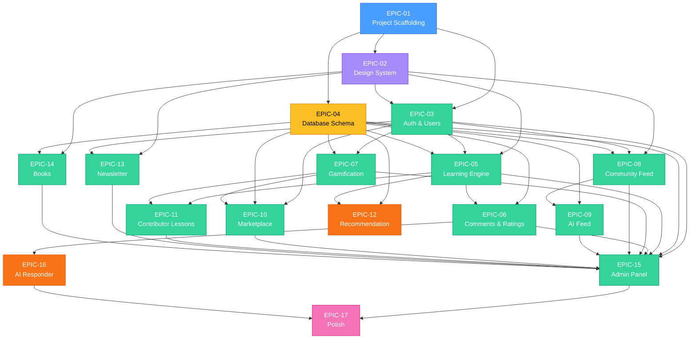

# AutomatikLabs — Epic Dependency Graph



## Legenda

| Cor | Tipo |
|---|---|
| Azul | Infra |
| Roxo | Frontend |
| Verde | Fullstack |
| Amarelo | Database |
| Laranja | Backend |
| Rosa | Polish |

## Caminho Critico

O caminho critico (longest dependency chain) e:

```
E01 → E04 → E05 → E06 → E16 → E17
E01 → E02 → E03 → E05 → E11 → E15 → E17
```

**Paralelismo maximo:** Fases 3 e 4 permitem ate 7 epics simultaneos com diferentes equipes.
