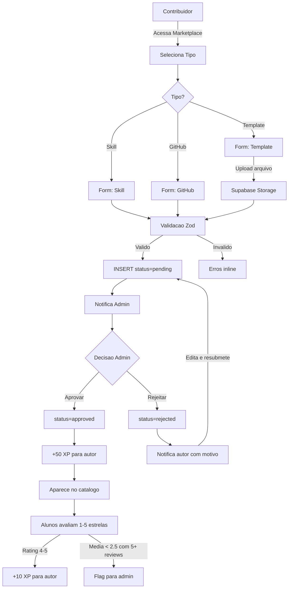

# AutomatikLabs — Marketplace de Contribuicoes

> **Versao:** 1.0.0
> **Data:** 2026-04-01
> **Status:** Aprovado
> **Autor:** Marketplace Specialist AutomatikLabs

---

## Sumario Executivo

O Marketplace e o hub de contribuicoes dos alunos da AutomatikLabs. Permite que membros compartilhem skills documentadas, projetos GitHub e templates downloadaveis, criando um ecossistema de valor gerado pela comunidade. Integrado ao sistema de gamificacao (+50 XP por upload aprovado, +10 XP por avaliacao positiva recebida).

---

## 1. Tipos de Item

### 1.1 Skill

Competencia documentada com evidencia pratica.

| Campo | Tipo | Obrigatorio | Descricao |
|-------|------|-------------|-----------|
| `title` | TEXT (3-200 chars) | Sim | Nome da skill (ex: "Prompt Engineering Avancado") |
| `description` | TEXT (10-5000 chars) | Sim | Descricao detalhada da competencia |
| `tags` | TEXT[] (1-10 tags) | Sim | Tags para categorizar (ex: ['ai', 'prompt', 'chatgpt']) |
| `evidence_type` | ENUM | Sim | 'link' ou 'text' |
| `evidence_url` | TEXT (URL) | Se evidence_type = 'link' | Link para portfolio, certificado, projeto |
| `evidence_text` | TEXT (10-2000 chars) | Se evidence_type = 'text' | Descricao textual da evidencia |

### 1.2 Projeto GitHub

Repositorio publico com codigo.

| Campo | Tipo | Obrigatorio | Descricao |
|-------|------|-------------|-----------|
| `title` | TEXT (3-200 chars) | Sim | Nome do projeto |
| `description` | TEXT (10-5000 chars) | Sim | O que o projeto faz e como usar |
| `repo_url` | TEXT (URL GitHub) | Sim | URL do repositorio publico |
| `tags` | TEXT[] (1-10 tags) | Sim | Tags de tecnologias e categorias |
| `languages` | TEXT[] | Auto-detectado | Linguagens do repo (via GitHub API) |
| `stars` | INTEGER | Auto-detectado | Estrelas do repo (via GitHub API, atualizado diariamente) |

### 1.3 Template

Arquivo ou recurso downloadable.

| Campo | Tipo | Obrigatorio | Descricao |
|-------|------|-------------|-----------|
| `title` | TEXT (3-200 chars) | Sim | Nome do template |
| `description` | TEXT (10-5000 chars) | Sim | O que e e como usar |
| `file_path` | TEXT | Sim | Path no Supabase Storage (upload pelo contribuidor) |
| `file_size` | INTEGER | Auto | Tamanho do arquivo em bytes |
| `file_type` | TEXT | Auto | MIME type do arquivo |
| `preview_url` | TEXT (URL) | Opcional | Link para preview (se aplicavel) |
| `tags` | TEXT[] (1-10 tags) | Sim | Tags de categorias |

**Formatos aceitos para upload:** `.zip`, `.pdf`, `.docx`, `.xlsx`, `.pptx`, `.fig`, `.sketch`, `.json`, `.csv`, `.txt`, `.md`
**Tamanho maximo:** 50MB por arquivo

---

## 2. Schema do Banco

### 2.1 Tabela Principal

```sql
CREATE TABLE marketplace_items (
  id UUID DEFAULT gen_random_uuid() PRIMARY KEY,
  author_id UUID NOT NULL REFERENCES profiles(id) ON DELETE CASCADE,
  type TEXT NOT NULL CHECK (type IN ('skill', 'github', 'template')),
  title TEXT NOT NULL CHECK (char_length(title) BETWEEN 3 AND 200),
  description TEXT NOT NULL CHECK (char_length(description) BETWEEN 10 AND 5000),
  tags TEXT[] NOT NULL DEFAULT '{}',
  status TEXT NOT NULL DEFAULT 'pending' CHECK (status IN ('pending', 'approved', 'rejected')),

  -- Campos tipo-especificos armazenados em JSONB
  metadata JSONB NOT NULL DEFAULT '{}',
  -- Skill:   { evidence_type, evidence_url?, evidence_text? }
  -- GitHub:  { repo_url, languages, stars }
  -- Template: { file_path, file_size, file_type, preview_url? }

  -- Moderacao
  reviewed_by UUID REFERENCES profiles(id),
  reviewed_at TIMESTAMPTZ,
  rejection_reason TEXT,

  -- Metricas agregadas (denormalizadas para performance)
  avg_rating NUMERIC(2,1) DEFAULT 0,
  rating_count INTEGER DEFAULT 0,
  view_count INTEGER DEFAULT 0,

  -- Full-text search
  search_vector TSVECTOR,

  created_at TIMESTAMPTZ DEFAULT now() NOT NULL,
  updated_at TIMESTAMPTZ DEFAULT now() NOT NULL
);

-- Indices
CREATE INDEX idx_marketplace_status ON marketplace_items(status);
CREATE INDEX idx_marketplace_type ON marketplace_items(type);
CREATE INDEX idx_marketplace_author ON marketplace_items(author_id);
CREATE INDEX idx_marketplace_rating ON marketplace_items(avg_rating DESC) WHERE status = 'approved';
CREATE INDEX idx_marketplace_created ON marketplace_items(created_at DESC) WHERE status = 'approved';
CREATE INDEX idx_marketplace_search ON marketplace_items USING GIN(search_vector);
CREATE INDEX idx_marketplace_tags ON marketplace_items USING GIN(tags);

-- RLS
ALTER TABLE marketplace_items ENABLE ROW LEVEL SECURITY;

-- Todos veem itens aprovados
CREATE POLICY "public_read_approved" ON marketplace_items
  FOR SELECT USING (status = 'approved');

-- Autor ve seus proprios itens (qualquer status)
CREATE POLICY "author_read_own" ON marketplace_items
  FOR SELECT USING (auth.uid() = author_id);

-- Autor pode inserir
CREATE POLICY "author_insert" ON marketplace_items
  FOR INSERT WITH CHECK (auth.uid() = author_id);

-- Autor pode editar itens pending/rejected
CREATE POLICY "author_update_own" ON marketplace_items
  FOR UPDATE USING (auth.uid() = author_id AND status IN ('pending', 'rejected'));
```

### 2.2 Full-Text Search

```sql
-- Trigger para manter search_vector atualizado
CREATE OR REPLACE FUNCTION marketplace_search_trigger() RETURNS trigger AS $$
BEGIN
  NEW.search_vector :=
    setweight(to_tsvector('portuguese', COALESCE(NEW.title, '')), 'A') ||
    setweight(to_tsvector('portuguese', COALESCE(NEW.description, '')), 'B') ||
    setweight(to_tsvector('portuguese', COALESCE(array_to_string(NEW.tags, ' '), '')), 'C');
  RETURN NEW;
END;
$$ LANGUAGE plpgsql;

CREATE TRIGGER trg_marketplace_search
  BEFORE INSERT OR UPDATE OF title, description, tags
  ON marketplace_items
  FOR EACH ROW
  EXECUTE FUNCTION marketplace_search_trigger();
```

### 2.3 Tabela de Avaliacoes

```sql
CREATE TABLE marketplace_reviews (
  id UUID DEFAULT gen_random_uuid() PRIMARY KEY,
  item_id UUID NOT NULL REFERENCES marketplace_items(id) ON DELETE CASCADE,
  reviewer_id UUID NOT NULL REFERENCES profiles(id) ON DELETE CASCADE,
  rating INTEGER NOT NULL CHECK (rating BETWEEN 1 AND 5),
  review_text TEXT CHECK (char_length(review_text) <= 2000),
  created_at TIMESTAMPTZ DEFAULT now() NOT NULL,
  updated_at TIMESTAMPTZ DEFAULT now() NOT NULL,

  -- 1 avaliacao por user por item
  CONSTRAINT unique_review UNIQUE (item_id, reviewer_id)
);

CREATE INDEX idx_reviews_item ON marketplace_reviews(item_id);
CREATE INDEX idx_reviews_reviewer ON marketplace_reviews(reviewer_id);

-- RLS
ALTER TABLE marketplace_reviews ENABLE ROW LEVEL SECURITY;

CREATE POLICY "public_read_reviews" ON marketplace_reviews
  FOR SELECT USING (true);

CREATE POLICY "user_insert_review" ON marketplace_reviews
  FOR INSERT WITH CHECK (auth.uid() = reviewer_id);

CREATE POLICY "user_update_own_review" ON marketplace_reviews
  FOR UPDATE USING (auth.uid() = reviewer_id);
```

### 2.4 Trigger de Atualizacao de Metricas

```sql
-- Atualiza avg_rating e rating_count no item ao inserir/atualizar review
CREATE OR REPLACE FUNCTION update_item_rating() RETURNS trigger AS $$
BEGIN
  UPDATE marketplace_items
  SET
    avg_rating = (
      SELECT ROUND(AVG(rating)::numeric, 1)
      FROM marketplace_reviews
      WHERE item_id = COALESCE(NEW.item_id, OLD.item_id)
    ),
    rating_count = (
      SELECT COUNT(*)
      FROM marketplace_reviews
      WHERE item_id = COALESCE(NEW.item_id, OLD.item_id)
    ),
    updated_at = now()
  WHERE id = COALESCE(NEW.item_id, OLD.item_id);

  RETURN COALESCE(NEW, OLD);
END;
$$ LANGUAGE plpgsql;

CREATE TRIGGER trg_update_item_rating
  AFTER INSERT OR UPDATE OR DELETE ON marketplace_reviews
  FOR EACH ROW
  EXECUTE FUNCTION update_item_rating();
```

---

## 3. Fluxo Completo

### 3.1 Submissao

```
1. Contribuidor acessa /marketplace → clica "Novo Item"
2. Seleciona tipo: Skill | Projeto GitHub | Template
3. Formulario especifico do tipo:
   - Skill: titulo, descricao, tags, tipo de evidencia, evidencia
   - GitHub: titulo, descricao, repo_url, tags
     → Backend valida se repo existe e e publico (GitHub API)
     → Auto-preenche languages e stars
   - Template: titulo, descricao, tags, upload de arquivo
     → Upload direto para Supabase Storage (bucket: marketplace-files)
     → Validacao: tipo de arquivo permitido, tamanho < 50MB
4. Validacao Zod no frontend E no backend
5. INSERT marketplace_items com status = 'pending'
6. Contribuidor ve card com badge "Pendente de Aprovacao"
```

### 3.2 Moderacao

```
1. Admin recebe notificacao (via gamification_notifications + email via Resend)
2. Acessa /admin/marketplace/pending
3. Ve lista de itens pendentes com preview
4. Para cada item, pode:
   a) APROVAR:
      → UPDATE status = 'approved', reviewed_by, reviewed_at
      → grantXP('marketplace_upload_approved', itemId) para o autor (+50 XP)
      → Notificacao para o autor: "Seu item foi aprovado!"
   b) REJEITAR:
      → UPDATE status = 'rejected', reviewed_by, reviewed_at, rejection_reason
      → Notificacao para o autor: "Seu item foi rejeitado: [motivo]"
      → Autor pode editar e resubmeter (status volta para 'pending')
```

### 3.3 Catalogo Publico

```
1. Itens aprovados aparecem em /marketplace
2. Exibidos como cards com:
   - Titulo, tipo (tag colorida), tags
   - Autor (avatar + nome + nivel)
   - Rating medio (estrelas) + numero de avaliacoes
   - Data de publicacao
3. Filtros disponiveis:
   - Tipo: Todos | Skill | GitHub | Template
   - Categoria: tags fixas (AI, Dev, Design, Marketing, Negocios, Outros)
   - Rating minimo: 1-5 estrelas
   - Ordenacao: Mais recentes | Mais bem avaliados | Mais vistos
4. Busca: full-text search no titulo e descricao
```

### 3.4 Avaliacao

```
1. Aluno abre pagina de detalhe do item
2. Pode avaliar: 1-5 estrelas + review textual (opcional, max 2000 chars)
3. 1 avaliacao por user por item (UNIQUE constraint)
4. Pode editar sua avaliacao depois
5. Se rating >= 4: autor ganha +10 XP
6. Se rating <= 2 E item tem media < 2.5 com 5+ reviews:
   → Flag automatico para revisao do admin
   → INSERT em admin_flags (item_id, reason: 'low_rating_threshold')
```

### 3.5 Diagrama de Fluxo



---

## 4. Categorias e Busca

### 4.1 Categorias Fixas

| Categoria | Slug | Descricao |
|-----------|------|-----------|
| Inteligencia Artificial | `ai` | Prompts, modelos, automacoes com IA |
| Desenvolvimento | `dev` | Codigo, APIs, ferramentas tecnicas |
| Design | `design` | UI/UX, templates visuais, Figma |
| Marketing | `marketing` | Copy, funnels, campanhas, ads |
| Negocios | `business` | Estrategia, vendas, operacoes |
| Produtividade | `productivity` | Workflows, automacoes, ferramentas |
| Dados | `data` | Analytics, dashboards, datasets |
| Outros | `other` | Tudo que nao se encaixa acima |

### 4.2 Tags Livres

- Contribuidor pode adicionar 1-10 tags livres ao item
- Tags sao normalizadas: lowercase, sem espacos extras, max 30 chars cada
- Tags populares aparecem como sugestao no formulario
- Filtro por tag via index GIN em `TEXT[]`

### 4.3 Busca Full-Text

```typescript
// src/features/marketplace/actions/search-items.ts

export async function searchMarketplace(params: {
  query?: string
  type?: 'skill' | 'github' | 'template'
  category?: string
  minRating?: number
  sortBy?: 'recent' | 'top_rated' | 'most_viewed'
  page?: number
  limit?: number
}) {
  const { query, type, category, minRating, sortBy = 'recent', page = 1, limit = 20 } = params

  let queryBuilder = supabase
    .from('marketplace_items')
    .select('*, profiles!author_id(display_name, avatar_url)')
    .eq('status', 'approved')

  if (query) {
    // Full-text search com ranking
    queryBuilder = queryBuilder.textSearch('search_vector', query, {
      type: 'websearch',
      config: 'portuguese',
    })
  }

  if (type) queryBuilder = queryBuilder.eq('type', type)
  if (category) queryBuilder = queryBuilder.contains('tags', [category])
  if (minRating) queryBuilder = queryBuilder.gte('avg_rating', minRating)

  // Ordenacao
  switch (sortBy) {
    case 'recent':
      queryBuilder = queryBuilder.order('created_at', { ascending: false })
      break
    case 'top_rated':
      queryBuilder = queryBuilder.order('avg_rating', { ascending: false })
      break
    case 'most_viewed':
      queryBuilder = queryBuilder.order('view_count', { ascending: false })
      break
  }

  // Paginacao
  const from = (page - 1) * limit
  queryBuilder = queryBuilder.range(from, from + limit - 1)

  return queryBuilder
}
```

---

## 5. Sistema de Avaliacao

### 5.1 Regras

| Regra | Implementacao |
|-------|--------------|
| 1 avaliacao por user por item | UNIQUE constraint `(item_id, reviewer_id)` |
| Rating 1-5 estrelas | CHECK constraint `rating BETWEEN 1 AND 5` |
| Review textual opcional | Max 2000 caracteres |
| Edicao permitida | User pode atualizar rating e review |
| Autor nao pode se auto-avaliar | Validacao no backend: `reviewer_id != item.author_id` |
| Rating 4-5 gera XP para autor | +10 XP via `grantXP('marketplace_positive_review', itemId)` |
| Flag de baixa qualidade | Media < 2.5 com 5+ reviews → flag para admin |

### 5.2 Zod Schema

```typescript
// src/features/marketplace/schemas.ts

import { z } from 'zod'

export const createSkillSchema = z.object({
  type: z.literal('skill'),
  title: z.string().min(3).max(200),
  description: z.string().min(10).max(5000),
  tags: z.array(z.string().max(30)).min(1).max(10),
  evidence_type: z.enum(['link', 'text']),
  evidence_url: z.string().url().optional(),
  evidence_text: z.string().min(10).max(2000).optional(),
}).refine(
  data => data.evidence_type === 'link' ? !!data.evidence_url : !!data.evidence_text,
  { message: 'Evidencia obrigatoria conforme o tipo selecionado' }
)

export const createGithubSchema = z.object({
  type: z.literal('github'),
  title: z.string().min(3).max(200),
  description: z.string().min(10).max(5000),
  tags: z.array(z.string().max(30)).min(1).max(10),
  repo_url: z.string().url().regex(/^https:\/\/github\.com\/[\w-]+\/[\w.-]+$/),
})

export const createTemplateSchema = z.object({
  type: z.literal('template'),
  title: z.string().min(3).max(200),
  description: z.string().min(10).max(5000),
  tags: z.array(z.string().max(30)).min(1).max(10),
  preview_url: z.string().url().optional(),
  // file upload handled separately via multipart
})

export const createItemSchema = z.discriminatedUnion('type', [
  createSkillSchema,
  createGithubSchema,
  createTemplateSchema,
])

export const reviewSchema = z.object({
  item_id: z.string().uuid(),
  rating: z.number().int().min(1).max(5),
  review_text: z.string().max(2000).optional(),
})
```

### 5.3 Exibicao de Rating

Cada card de item no catalogo exibe:

```
┌──────────────────────────────────┐
│  📤 Template                     │  ← tag de tipo colorida
│                                  │
│  "Prompt Pack - 50 prompts       │
│   para ChatGPT"                  │
│                                  │
│  ⭐⭐⭐⭐☆ 4.2 (18 avaliacoes)   │  ← rating medio
│                                  │
│  👤 @joao · 🔬 Especialista      │  ← autor + nivel
│  📅 15 Mar 2026                  │  ← data
│                                  │
│  #ai #prompt #chatgpt            │  ← tags
└──────────────────────────────────┘
```

---

## 6. Perfil de Contribuidor

### 6.1 Secao no Perfil do Aluno

Cada aluno tem uma secao "Marketplace" no seu perfil publico:

```
┌─────────────────────────────────────────────┐
│  🏪 Marketplace                              │
│                                              │
│  📊 Resumo                                   │
│  ├── Itens submetidos: 8                     │
│  ├── Itens aprovados: 6                      │
│  ├── Taxa de aprovacao: 75%                  │
│  ├── Media de rating: 4.3 ⭐                 │
│  ├── Total de avaliacoes: 42                 │
│  └── XP ganho pelo marketplace: 480          │
│                                              │
│  📦 Itens Aprovados                          │
│  ┌──────────┐ ┌──────────┐ ┌──────────┐     │
│  │ Skill    │ │ GitHub   │ │ Template │     │
│  │ 4.5 ⭐   │ │ 4.0 ⭐   │ │ 4.8 ⭐   │     │
│  └──────────┘ └──────────┘ └──────────┘     │
└─────────────────────────────────────────────┘
```

### 6.2 Query para Stats do Contribuidor

```sql
SELECT
  COUNT(*) FILTER (WHERE status = 'pending') AS pending_count,
  COUNT(*) FILTER (WHERE status = 'approved') AS approved_count,
  COUNT(*) FILTER (WHERE status = 'rejected') AS rejected_count,
  ROUND(AVG(avg_rating) FILTER (WHERE status = 'approved'), 1) AS overall_avg_rating,
  SUM(rating_count) FILTER (WHERE status = 'approved') AS total_reviews_received
FROM marketplace_items
WHERE author_id = $1;
```

---

## 7. Moderacao e Qualidade

### 7.1 Dashboard Admin

```
/admin/marketplace/pending → Lista de itens pendentes
/admin/marketplace/flagged → Itens com flag de baixa qualidade
/admin/marketplace/all     → Todos os itens (filtros por status/tipo)
```

### 7.2 Regras de Flag Automatico

| Condicao | Acao |
|----------|------|
| Item com media < 2.5 e 5+ reviews | Flag para revisao. Admin pode remover do catalogo |
| 3+ reviews reportados como "spam" ou "ofensivo" | Flag para revisao |
| Repo GitHub retorna 404 (check diario via pg_cron) | Flag + notificacao ao autor |
| Arquivo do template deletado do Storage | Flag + notificacao ao autor |

### 7.3 Check Diario de Links Mortos (GitHub)

```sql
-- pg_cron job diario: verifica se repos GitHub ainda existem
-- Implementado como Supabase Edge Function chamada via pg_cron

SELECT cron.schedule(
  'check_github_repos',
  '0 6 * * *', -- 06:00 UTC diariamente
  $$SELECT net.http_post(
    url := 'https://<project>.supabase.co/functions/v1/check-marketplace-links',
    headers := '{"Authorization": "Bearer <service_role_key>"}'::jsonb
  );$$
);
```

---

## 8. Supabase Storage — Bucket de Templates

### 8.1 Configuracao do Bucket

```sql
-- Bucket para arquivos de template do marketplace
INSERT INTO storage.buckets (id, name, public, file_size_limit, allowed_mime_types)
VALUES (
  'marketplace-files',
  'marketplace-files',
  false,  -- nao-publico, acesso via signed URLs
  52428800,  -- 50MB
  ARRAY[
    'application/zip',
    'application/pdf',
    'application/vnd.openxmlformats-officedocument.wordprocessingml.document',
    'application/vnd.openxmlformats-officedocument.spreadsheetml.sheet',
    'application/vnd.openxmlformats-officedocument.presentationml.presentation',
    'application/json',
    'text/csv',
    'text/plain',
    'text/markdown'
  ]
);
```

### 8.2 Policies de Storage

```sql
-- Autor pode fazer upload para sua pasta
CREATE POLICY "author_upload" ON storage.objects
  FOR INSERT WITH CHECK (
    bucket_id = 'marketplace-files' AND
    (storage.foldername(name))[1] = auth.uid()::text
  );

-- Qualquer user logado pode baixar arquivos de itens aprovados
-- (validado via API route que gera signed URL apos verificar status = 'approved')
```

### 8.3 Fluxo de Download

```
1. Aluno clica "Download" no card do template
2. Frontend chama API: POST /api/marketplace/download
3. Backend:
   a) Verifica se item existe e status = 'approved'
   b) Incrementa view_count
   c) Gera signed URL (valido por 5 minutos)
   d) Retorna URL
4. Frontend redireciona para signed URL → download inicia
```

---

## 9. Integracao com Gamificacao

| Evento no Marketplace | Acao na Gamificacao |
|----------------------|---------------------|
| Item aprovado pelo admin | +50 XP para o autor (`marketplace_upload_approved`) |
| Review 4-5 estrelas recebida | +10 XP para o autor (`marketplace_positive_review`) |
| Primeiro upload aprovado | Badge `first_upload` para o autor |
| 5 uploads aprovados | Badge `five_uploads` para o autor |
| 10 reviews recebidas | Badge `ten_reviews_received` para o autor |

---

## 10. Estrutura de Feature Module

```
src/features/marketplace/
├── actions/
│   ├── create-item.ts         # Server Action: cria item (tipo-especifico)
│   ├── search-items.ts        # Busca e filtros
│   ├── get-item.ts            # Detalhe do item
│   ├── review-item.ts         # Submeter avaliacao
│   ├── approve-item.ts        # Admin: aprovar
│   ├── reject-item.ts         # Admin: rejeitar
│   └── download-template.ts   # Gerar signed URL
├── components/
│   ├── item-card.tsx           # Card no catalogo
│   ├── item-detail.tsx         # Pagina de detalhe
│   ├── item-form.tsx           # Formulario de submissao (multi-step)
│   ├── skill-form.tsx          # Campos especificos de Skill
│   ├── github-form.tsx         # Campos especificos de GitHub
│   ├── template-form.tsx       # Campos especificos de Template + upload
│   ├── review-form.tsx         # Formulario de avaliacao
│   ├── review-list.tsx         # Lista de avaliacoes de um item
│   ├── marketplace-filters.tsx # Sidebar de filtros
│   ├── marketplace-search.tsx  # Barra de busca
│   └── contributor-stats.tsx   # Stats no perfil do aluno
├── hooks/
│   ├── use-marketplace.ts      # Hook para listagem e filtros
│   └── use-item-detail.ts
├── schemas.ts                   # Zod schemas (todos os tipos)
├── services/
│   └── github-service.ts       # Validacao de repo via GitHub API
└── types.ts
```

---

## 11. API Routes

| Rota | Metodo | Descricao | Auth |
|------|--------|-----------|------|
| `/api/marketplace` | GET | Listar itens aprovados (com filtros, busca, paginacao) | Publico (logado) |
| `/api/marketplace` | POST | Criar item (Server Action preferido) | User logado |
| `/api/marketplace/[id]` | GET | Detalhe de um item | Publico (logado) |
| `/api/marketplace/[id]/review` | POST | Submeter avaliacao | User logado |
| `/api/marketplace/[id]/download` | POST | Gerar signed URL de download | User logado |
| `/api/admin/marketplace/pending` | GET | Listar itens pendentes | Admin |
| `/api/admin/marketplace/[id]/approve` | POST | Aprovar item | Admin |
| `/api/admin/marketplace/[id]/reject` | POST | Rejeitar item (com motivo) | Admin |

---

## 12. Metricas e Monitoramento

| Metrica | Descricao | Uso |
|---------|-----------|-----|
| Itens submetidos/semana | Volume de contribuicoes | Saude do ecossistema |
| Taxa de aprovacao | % de itens aprovados vs rejeitados | Qualidade do conteudo |
| Tempo medio de review | Tempo entre submissao e decisao do admin | SLA de moderacao |
| Rating medio global | Media de todas avaliacoes | Qualidade geral |
| Downloads/semana (templates) | Volume de downloads | Utilidade do conteudo |
| Top contribuidores | Users com mais itens aprovados | Reconhecimento |
| Itens flaggados/semana | Volume de flags automaticos | Problemas de qualidade |
