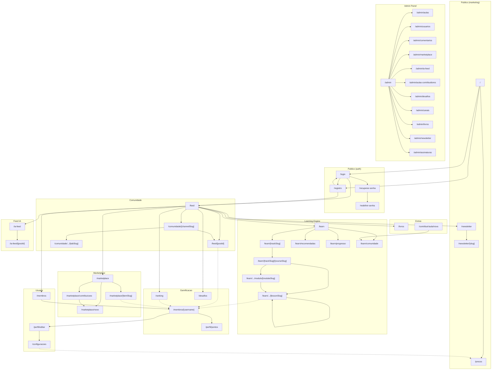

# AutomatikLabs — Mapa Completo de Telas

> **Versao:** 1.0.0
> **Data:** 2026-04-01
> **Status:** Draft
> **Autor:** Arquiteto de Informacao

---

## Sumario

Este documento mapeia **todas as telas** da plataforma AutomatikLabs, organizadas por dominio. Para cada tela: URL, componentes, navegacao, dados, acoes, permissoes e nivel de assinatura.

**Convencoes de leitura:**
- **Roles:** `aluno` | `contribuidor` | `moderador` | `admin`
- **Niveis:** `free` | `pro` | `premium`
- **Layout zones:** `(auth)` = layout minimo | `(marketing)` = layout publico | `(platform)` = tri-panel Circle.so | `admin` = admin panel

---

## 1. LEARNING ENGINE

### 1.1 Catalogo de Trilhas de Estudo

| Campo | Valor |
|---|---|
| **URL** | `/learn` |
| **Layout** | `(platform)` — tri-panel |
| **Componentes** | `TrackGrid`, `TrackCard` (thumbnail, titulo, num. cursos, progresso %), `SearchBar`, `FilterTabs` (por nivel, categoria), `ProgressSummaryBanner` |
| **Navegacao de entrada** | Sidebar esquerda (link "Aprender"), Header, qualquer redirect pos-login |
| **Navegacao de saida** | `TrackCard` → `/learn/[trackSlug]`, busca → filtra in-place |
| **Dados necessarios** | `tracks` (id, title, slug, description, thumbnail_url, category, difficulty), `user_track_progress` (aggregated % per track), `courses` count per track |
| **Acoes** | Buscar, filtrar por categoria/nivel, clicar em trilha |
| **Permissoes** | `aluno`, `contribuidor`, `moderador`, `admin` |
| **Assinatura minima** | `free` (todas as trilhas visiveis; conteudo interno pode ser restrito) |

### 1.2 Listagem de Cursos (dentro de uma trilha)

| Campo | Valor |
|---|---|
| **URL** | `/learn/[trackSlug]` |
| **Layout** | `(platform)` — tri-panel |
| **Componentes** | `TrackHeader` (titulo, descricao, progresso geral), `CourseList`, `CourseCard` (thumbnail, titulo, duracao, num. modulos, progresso %, badge de nivel de assinatura), `BreadcrumbNav` |
| **Navegacao de entrada** | `/learn` (TrackCard click) |
| **Navegacao de saida** | `CourseCard` → `/learn/[trackSlug]/[courseSlug]`, breadcrumb → `/learn` |
| **Dados necessarios** | `tracks` (by slug), `courses` (filtered by track_id, ordered by position), `user_course_progress` (per course) |
| **Acoes** | Clicar em curso, voltar para catalogo |
| **Permissoes** | `aluno`, `contribuidor`, `moderador`, `admin` |
| **Assinatura minima** | `free` (listagem visivel; cursos pro/premium mostram badge de lock) |

### 1.3 Visao do Curso (modulos + progresso)

| Campo | Valor |
|---|---|
| **URL** | `/learn/[trackSlug]/[courseSlug]` |
| **Layout** | `(platform)` — tri-panel |
| **Componentes** | `CourseHeader` (titulo, descricao, instrutor, duracao total), `ProgressBar` (geral), `ModuleAccordion` (lista de modulos expandiveis com aulas), `CurriculumSidebar` (panel direito), `EnrollButton` / `ContinueButton`, `BreadcrumbNav` |
| **Navegacao de entrada** | `/learn/[trackSlug]` (CourseCard click) |
| **Navegacao de saida** | `ModuleAccordion` aula click → `/learn/[trackSlug]/[courseSlug]/[lessonSlug]`, `ContinueButton` → proxima aula nao completa, breadcrumb → `/learn/[trackSlug]` |
| **Dados necessarios** | `courses` (by slug), `modules` (by course_id, ordered), `lessons` (by module_id, ordered), `user_lesson_progress` (per lesson), `user_profiles` (instrutor) |
| **Acoes** | Iniciar/continuar curso, expandir modulo, clicar em aula, ver progresso |
| **Permissoes** | `aluno`, `contribuidor`, `moderador`, `admin` |
| **Assinatura minima** | Depende do curso: `free`, `pro`, ou `premium`. Cursos acima do nivel mostram paywall com CTA de upgrade |

### 1.4 Visao do Modulo (aulas sequenciais)

| Campo | Valor |
|---|---|
| **URL** | `/learn/[trackSlug]/[courseSlug]/modulo/[moduleSlug]` |
| **Layout** | `(platform)` — tri-panel |
| **Componentes** | `ModuleHeader` (titulo, descricao, progresso), `LessonList` (sequencial, com status: completa/em andamento/bloqueada), `BreadcrumbNav` |
| **Navegacao de entrada** | `/learn/[trackSlug]/[courseSlug]` (click no modulo) |
| **Navegacao de saida** | `LessonList` item → `/learn/[trackSlug]/[courseSlug]/[lessonSlug]`, breadcrumb → curso |
| **Dados necessarios** | `modules` (by slug), `lessons` (by module_id, ordered by position), `user_lesson_progress` |
| **Acoes** | Clicar em aula, ver progresso do modulo |
| **Permissoes** | `aluno`, `contribuidor`, `moderador`, `admin` |
| **Assinatura minima** | Herda do curso pai |

### 1.5 Player de Aula

| Campo | Valor |
|---|---|
| **URL** | `/learn/[trackSlug]/[courseSlug]/[lessonSlug]` |
| **Layout** | `(platform)` — tri-panel (sidebar direita = curriculum navigation) |
| **Componentes** | `LessonPlayer` (video embed — YouTube/Vimeo URL ou player nativo), `LessonContent` (markdown renderizado), `StarRating` (1-5 estrelas), `CommentThread` (thread de comentarios da aula), `CurriculumSidebar` (panel direito — navegacao entre aulas), `NextLessonButton`, `PrevLessonButton`, `MarkCompleteButton`, `BreadcrumbNav` |
| **Navegacao de entrada** | Curso overview (aula click), modulo overview (aula click), `NextLessonButton` da aula anterior, recomendacoes, busca |
| **Navegacao de saida** | `NextLessonButton` → proxima aula, `PrevLessonButton` → aula anterior, `CurriculumSidebar` → qualquer aula do curso, breadcrumb → curso/modulo |
| **Dados necessarios** | `lessons` (by slug — video_url, content_md, duration, position), `modules` + `courses` (para breadcrumb e sidebar), `user_lesson_progress` (status, rating), `comments` (filtered by lesson_id, com author info), `user_profiles` (autores dos comentarios) |
| **Acoes** | Assistir video, ler conteudo, marcar como completa, avaliar (1-5 estrelas), comentar, responder comentario, navegar entre aulas |
| **Permissoes** | `aluno`, `contribuidor`, `moderador`, `admin` |
| **Assinatura minima** | Herda do curso pai. Aula bloqueada mostra preview + paywall |

### 1.6 Aulas Recomendadas

| Campo | Valor |
|---|---|
| **URL** | `/learn/recomendadas` |
| **Layout** | `(platform)` — tri-panel |
| **Componentes** | `RecommendationGrid`, `LessonCard` (com motivo da recomendacao), `RefreshButton`, `FilterTabs` (por trilha, dificuldade) |
| **Navegacao de entrada** | Sidebar esquerda, dashboard do aluno, notificacoes |
| **Navegacao de saida** | `LessonCard` → `/learn/[trackSlug]/[courseSlug]/[lessonSlug]` |
| **Dados necessarios** | pgvector similarity search em `lesson_embeddings` cruzando com `user_lesson_progress`, `user_interests`, historico de consumo |
| **Acoes** | Ver recomendacoes, filtrar, clicar em aula recomendada |
| **Permissoes** | `aluno`, `contribuidor`, `moderador`, `admin` |
| **Assinatura minima** | `free` (recomendacoes podem incluir conteudo pro/premium com badge de lock) |

### 1.7 Meu Progresso (Dashboard do Aluno)

| Campo | Valor |
|---|---|
| **URL** | `/learn/progresso` |
| **Layout** | `(platform)` — tri-panel |
| **Componentes** | `ProgressDashboard`, `OverallStats` (aulas completas, horas assistidas, streak), `TrackProgressList` (por trilha), `CourseProgressList` (por curso), `RecentActivityFeed`, `StreakCalendar`, `XPBadge` |
| **Navegacao de entrada** | Sidebar esquerda, header (avatar dropdown), perfil |
| **Navegacao de saida** | Qualquer curso/trilha listada → pagina respectiva, aula do recent activity → player |
| **Dados necessarios** | `user_lesson_progress` (aggregated), `user_course_progress`, `user_track_progress`, `user_xp` (pontos, streak), `badges` (earned) |
| **Acoes** | Visualizar progresso, clicar para retomar curso/trilha |
| **Permissoes** | `aluno`, `contribuidor`, `moderador`, `admin` |
| **Assinatura minima** | `free` |

---

## 2. COMENTARIOS + IA

### 2.1 Thread de Comentarios (dentro de cada aula)

| Campo | Valor |
|---|---|
| **URL** | Embutida em `/learn/[trackSlug]/[courseSlug]/[lessonSlug]` (secao inferior) |
| **Layout** | Componente dentro do Player de Aula |
| **Componentes** | `CommentThread`, `CommentComposer` (input + submit), `CommentItem` (avatar, nome, data, conteudo, badge IA/Humano), `ReplyButton`, `LikeButton`, `FlagButton`, `AIBadge` ("Respondido por IA"), `HumanBadge` ("Respondido por Humano") |
| **Navegacao de entrada** | Scroll down no player de aula |
| **Navegacao de saida** | Click em autor → `/membros/[username]` |
| **Dados necessarios** | `comments` (lesson_id, author_id, content, parent_id for threading, is_ai_response, created_at), `user_profiles` (author info) |
| **Acoes** | Criar comentario, responder, curtir, denunciar, visualizar badge IA vs Humano |
| **Permissoes** | `aluno` (ler + escrever), `contribuidor` (idem), `moderador` (+ deletar/moderar), `admin` (full) |
| **Assinatura minima** | `free` (leitura), `free` (escrita — todos podem comentar) |

### 2.2 Painel Admin — Moderacao de Comentarios

| Campo | Valor |
|---|---|
| **URL** | `/admin/comentarios` |
| **Layout** | `admin` |
| **Componentes** | `CommentModerationTable` (lista com filtros), `StatusFilter` (pendente, aprovado, rejeitado, flagged), `CommentPreview` (preview do comentario no contexto da aula), `BulkActions` (aprovar, rejeitar, deletar em massa), `AIResponseToggle` (ativar/desativar IA para aula especifica) |
| **Navegacao de entrada** | Admin sidebar → "Comentarios" |
| **Navegacao de saida** | Click na aula → player da aula, click no autor → perfil |
| **Dados necessarios** | `comments` (all, com status de moderacao), `lessons` (titulo para contexto), `user_profiles` (autores), `ai_comment_config` (settings per lesson) |
| **Acoes** | Aprovar, rejeitar, deletar comentario, responder como admin, toggle IA autoresponder por aula, bulk moderation |
| **Permissoes** | `moderador`, `admin` |
| **Assinatura minima** | N/A (role-based, nao tier-based) |

### 2.3 API — IA Auto-responder

| Campo | Valor |
|---|---|
| **URL** | `POST /api/comments/ai-respond` (Route Handler, nao tela) |
| **Componentes** | N/A (backend) — resultado aparece como `CommentItem` com `AIBadge` no thread |
| **Dados necessarios** | Contexto da aula (content_md, video transcript), comentario original, historico do thread, Claude API |
| **Acoes** | Triggered automaticamente por novo comentario (se IA habilitada para a aula) ou manualmente pelo admin |
| **Permissoes** | System (Edge Function / Server Action) |

---

## 3. GAMIFICACAO + RANKING

### 3.1 Ranking Global (Leaderboard)

| Campo | Valor |
|---|---|
| **URL** | `/ranking` |
| **Layout** | `(platform)` — tri-panel |
| **Componentes** | `LeaderboardTable` (posicao, avatar, nome, XP total, badges count, streak), `PodiumTop3` (destaque visual para top 3), `TimeFilter` (semanal, mensal, all-time), `CategoryFilter` (geral, por trilha), `MyPositionHighlight` (destaca posicao do usuario logado) |
| **Navegacao de entrada** | Sidebar esquerda → "Ranking", perfil do aluno, notificacoes de ranking |
| **Navegacao de saida** | Click em membro → `/membros/[username]`, click em trilha → `/learn/[trackSlug]` |
| **Dados necessarios** | `user_xp` (aggregated, sorted), `user_profiles`, `badges` (count per user), `user_streaks` |
| **Acoes** | Filtrar por periodo/categoria, visualizar ranking, clicar em perfil de membro |
| **Permissoes** | `aluno`, `contribuidor`, `moderador`, `admin` |
| **Assinatura minima** | `free` |

### 3.2 Perfil do Aluno (Pontuacao + Badges)

| Campo | Valor |
|---|---|
| **URL** | `/membros/[username]` |
| **Layout** | `(platform)` — tri-panel |
| **Componentes** | `ProfileHeader` (avatar, nome, bio, stats), `XPDisplay` (total, nivel), `BadgeGrid` (badges conquistados), `ProgressSummary` (cursos completos, trilhas em andamento), `ActivityFeed` (acoes recentes), `StreakDisplay`, `SocialLinks` (Instagram, portfolio), `ContributionsList` (se contribuidor) |
| **Navegacao de entrada** | Leaderboard (click no membro), comentarios (click no autor), feed (click no autor), membros list |
| **Navegacao de saida** | Curso/trilha no progresso → pagina respectiva, badge → detalhes do badge (modal), social links → externo |
| **Dados necessarios** | `user_profiles` (by username), `user_xp`, `badges` + `user_badges` (earned), `user_course_progress`, `user_track_progress`, `marketplace_items` (se contribuidor), `posts` (recent activity) |
| **Acoes** | Visualizar perfil, ver badges (modal com detalhes), seguir links sociais |
| **Permissoes** | `aluno`, `contribuidor`, `moderador`, `admin` (perfil publico para todos logados) |
| **Assinatura minima** | `free` |

### 3.3 Area de Desafios

| Campo | Valor |
|---|---|
| **URL** | `/desafios` |
| **Layout** | `(platform)` — tri-panel |
| **Componentes** | `ChallengeGrid`, `ChallengeCard` (titulo, descricao, prazo, XP reward, dificuldade, status: aberto/encerrado/em andamento), `StatusFilter` (ativos, encerrados, meus), `ChallengeDetail` (modal ou drawer com criterios completos), `SubmitButton`, `MySubmissionsList` |
| **Navegacao de entrada** | Sidebar esquerda → "Desafios", notificacoes, ranking |
| **Navegacao de saida** | `ChallengeCard` → modal de detalhes, submit → form de submissao |
| **Dados necessarios** | `challenges` (title, description, criteria, deadline, xp_reward, difficulty, status), `user_challenge_submissions` (per user), `challenge_results` (winners) |
| **Acoes** | Ver desafios, filtrar, submeter resposta, ver proprias submissoes |
| **Permissoes** | `aluno`, `contribuidor`, `moderador`, `admin` |
| **Assinatura minima** | `free` (desafios basicos), `pro`/`premium` (desafios avancados — definido per challenge) |

### 3.4 Historico de Pontos

| Campo | Valor |
|---|---|
| **URL** | `/perfil/pontos` (ou tab dentro de `/learn/progresso`) |
| **Layout** | `(platform)` — tri-panel |
| **Componentes** | `PointsTimeline` (lista cronologica de ganhos de XP), `PointsChart` (grafico de evolucao), `SourceBreakdown` (donut chart: aulas, desafios, comentarios, marketplace), `DateFilter` |
| **Navegacao de entrada** | Perfil do aluno, dashboard de progresso |
| **Navegacao de saida** | Item do timeline → aula/desafio/post que gerou os pontos |
| **Dados necessarios** | `xp_transactions` (user_id, amount, source_type, source_id, created_at) |
| **Acoes** | Filtrar por periodo, ver detalhes de cada transacao de pontos |
| **Permissoes** | `aluno`, `contribuidor`, `moderador`, `admin` (proprio historico) |
| **Assinatura minima** | `free` |

---

## 4. MARKETPLACE

### 4.1 Catalogo do Marketplace

| Campo | Valor |
|---|---|
| **URL** | `/marketplace` |
| **Layout** | `(platform)` — tri-panel |
| **Componentes** | `MarketplaceGrid`, `ItemCard` (thumbnail, titulo, tipo badge, autor, rating, preco/gratis), `FilterSidebar` (tipo: Skills/Projetos GitHub/Templates, categoria, preco, rating), `SearchBar`, `SortDropdown` (mais recentes, mais populares, melhor avaliados) |
| **Navegacao de entrada** | Sidebar esquerda → "Marketplace" |
| **Navegacao de saida** | `ItemCard` → `/marketplace/[itemSlug]`, autor click → `/membros/[username]` |
| **Dados necessarios** | `marketplace_items` (id, title, slug, type, description, thumbnail_url, price, author_id, avg_rating, download_count, status: approved), `user_profiles` (author) |
| **Acoes** | Buscar, filtrar, ordenar, clicar em item |
| **Permissoes** | `aluno`, `contribuidor`, `moderador`, `admin` |
| **Assinatura minima** | `free` (catalogo visivel), itens individuais podem requerer `pro`/`premium` |

### 4.2 Pagina do Item

| Campo | Valor |
|---|---|
| **URL** | `/marketplace/[itemSlug]` |
| **Layout** | `(platform)` — tri-panel |
| **Componentes** | `ItemHeader` (titulo, tipo, autor, rating), `ItemDescription` (markdown), `ScreenshotGallery`, `ReviewList` (avaliacoes de quem baixou), `ReviewComposer`, `DownloadButton` / `ExternalLinkButton` (GitHub), `RelatedItems`, `BreadcrumbNav` |
| **Navegacao de entrada** | `/marketplace` (card click), perfil do contribuidor |
| **Navegacao de saida** | Download (file), link externo (GitHub), autor → `/membros/[username]`, related items → `/marketplace/[itemSlug]`, breadcrumb → `/marketplace` |
| **Dados necessarios** | `marketplace_items` (by slug, com full description), `marketplace_reviews` (item_id), `user_profiles` (author + reviewers), `marketplace_items` (related, by type/category) |
| **Acoes** | Download/acessar, avaliar, escrever review |
| **Permissoes** | `aluno` (download + review), `contribuidor` (idem), `moderador` (+ moderar reviews), `admin` (full) |
| **Assinatura minima** | Depende do item: `free`, `pro`, ou `premium` |

### 4.3 Upload de Item (Contribuidores)

| Campo | Valor |
|---|---|
| **URL** | `/marketplace/novo` |
| **Layout** | `(platform)` — tri-panel |
| **Componentes** | `ItemUploadForm` (titulo, tipo dropdown, descricao markdown editor, tags, thumbnail upload, file upload ou GitHub URL, preco), `MarkdownPreview`, `SubmitForReviewButton` |
| **Navegacao de entrada** | `/marketplace` (botao "Contribuir"), perfil → minhas contribuicoes |
| **Navegacao de saida** | Submit → `/marketplace/contribuicoes` (com status "Pendente"), cancelar → `/marketplace` |
| **Dados necessarios** | `marketplace_categories`, `tags`, Supabase Storage (upload) |
| **Acoes** | Preencher form, upload files, preview markdown, submit para revisao |
| **Permissoes** | `contribuidor`, `moderador`, `admin` |
| **Assinatura minima** | `pro` (contribuidor precisa ser pelo menos pro) |

### 4.4 Minhas Contribuicoes (Dashboard do Contribuidor)

| Campo | Valor |
|---|---|
| **URL** | `/marketplace/contribuicoes` |
| **Layout** | `(platform)` — tri-panel |
| **Componentes** | `ContributionsList` (meus itens com status: pendente/aprovado/rejeitado), `StatsCards` (downloads totais, rating medio, XP ganho), `StatusBadge`, `EditButton`, `ItemPreview` |
| **Navegacao de entrada** | Perfil, marketplace (botao "Minhas Contribuicoes") |
| **Navegacao de saida** | Item → `/marketplace/[itemSlug]`, editar → `/marketplace/[itemSlug]/editar`, novo → `/marketplace/novo` |
| **Dados necessarios** | `marketplace_items` (where author_id = current_user), `marketplace_reviews` (aggregated per item), `xp_transactions` (from marketplace) |
| **Acoes** | Ver status, editar item, ver estatisticas, submeter novo |
| **Permissoes** | `contribuidor`, `moderador`, `admin` |
| **Assinatura minima** | `pro` |

---

## 5. FEED DA COMUNIDADE (estilo Circle.so)

### 5.1 Feed Principal

| Campo | Valor |
|---|---|
| **URL** | `/feed` |
| **Layout** | `(platform)` — tri-panel (sidebar esquerda = canais, centro = feed, direita = membros online / trending) |
| **Componentes** | `PostFeed` (infinite scroll), `PostCard` (autor, conteudo, imagens, likes, comentarios count, timestamp), `PostComposer` (floating ou topo), `ChannelSidebar` (panel esquerdo — lista de canais), `TrendingSidebar` (panel direito — trending posts, membros online via Supabase Realtime Presence), `FilterTabs` (Recentes, Populares, Seguindo) |
| **Navegacao de entrada** | Login redirect default, sidebar esquerda → "Feed", notificacoes |
| **Navegacao de saida** | Post click → `/feed/[postId]`, canal click → `/comunidade/[channelSlug]`, autor click → `/membros/[username]` |
| **Dados necessarios** | `posts` (with author, channel, likes_count, comments_count — paginated), `user_profiles`, `channels` (for sidebar), `presence` (Supabase Realtime) |
| **Acoes** | Criar post, curtir, comentar (inline), filtrar, scroll infinito |
| **Permissoes** | `aluno`, `contribuidor`, `moderador`, `admin` |
| **Assinatura minima** | `free` |

### 5.2 Canais (Spaces)

| Campo | Valor |
|---|---|
| **URL** | `/comunidade/[channelSlug]` |
| **Layout** | `(platform)` — tri-panel |
| **Componentes** | `ChannelHeader` (nome, descricao, membro count, imagem), `ChannelTabs` (abas customizaveis: Discussao, Recursos, Eventos, etc.), `PostFeed` (filtrado por canal), `PostComposer`, `MemberList` (panel direito), `PinnedPosts` |
| **Navegacao de entrada** | Feed (sidebar de canais), link direto, notificacao |
| **Navegacao de saida** | Post → `/feed/[postId]`, membro → `/membros/[username]`, tab → conteudo da aba |
| **Dados necessarios** | `channels` (by slug), `channel_tabs` (per channel), `posts` (filtered by channel_id), `channel_members`, `user_profiles` |
| **Acoes** | Publicar post, curtir, comentar, navegar abas, ver membros |
| **Permissoes** | `aluno`, `contribuidor`, `moderador`, `admin` (canais podem ter restricao de role) |
| **Assinatura minima** | `free` (canais basicos), `pro`/`premium` (canais exclusivos — definido per channel) |

### 5.3 Abas dentro de Canais

| Campo | Valor |
|---|---|
| **URL** | `/comunidade/[channelSlug]/[tabSlug]` |
| **Layout** | `(platform)` — tri-panel |
| **Componentes** | `TabContent` (varia por tipo: feed de posts, lista de recursos, calendario de eventos, wiki), `TabNav` (navegacao entre abas do canal) |
| **Navegacao de entrada** | `/comunidade/[channelSlug]` (click na aba) |
| **Navegacao de saida** | Varia por tipo de conteudo da aba |
| **Dados necessarios** | `channel_tabs` (by slug + channel), conteudo varia por tipo de aba |
| **Acoes** | Depende do tipo de aba (postar, curtir, adicionar recurso, etc.) |
| **Permissoes** | Herda do canal |
| **Assinatura minima** | Herda do canal |

### 5.4 Composer de Post

| Campo | Valor |
|---|---|
| **URL** | Modal/drawer em `/feed` ou `/comunidade/[channelSlug]` |
| **Layout** | Overlay sobre qualquer tela de feed |
| **Componentes** | `PostComposer` (rich text editor com markdown), `ImageUpload`, `EmojiPicker`, `ChannelSelector` (se aberto do feed global), `MentionAutocomplete` (@usuario), `PollCreator` (opcional), `PublishButton` |
| **Navegacao de entrada** | Botao "Novo Post" em feed ou canal |
| **Navegacao de saida** | Publicar → post aparece no feed, cancelar → fecha modal |
| **Dados necessarios** | `channels` (para selector), `user_profiles` (para @mentions autocomplete) |
| **Acoes** | Escrever post, fazer upload de imagens, mencionar usuarios, selecionar canal, publicar |
| **Permissoes** | `aluno`, `contribuidor`, `moderador`, `admin` |
| **Assinatura minima** | `free` |

### 5.5 Thread de Post

| Campo | Valor |
|---|---|
| **URL** | `/feed/[postId]` |
| **Layout** | `(platform)` — tri-panel |
| **Componentes** | `PostDetail` (conteudo completo, imagens full-size), `CommentThread` (lista de comentarios com replies aninhadas), `CommentComposer`, `LikeButton`, `BookmarkButton`, `ShareButton`, `AuthorInfo` (mini perfil), `RelatedPosts` (panel direito) |
| **Navegacao de entrada** | Feed (click no post), notificacao de comentario, link direto |
| **Navegacao de saida** | Autor → `/membros/[username]`, canal badge → `/comunidade/[channelSlug]`, related post → `/feed/[postId]` |
| **Dados necessarios** | `posts` (by id, full content), `comments` (by post_id, threaded), `user_profiles` (author + commenters), `post_likes`, `post_bookmarks` |
| **Acoes** | Comentar, curtir, bookmark, compartilhar, denunciar |
| **Permissoes** | `aluno`, `contribuidor`, `moderador` (+ moderar), `admin` (full) |
| **Assinatura minima** | `free` |

---

## 6. FEED DE IAs (MoltBook-inspired)

### 6.1 Feed de IAs

| Campo | Valor |
|---|---|
| **URL** | `/ia-feed` |
| **Layout** | `(platform)` — tri-panel |
| **Componentes** | `AIPostFeed` (infinite scroll, somente posts de IA), `AIPostCard` (conteudo, badge "IA", AI agent name, timestamp, likes, comments), `AIAgentSidebar` (panel direito — lista de agentes ativos), `FilterTabs` (por agente, por topico) |
| **Navegacao de entrada** | Sidebar esquerda → "Feed IA", notificacoes |
| **Navegacao de saida** | Post click → `/ia-feed/[postId]`, agente click → filtro por agente |
| **Dados necessarios** | `ai_posts` (content, agent_id, status: approved, created_at), `ai_agents` (name, avatar, description), `ai_post_likes`, `ai_post_comments` |
| **Acoes** | Ler posts, curtir, comentar (humanos comentam em posts de IA), filtrar por agente/topico |
| **Permissoes** | `aluno`, `contribuidor`, `moderador`, `admin` |
| **Assinatura minima** | `free` |

### 6.2 Post de IA (Detalhe)

| Campo | Valor |
|---|---|
| **URL** | `/ia-feed/[postId]` |
| **Layout** | `(platform)` — tri-panel |
| **Componentes** | `AIPostDetail` (conteudo completo, badge "IA" proeminente, agent info), `AICommentThread` (humanos + IAs replies), `AIBadge`, `HumanBadge`, `LikeButton`, `CommentComposer` |
| **Navegacao de entrada** | Feed IA (click no post), notificacao |
| **Navegacao de saida** | Agente → filtro no feed, comentarista humano → `/membros/[username]` |
| **Dados necessarios** | `ai_posts` (by id), `ai_post_comments` (threaded — humanos + IA), `ai_agents`, `user_profiles` (human commenters) |
| **Acoes** | Ler, curtir, comentar, ver thread IA-IA interactions |
| **Permissoes** | `aluno`, `contribuidor`, `moderador`, `admin` |
| **Assinatura minima** | `free` |

### 6.3 Fila de Aprovacao de Posts de IA

| Campo | Valor |
|---|---|
| **URL** | `/admin/ia-feed` |
| **Layout** | `admin` |
| **Componentes** | `AIPostQueue` (lista de posts pendentes), `PostPreview` (conteudo completo + agente), `ApproveButton`, `RejectButton`, `EditAndApproveButton`, `BulkActions`, `AgentFilter` |
| **Navegacao de entrada** | Admin sidebar → "Feed IA", notificacao de novo post pendente |
| **Navegacao de saida** | Approve → post aparece no feed, preview → `/ia-feed/[postId]` |
| **Dados necessarios** | `ai_posts` (where status = 'pending'), `ai_agents` |
| **Acoes** | Aprovar, rejeitar, editar e aprovar, bulk approve/reject |
| **Permissoes** | `moderador`, `admin` |
| **Assinatura minima** | N/A |

---

## 7. AULAS DE CONTRIBUIDORES

### 7.1 Upload de Aula (Contribuidores)

| Campo | Valor |
|---|---|
| **URL** | `/contribuir/aula/nova` |
| **Layout** | `(platform)` — tri-panel |
| **Componentes** | `LessonUploadForm` (titulo, descricao, video URL ou upload, conteudo markdown, tags, trilha/curso sugerido), `MarkdownEditor` + `MarkdownPreview`, `VideoUploader` (resumable upload via Supabase Storage), `SubmitForReviewButton` |
| **Navegacao de entrada** | Sidebar → "Contribuir", perfil → minhas contribuicoes |
| **Navegacao de saida** | Submit → `/contribuir/aulas` (com status pendente), cancelar → feed |
| **Dados necessarios** | `tracks` + `courses` (para sugerir posicao), `tags`, Supabase Storage |
| **Acoes** | Preencher form, upload video, escrever conteudo, submit para revisao |
| **Permissoes** | `contribuidor`, `moderador`, `admin` |
| **Assinatura minima** | `pro` |

### 7.2 Fila de Aprovacao de Aulas

| Campo | Valor |
|---|---|
| **URL** | `/admin/aulas-contribuidores` |
| **Layout** | `admin` |
| **Componentes** | `LessonApprovalQueue` (lista de aulas pendentes), `LessonPreview` (video player + conteudo), `ApproveButton`, `RejectButton` (com motivo), `FeedbackComposer` (feedback para o contribuidor), `AssignToModuleDropdown` |
| **Navegacao de entrada** | Admin sidebar → "Aulas Contribuidores", notificacao |
| **Navegacao de saida** | Approve → aula publicada no catalogo da comunidade, contribuidor → perfil |
| **Dados necessarios** | `contributor_lessons` (where status = 'pending'), `user_profiles` (contributor), `modules` + `courses` (para atribuir) |
| **Acoes** | Preview aula, aprovar (e atribuir a modulo/curso), rejeitar com feedback, devolver para revisao |
| **Permissoes** | `moderador`, `admin` |
| **Assinatura minima** | N/A |

### 7.3 Catalogo de Aulas da Comunidade

| Campo | Valor |
|---|---|
| **URL** | `/learn/comunidade` |
| **Layout** | `(platform)` — tri-panel |
| **Componentes** | `CommunityLessonGrid`, `LessonCard` (com badge "Comunidade", autor, rating), `SearchBar`, `FilterTabs` (por topico, rating, contribuidor) |
| **Navegacao de entrada** | Sidebar → dentro de "Aprender", catalogo de trilhas |
| **Navegacao de saida** | Aula → player (mesma interface de 1.5, com badge "Comunidade"), autor → perfil |
| **Dados necessarios** | `contributor_lessons` (where status = 'approved'), `user_profiles` (authors), ratings aggregated |
| **Acoes** | Buscar, filtrar, clicar em aula |
| **Permissoes** | `aluno`, `contribuidor`, `moderador`, `admin` |
| **Assinatura minima** | `free` |

---

## 8. RECOMENDACAO DE LIVROS

### 8.1 Catalogo de Livros Recomendados

| Campo | Valor |
|---|---|
| **URL** | `/livros` |
| **Layout** | `(platform)` — tri-panel |
| **Componentes** | `BookGrid`, `BookCard` (capa, titulo, autor, descricao curta, tags, link externo), `SearchBar`, `TagFilter` (IA, Negocios, Programacao, etc.), `SortDropdown` (recentes, mais recomendados) |
| **Navegacao de entrada** | Sidebar esquerda → "Livros" |
| **Navegacao de saida** | `BookCard` → modal de detalhes ou link externo (Amazon/afiliado), tag click → filtra |
| **Dados necessarios** | `books` (title, author, description, cover_url, external_url, tags, recommended_by, created_at) |
| **Acoes** | Buscar, filtrar por tags, ver detalhes, acessar link externo |
| **Permissoes** | `aluno`, `contribuidor`, `moderador`, `admin` |
| **Assinatura minima** | `free` |

---

## 9. NEWSLETTER

### 9.1 Area Publica (Archive + Subscribe)

| Campo | Valor |
|---|---|
| **URL** | `/newsletter` |
| **Layout** | `(marketing)` ou `(platform)` — acessivel com ou sem login |
| **Componentes** | `NewsletterArchive` (lista de edicoes publicadas), `NewsletterCard` (titulo, data, preview), `SubscribeForm` (email input + botao), `NewsletterViewer` (modal ou inline com conteudo completo) |
| **Navegacao de entrada** | Footer do site, sidebar, landing page, email link |
| **Navegacao de saida** | Newsletter click → `/newsletter/[editionSlug]`, subscribe → confirmacao |
| **Dados necessarios** | `newsletters` (title, slug, content_html, published_at, status: published), `newsletter_subscribers` |
| **Acoes** | Ler edicoes passadas, se inscrever, cancelar inscricao |
| **Permissoes** | Publico (sem login necessario) |
| **Assinatura minima** | Nenhuma (publico) |

### 9.2 Visualizacao de Newsletter

| Campo | Valor |
|---|---|
| **URL** | `/newsletter/[editionSlug]` |
| **Layout** | `(marketing)` ou `(platform)` |
| **Componentes** | `NewsletterContent` (HTML renderizado), `ShareButtons`, `SubscribeCTA`, `PrevNextNav` (edicoes anterior/proxima) |
| **Navegacao de entrada** | Archive, email link, compartilhamento |
| **Navegacao de saida** | Prev/Next edition, subscribe CTA, links internos no conteudo |
| **Dados necessarios** | `newsletters` (by slug, full content) |
| **Acoes** | Ler, compartilhar, se inscrever |
| **Permissoes** | Publico |
| **Assinatura minima** | Nenhuma |

### 9.3 Painel Admin — Newsletter

| Campo | Valor |
|---|---|
| **URL** | `/admin/newsletter` |
| **Layout** | `admin` |
| **Componentes** | `NewsletterList` (edicoes: rascunho, agendada, enviada), `CreateButton`, `NewsletterEditor` (rich text / HTML editor), `PreviewPanel`, `ScheduleSelector`, `SendButton` (via Resend API), `SubscriberStats` (total, open rate, click rate), `SubscriberManagement` |
| **Navegacao de entrada** | Admin sidebar → "Newsletter" |
| **Navegacao de saida** | Preview → visualizacao publica, edit → editor |
| **Dados necessarios** | `newsletters` (all statuses), `newsletter_subscribers` (list + stats), Resend API (send status) |
| **Acoes** | Criar, editar, preview, agendar, enviar, ver estatisticas, gerenciar inscritos |
| **Permissoes** | `admin` |
| **Assinatura minima** | N/A |

---

## 10. PAINEL ADMINISTRATIVO

### 10.1 Dashboard Admin (Metricas)

| Campo | Valor |
|---|---|
| **URL** | `/admin` |
| **Layout** | `admin` |
| **Componentes** | `MetricsGrid` (cards: total usuarios, MAU, MRR, churn rate), `GrowthChart` (line chart de usuarios ao longo do tempo), `ActiveUsersChart`, `TopCoursesTable` (mais acessados), `RecentActivityFeed`, `PendingActionsWidget` (items aguardando aprovacao: comentarios, marketplace items, aulas, posts IA) |
| **Navegacao de entrada** | Admin sidebar → "Dashboard", login de admin |
| **Navegacao de saida** | PendingActions → respectivas filas de moderacao, metricas → drilldown (futuro) |
| **Dados necessarios** | Aggregated: `user_profiles` (count, growth), `subscriptions` (MRR, tiers), `user_lesson_progress` (engagement), `posts` (activity), pending counts from comments/marketplace/contributor_lessons/ai_posts |
| **Acoes** | Visualizar metricas, acessar filas de moderacao |
| **Permissoes** | `admin` |
| **Assinatura minima** | N/A |

### 10.2 CRUD Aulas

| Campo | Valor |
|---|---|
| **URL** | `/admin/aulas` (lista), `/admin/aulas/nova` (criar), `/admin/aulas/[id]/editar` (editar) |
| **Layout** | `admin` |
| **Componentes** | `LessonTable` (titulo, curso, modulo, status, data), `LessonForm` (titulo, descricao, video URL — YouTube/Vimeo ou upload direto, conteudo markdown, modulo assignment, position, tier requirement), `MarkdownEditor`, `VideoUploader`, `StatusToggle` (draft/published), `DeleteButton` |
| **Navegacao de entrada** | Admin sidebar → "Aulas" |
| **Navegacao de saida** | Salvar → volta para lista, preview → player da aula |
| **Dados necessarios** | `lessons` (all), `modules`, `courses`, `tracks`, Supabase Storage (video upload) |
| **Acoes** | Listar, criar, editar, deletar, reordenar, publicar/despublicar aulas |
| **Permissoes** | `admin` |
| **Assinatura minima** | N/A |

### 10.3 Gerenciamento de Usuarios

| Campo | Valor |
|---|---|
| **URL** | `/admin/usuarios` |
| **Layout** | `admin` |
| **Componentes** | `UserTable` (nome, email, role, tier, status, data de registro), `SearchBar`, `FilterDropdowns` (role, tier, status), `UserDetailDrawer` (perfil completo + acoes), `RoleSelector`, `TierSelector`, `BanButton`, `InviteButton` |
| **Navegacao de entrada** | Admin sidebar → "Usuarios" |
| **Navegacao de saida** | User click → drawer com detalhes, perfil link → `/membros/[username]` |
| **Dados necessarios** | `user_profiles` (all), `subscriptions` (tier per user), `auth.users` (via admin client) |
| **Acoes** | Buscar, filtrar, alterar role, alterar tier, banir/desbanir, convidar usuario |
| **Permissoes** | `admin` |
| **Assinatura minima** | N/A |

### 10.4 Aprovacao de Itens do Marketplace

| Campo | Valor |
|---|---|
| **URL** | `/admin/marketplace` |
| **Layout** | `admin` |
| **Componentes** | `MarketplaceQueue` (itens pendentes), `ItemPreview` (completo), `ApproveButton`, `RejectButton` (com motivo), `BulkActions` |
| **Navegacao de entrada** | Admin sidebar → "Marketplace", dashboard pending widget |
| **Navegacao de saida** | Approve → item no catalogo, preview → `/marketplace/[itemSlug]` |
| **Dados necessarios** | `marketplace_items` (where status = 'pending'), `user_profiles` (contributor) |
| **Acoes** | Preview, aprovar, rejeitar com feedback |
| **Permissoes** | `moderador`, `admin` |
| **Assinatura minima** | N/A |

### 10.5 CRUD Desafios

| Campo | Valor |
|---|---|
| **URL** | `/admin/desafios` (lista), `/admin/desafios/novo` (criar), `/admin/desafios/[id]/editar` (editar) |
| **Layout** | `admin` |
| **Componentes** | `ChallengeTable` (titulo, prazo, status, participantes), `ChallengeForm` (titulo, descricao, criterios, prazo, XP reward, dificuldade, tier requirement), `SubmissionsList` (submissoes por desafio), `WinnerSelector` |
| **Navegacao de entrada** | Admin sidebar → "Desafios" |
| **Navegacao de saida** | Salvar → lista, ver submissoes → lista de participantes |
| **Dados necessarios** | `challenges` (all), `user_challenge_submissions`, `user_profiles` (participants) |
| **Acoes** | Criar, editar, deletar desafio, ver submissoes, selecionar vencedores |
| **Permissoes** | `admin` |
| **Assinatura minima** | N/A |

### 10.6 CRUD Canais e Abas

| Campo | Valor |
|---|---|
| **URL** | `/admin/canais` (lista), `/admin/canais/novo` (criar), `/admin/canais/[id]/editar` (editar) |
| **Layout** | `admin` |
| **Componentes** | `ChannelTable` (nome, membros, posts count, status), `ChannelForm` (nome, slug, descricao, imagem, tipo, visibility, tier requirement), `TabManager` (adicionar/remover/reordenar abas), `ChannelDeleteConfirm` |
| **Navegacao de entrada** | Admin sidebar → "Canais" |
| **Navegacao de saida** | Salvar → lista, preview → `/comunidade/[channelSlug]` |
| **Dados necessarios** | `channels` (all), `channel_tabs`, `posts` (count per channel) |
| **Acoes** | Criar, editar, deletar canal, gerenciar abas, definir permissoes e tier |
| **Permissoes** | `admin` |
| **Assinatura minima** | N/A |

### 10.7 CRUD Livros

| Campo | Valor |
|---|---|
| **URL** | `/admin/livros` (lista), `/admin/livros/novo` (criar), `/admin/livros/[id]/editar` (editar) |
| **Layout** | `admin` |
| **Componentes** | `BookTable` (titulo, autor, tags), `BookForm` (titulo, autor, descricao, capa upload, link externo, tags), `TagSelector` |
| **Navegacao de entrada** | Admin sidebar → "Livros" |
| **Navegacao de saida** | Salvar → lista |
| **Dados necessarios** | `books` (all), `tags` |
| **Acoes** | Criar, editar, deletar livro |
| **Permissoes** | `admin` |
| **Assinatura minima** | N/A |

### 10.8 Configuracao de Niveis de Assinatura

| Campo | Valor |
|---|---|
| **URL** | `/admin/assinaturas` |
| **Layout** | `admin` |
| **Componentes** | `TierConfigTable` (free, pro, premium — features per tier), `TierForm` (nome, preco, features list, Stripe price ID), `FeatureMatrix` (visual: qual tier tem o que), `StripeSyncButton` |
| **Navegacao de entrada** | Admin sidebar → "Assinaturas" |
| **Navegacao de saida** | Salvar → reload |
| **Dados necessarios** | `subscription_tiers` (name, price, features, stripe_price_id), Stripe API (sync) |
| **Acoes** | Editar tiers, mapear features, sincronizar com Stripe |
| **Permissoes** | `admin` |
| **Assinatura minima** | N/A |

---

## 11. SISTEMA DE USUARIOS

### 11.1 Login

| Campo | Valor |
|---|---|
| **URL** | `/login` |
| **Layout** | `(auth)` — minimalista, sem sidebar |
| **Componentes** | `LoginForm` (email + senha), `SocialLoginButtons` (Google, GitHub), `MagicLinkButton`, `ForgotPasswordLink`, `RegisterLink` |
| **Navegacao de entrada** | Redirect de paginas protegidas, link "Entrar" no header, register |
| **Navegacao de saida** | Login sucesso → `/feed` (redirect default), "Criar conta" → `/registro`, "Esqueci senha" → `/recuperar-senha` |
| **Dados necessarios** | Supabase Auth (signInWithPassword, signInWithOAuth, signInWithOtp) |
| **Acoes** | Login com email/senha, login social (Google, GitHub), magic link |
| **Permissoes** | Publico |
| **Assinatura minima** | Nenhuma |

### 11.2 Registro

| Campo | Valor |
|---|---|
| **URL** | `/registro` |
| **Layout** | `(auth)` — minimalista |
| **Componentes** | `RegisterForm` (nome, email, senha, confirm senha), `SocialLoginButtons`, `TermsCheckbox`, `LoginLink` |
| **Navegacao de entrada** | Login page, landing page CTA, pricing page |
| **Navegacao de saida** | Registro sucesso → `/onboarding` ou `/feed`, "Ja tenho conta" → `/login` |
| **Dados necessarios** | Supabase Auth (signUp), triggers para criar `user_profiles` row |
| **Acoes** | Criar conta, login social |
| **Permissoes** | Publico |
| **Assinatura minima** | Nenhuma |

### 11.3 Recuperar Senha

| Campo | Valor |
|---|---|
| **URL** | `/recuperar-senha` |
| **Layout** | `(auth)` |
| **Componentes** | `ResetPasswordForm` (email), `ConfirmationMessage`, `BackToLoginLink` |
| **Navegacao de entrada** | `/login` → "Esqueci minha senha" |
| **Navegacao de saida** | Email enviado → instrucoes, back → `/login` |
| **Dados necessarios** | Supabase Auth (resetPasswordForEmail) |
| **Acoes** | Solicitar reset, voltar ao login |
| **Permissoes** | Publico |
| **Assinatura minima** | Nenhuma |

### 11.4 Redefinir Senha

| Campo | Valor |
|---|---|
| **URL** | `/redefinir-senha` (com token via query param) |
| **Layout** | `(auth)` |
| **Componentes** | `NewPasswordForm` (nova senha + confirmacao), `SuccessMessage` |
| **Navegacao de entrada** | Link no email de reset |
| **Navegacao de saida** | Sucesso → `/login` |
| **Dados necessarios** | Supabase Auth (updateUser com token) |
| **Acoes** | Definir nova senha |
| **Permissoes** | Publico (com token valido) |
| **Assinatura minima** | Nenhuma |

### 11.5 Perfil — Edicao

| Campo | Valor |
|---|---|
| **URL** | `/perfil/editar` |
| **Layout** | `(platform)` — tri-panel |
| **Componentes** | `ProfileEditForm` (nome, email, CPF, WhatsApp, Instagram, bio, foto upload, stack tags, portfolio URL), `AvatarUploader`, `StackTagSelector`, `SaveButton` |
| **Navegacao de entrada** | Header dropdown → "Meu Perfil", perfil publico → "Editar" |
| **Navegacao de saida** | Salvar → `/membros/[username]`, cancelar → voltar |
| **Dados necessarios** | `user_profiles` (current user), Supabase Storage (avatar upload) |
| **Acoes** | Editar todos os campos do perfil, upload foto, salvar |
| **Permissoes** | `aluno`, `contribuidor`, `moderador`, `admin` (proprio perfil) |
| **Assinatura minima** | `free` |

### 11.6 Configuracoes de Conta

| Campo | Valor |
|---|---|
| **URL** | `/configuracoes` |
| **Layout** | `(platform)` — tri-panel |
| **Componentes** | `SettingsTabs` (Conta, Assinatura, Notificacoes, Privacidade), `AccountSettings` (alterar email, alterar senha, deletar conta), `SubscriptionSettings` (plano atual, upgrade/downgrade, historico de pagamentos, portal Stripe), `NotificationSettings` (toggles: email, push, in-app), `PrivacySettings` (visibilidade do perfil) |
| **Navegacao de entrada** | Header dropdown → "Configuracoes" |
| **Navegacao de saida** | Upgrade → Stripe checkout, historico → Stripe portal, deletar conta → confirmacao |
| **Dados necessarios** | `user_profiles`, `subscriptions`, Supabase Auth (email/password update), Stripe (billing portal URL) |
| **Acoes** | Alterar email/senha, gerenciar assinatura, configurar notificacoes, deletar conta |
| **Permissoes** | `aluno`, `contribuidor`, `moderador`, `admin` (propria conta) |
| **Assinatura minima** | `free` |

### 11.7 Lista de Membros

| Campo | Valor |
|---|---|
| **URL** | `/membros` |
| **Layout** | `(platform)` — tri-panel |
| **Componentes** | `MemberGrid`, `MemberCard` (avatar, nome, role badge, XP, bio curta), `SearchBar`, `FilterDropdowns` (role, stack, nivel), `OnlineIndicator` (via Supabase Realtime Presence) |
| **Navegacao de entrada** | Sidebar esquerda → "Membros", feed (panel direito) |
| **Navegacao de saida** | Member click → `/membros/[username]` |
| **Dados necessarios** | `user_profiles` (paginated), `user_xp`, presence (Supabase Realtime) |
| **Acoes** | Buscar, filtrar, ver perfil |
| **Permissoes** | `aluno`, `contribuidor`, `moderador`, `admin` |
| **Assinatura minima** | `free` |

---

## 12. PAGINAS PUBLICAS / MARKETING

### 12.1 Landing Page

| Campo | Valor |
|---|---|
| **URL** | `/` |
| **Layout** | `(marketing)` |
| **Componentes** | `HeroSection`, `ValueProposition`, `FeatureGrid`, `TestimonialsCarousel`, `PricingPreview`, `CTASection`, `Footer` |
| **Navegacao de entrada** | URL direta, SEO, ads, social media |
| **Navegacao de saida** | CTA → `/registro`, pricing → `/precos`, login → `/login` |
| **Dados necessarios** | Estatico (ISR/SSG) |
| **Acoes** | Scroll, clicar CTA, navegar para precos |
| **Permissoes** | Publico |
| **Assinatura minima** | Nenhuma |

### 12.2 Precos

| Campo | Valor |
|---|---|
| **URL** | `/precos` |
| **Layout** | `(marketing)` |
| **Componentes** | `PricingTable` (3 colunas: free, pro, premium), `FeatureComparisonMatrix`, `FAQAccordion`, `CTAButton` (per tier) |
| **Navegacao de entrada** | Landing page, header, settings (upgrade) |
| **Navegacao de saida** | CTA → `/registro` (se nao logado) ou Stripe Checkout (se logado) |
| **Dados necessarios** | `subscription_tiers` (ou estatico), Stripe (checkout session) |
| **Acoes** | Comparar planos, iniciar checkout |
| **Permissoes** | Publico |
| **Assinatura minima** | Nenhuma |

---

## 13. DESIGN SYSTEM

> O Design System sera tratado em terminal dedicado. Referencia: componentes primitivos em `src/shared/components/ui/` (shadcn/ui base), layouts em `src/shared/components/layouts/` (tri-panel Circle.so-style), e tokens definidos via Tailwind CSS 4 `@theme`.

---

## Diagrama de Navegacao (Mermaid)

---

## Matriz de Permissoes (Tela x Role)

| Tela | Publico | Aluno | Contribuidor | Moderador | Admin |
|---|:---:|:---:|:---:|:---:|:---:|
| Landing Page | R | R | R | R | R |
| Precos | R | R | R | R | R |
| Newsletter (publica) | R | R | R | R | R |
| Login / Registro / Reset | R | — | — | — | — |
| Feed Principal | — | RW | RW | RWM | RWMD |
| Post Detail | — | RW | RW | RWM | RWMD |
| Canais | — | RW | RW | RWM | RWMD |
| Catalogo Trilhas | — | R | R | R | R |
| Curso / Modulo / Aula | — | RW | RW | RWM | RWMD |
| Aulas Recomendadas | — | R | R | R | R |
| Meu Progresso | — | R | R | R | R |
| Comentarios (aula) | — | RW | RW | RWM | RWMD |
| Ranking | — | R | R | R | R |
| Perfil (publico) | — | R | R | R | R |
| Perfil (edicao proprio) | — | RW | RW | RW | RW |
| Desafios | — | RW | RW | RW | RWMD |
| Historico de Pontos | — | R | R | R | R |
| Marketplace Catalogo | — | R | R | R | R |
| Marketplace Item | — | RW | RW | RWM | RWMD |
| Marketplace Upload | — | — | RW | RW | RW |
| Minhas Contribuicoes | — | — | RW | RW | RW |
| Feed IA | — | R | R | RM | RWMD |
| Upload Aula (contrib) | — | — | RW | RW | RW |
| Aulas Comunidade | — | R | R | R | R |
| Livros | — | R | R | R | R |
| Membros | — | R | R | R | R |
| Configuracoes Conta | — | RW | RW | RW | RW |
| Admin Dashboard | — | — | — | — | R |
| Admin CRUD Aulas | — | — | — | — | RWMD |
| Admin Usuarios | — | — | — | — | RWMD |
| Admin Comentarios | — | — | — | RWM | RWMD |
| Admin Marketplace | — | — | — | RWM | RWMD |
| Admin Feed IA | — | — | — | RWM | RWMD |
| Admin Aulas Contrib | — | — | — | RWM | RWMD |
| Admin Desafios | — | — | — | — | RWMD |
| Admin Canais/Abas | — | — | — | — | RWMD |
| Admin Livros | — | — | — | — | RWMD |
| Admin Newsletter | — | — | — | — | RWMD |
| Admin Assinaturas | — | — | — | — | RWMD |

**Legenda:** R = Read | W = Write | M = Moderate | D = Delete | — = Sem acesso

---

## Matriz de Assinaturas (Tela x Nivel)

| Tela | Free | Pro | Premium |
|---|:---:|:---:|:---:|
| Feed / Comunidade | Full | Full | Full |
| Canais Basicos | Full | Full | Full |
| Canais Exclusivos | — | Per-channel | Full |
| Catalogo Trilhas | View | Full | Full |
| Cursos Free | Full | Full | Full |
| Cursos Pro | Preview + Paywall | Full | Full |
| Cursos Premium | Preview + Paywall | Preview + Paywall | Full |
| Aulas Recomendadas | Parcial (free only) | Full | Full |
| Ranking | Full | Full | Full |
| Desafios Basicos | Full | Full | Full |
| Desafios Avancados | — | Full | Full |
| Marketplace (catalogo) | View | Full | Full |
| Marketplace (itens pro) | — | Full | Full |
| Marketplace (upload) | — | Full | Full |
| Feed IA | Full | Full | Full |
| Upload Aula (contrib) | — | Full | Full |
| Aulas Comunidade | View | Full | Full |
| Livros | Full | Full | Full |
| Newsletter | Full | Full | Full |

**Nota:** "Per-channel" significa que cada canal define individualmente se requer pro ou premium. Items do marketplace tambem podem definir tier individualmente.

---

## Contagem de Telas

| Dominio | Telas |
|---|---:|
| 1. Learning Engine | 7 |
| 2. Comentarios + IA | 2 + 1 API |
| 3. Gamificacao + Ranking | 4 |
| 4. Marketplace | 4 |
| 5. Feed da Comunidade | 5 |
| 6. Feed de IAs | 3 |
| 7. Aulas de Contribuidores | 3 |
| 8. Recomendacao de Livros | 1 |
| 9. Newsletter | 3 |
| 10. Painel Admin | 12 |
| 11. Sistema de Usuarios | 7 |
| 12. Paginas Publicas | 2 |
| **TOTAL** | **53 telas** |
