# AutomatikLabs — UX Flows & User Journeys

> **Versao:** 1.0.0
> **Data:** 2026-04-01
> **Status:** Aprovado
> **Autor:** UX Designer Senior — AutomatikLabs

---

## Sumario Executivo

Este documento mapeia todas as jornadas de usuario da plataforma AutomatikLabs, cobrindo desde o onboarding ate fluxos administrativos complexos. Cada jornada e documentada com persona, trigger, passos detalhados, touchpoints, emocoes, pain points, criterios de sucesso e diagrama Mermaid.

A experiencia e construida sobre o **tri-panel layout** inspirado no Circle.so, onde:
- **Sidebar esquerda** — Navegacao principal (espacos, cursos, configuracoes)
- **Painel central** — Conteudo principal da pagina ativa
- **Painel direito** — Informacoes contextuais (membros online, detalhes, acoes rapidas)

---

## Indice

1. [Personas & Mapas de Empatia](#1-personas--mapas-de-empatia)
2. [Principios de UX](#2-principios-de-ux)
3. [Padrao Tri-Panel Layout](#3-padrao-tri-panel-layout)
4. [Sitemap UX](#4-sitemap-ux)
5. [Jornadas de Usuario](#5-jornadas-de-usuario)
   - [J1: Onboarding do Aluno](#j1-onboarding-do-aluno)
   - [J2: Jornada de Aprendizado](#j2-jornada-de-aprendizado)
   - [J3: Interacao Social](#j3-interacao-social)
   - [J4: Gamificacao](#j4-gamificacao)
   - [J5: Contribuicao ao Marketplace](#j5-contribuicao-ao-marketplace)
   - [J6: Contribuicao de Aulas](#j6-contribuicao-de-aulas)
   - [J7: Feed de IAs (MoltBook)](#j7-feed-de-ias-moltbook)
   - [J8: Admin — Gestao de Conteudo](#j8-admin--gestao-de-conteudo)
   - [J9: Admin — Moderacao](#j9-admin--moderacao)
   - [J10: Newsletter](#j10-newsletter)
   - [J11: Recomendacao de Livros](#j11-recomendacao-de-livros)
   - [J12: Upgrade de Assinatura](#j12-upgrade-de-assinatura)

---

## 1. Personas & Mapas de Empatia

### 1.1 Aluno Iniciante

| Dimensao | Detalhes |
|---|---|
| **Quem e** | Profissional ou estudante curioso sobre IA, 22-40 anos. Pode ser de qualquer area — marketing, design, dev junior, freelancer. |
| **Objetivo** | Aprender a usar IA para ganhar dinheiro ou automatizar tarefas. |
| **Pensa** | "Sera que IA pode realmente me ajudar a ganhar dinheiro?" / "Parece complicado, mas quero tentar." |
| **Sente** | Animacao misturada com inseguranca. Medo de ficar para tras. |
| **Ve** | Conteudo sobre IA em redes sociais, promessas de renda com IA. |
| **Faz** | Assiste videos no YouTube, segue influenciadores de tech. |
| **Diz** | "Quero aprender IA mas nao sei por onde comecar." |
| **Pain Points** | Overload de informacao, medo de nao ser tecnico o suficiente, frustracoes com conteudo superficial. |
| **Necessidades** | Trilha clara e guiada, feedback de progresso, comunidade acolhedora. |

### 1.2 Aluno Avancado

| Dimensao | Detalhes |
|---|---|
| **Quem e** | Aluno que ja completou pelo menos 1 trilha. Confortavel com ferramentas de IA. 25-45 anos. |
| **Objetivo** | Aprofundar conhecimento, contribuir com a comunidade, se destacar no ranking. |
| **Pensa** | "Ja sei o basico, quero ir alem." / "Quero que reconhecam meu esforco." |
| **Sente** | Confianca crescente, desejo de reconhecimento, impulso competitivo saudavel. |
| **Ve** | Leaderboard, badges de outros usuarios, conteudo avancado bloqueado. |
| **Faz** | Completa cursos avancados, posta no feed, ajuda iniciantes nos comentarios. |
| **Diz** | "Como posso subir no ranking?" / "Quero contribuir com a comunidade." |
| **Pain Points** | Falta de conteudo avancado, ranking estagnado, caminho de contribuicao pouco claro. |
| **Necessidades** | Conteudo desafiador, caminho de progressao claro, reconhecimento visivel. |

### 1.3 Contribuidor

| Dimensao | Detalhes |
|---|---|
| **Quem e** | Aluno promovido que cria conteudo: skills, templates, projetos, aulas. |
| **Objetivo** | Compartilhar conhecimento, ganhar visibilidade, acumular pontos e reputacao. |
| **Pensa** | "Posso ensinar o que aprendi." / "Quero que meu conteudo ajude outros." |
| **Sente** | Orgulho de contribuir, ansiedade sobre qualidade do conteudo, expectativa de aprovacao. |
| **Ve** | Dashboard de contribuicoes, metricas de impacto, status de aprovacao. |
| **Faz** | Faz upload de skills/templates, prepara aulas, responde avaliacoes. |
| **Diz** | "Minha aula ja foi aprovada?" / "Quantas pessoas usaram meu template?" |
| **Pain Points** | Processo de aprovacao lento, feedback insuficiente em rejeicoes, interface de upload confusa. |
| **Necessidades** | Upload intuitivo, feedback rapido e construtivo, metricas de impacto claras. |

### 1.4 Moderador

| Dimensao | Detalhes |
|---|---|
| **Quem e** | Membro de confianca com permissoes de moderacao. Pode ser aluno avancado ou membro da equipe. |
| **Objetivo** | Manter a qualidade e seguranca da plataforma. |
| **Pensa** | "Preciso manter a comunidade saudavel e o conteudo de qualidade." |
| **Sente** | Responsabilidade, pressao por eficiencia, satisfacao ao manter a ordem. |
| **Ve** | Fila de moderacao, flags de conteudo, dashboards de atividade. |
| **Faz** | Revisa posts, aprova/rejeita itens do marketplace, modera comentarios. |
| **Diz** | "Quantos itens estao na fila?" / "Preciso de contexto para tomar essa decisao." |
| **Pain Points** | Volume alto de itens, falta de contexto para decisoes, ferramentas lentas. |
| **Necessidades** | Fila de moderacao eficiente, preview rapido, acoes em batch, historico de decisoes. |

### 1.5 Admin

| Dimensao | Detalhes |
|---|---|
| **Quem e** | Proprietario ou gestor da plataforma. Visao estrategica e operacional. |
| **Objetivo** | Gerenciar conteudo, usuarios, metricas e crescimento da plataforma. |
| **Pensa** | "Como posso crescer a base e manter engajamento?" |
| **Sente** | Responsabilidade pelo sucesso da plataforma, urgencia por dados e controle. |
| **Ve** | Dashboards analiticos, metricas de engajamento, fluxo de receita. |
| **Faz** | Cria trilhas/cursos, envia newsletters, gerencia membros, configura planos. |
| **Diz** | "Quantos alunos completaram a trilha?" / "Preciso lançar o novo curso ate sexta." |
| **Pain Points** | Muitas telas para gerenciar, falta de automacao, dificuldade em priorizar. |
| **Necessidades** | Dashboard centralizado, CRUD eficiente, analytics acionaveis, bulk actions. |

---

## 2. Principios de UX

### 2.1 Principios Fundamentais

1. **Progressive Disclosure** — Nao sobrecarregar o usuario com tudo de uma vez. Mostrar o essencial, revelar detalhes conforme necessario.
2. **Feedback Imediato** — Toda acao do usuario deve ter resposta visual em <100ms (loading states, skeletons, optimistic updates).
3. **Guiado, Nao Restritivo** — Trilhas sugerem caminho, mas o usuario pode explorar livremente.
4. **Gamificacao Natural** — Pontos e badges devem parecer recompensa organica, nao manipulacao.
5. **Contexto Sempre Presente** — O painel direito oferece informacao contextual sem forcar navegacao adicional.
6. **Mobile-First, Desktop-Complete** — Funcional no mobile, experiencia completa no desktop (tri-panel).

### 2.2 Micro-Interacoes

| Acao | Micro-Interacao |
|---|---|
| **Completar aula** | Checkmark animado + confetti sutil + "+10 XP" floating badge |
| **Completar modulo** | Progress ring preenche 100% + notificacao toast + "+25 XP" |
| **Completar curso** | Modal celebratorio com certificado + badge unlock animation |
| **Completar trilha** | Full-screen celebration + badge especial + "+500 XP" |
| **Postar no feed** | Slide-in do post com animacao suave |
| **Receber like** | Heart pulse animation no sino de notificacoes |
| **Subir no ranking** | Posicao anterior → nova com animacao de slide |
| **Upload aprovado** | Notificacao com checkmark verde + "+50 XP" |
| **Erro** | Shake animation + mensagem vermelha inline + sugestao de correcao |
| **Loading** | Skeleton screens que espelham o layout final do conteudo |

### 2.3 Estados de UI

| Estado | Tratamento |
|---|---|
| **Empty State** | Ilustracao customizada + CTA claro. Ex: "Voce ainda nao comecou nenhuma trilha. Que tal explorar nosso catalogo?" |
| **Loading** | Skeleton screens (nao spinners). Cada componente tem seu skeleton proprio que replica sua forma. |
| **Error** | Mensagem amigavel + acao de retry. Nunca jargao tecnico. Ex: "Algo deu errado ao carregar o feed. Tentar novamente?" |
| **Success** | Toast temporario (3s) com cor verde. Para acoes importantes, modal de confirmacao. |
| **Restricted** | Conteudo blur/overlay com CTA de upgrade. Nunca esconder completamente — mostrar que existe para motivar. |
| **Offline** | Banner topo "Voce esta offline. Algumas funcoes podem nao funcionar." com auto-dismiss ao reconectar. |

### 2.4 Acessibilidade

- Contraste minimo WCAG AA (4.5:1 para texto, 3:1 para elementos grandes)
- Navegacao completa por teclado (Tab, Enter, Escape)
- Labels ARIA em todos os elementos interativos
- Focus visible em todos os elementos focaveis
- Reducao de movimento respeitada via `prefers-reduced-motion`

---

## 3. Padrao Tri-Panel Layout

### 3.1 Estrutura

```
┌──────────┬─────────────────────────────────┬──────────────┐
│          │                                 │              │
│  SIDEBAR │        CENTRO (MAIN)            │  PAINEL DIR  │
│  ESQUERDA│                                 │  (CONTEXTUAL)│
│          │                                 │              │
│  240px   │        flex-1 (min 600px)       │  320px       │
│  fixed   │        scrollable               │  fixed       │
│          │                                 │              │
└──────────┴─────────────────────────────────┴──────────────┘
```

### 3.2 Distribuicao de Conteudo por Pagina

| Pagina | Sidebar Esquerda | Centro | Painel Direito |
|---|---|---|---|
| **Feed** | Navegacao: Espacos, Canais, DMs | Lista de posts do canal ativo | Membros online, trending topics, regras do espaco |
| **Learn** | Trilhas disponiveis, progresso geral | Catalogo de cursos (grid/list) | Filtros, recomendacoes personalizadas |
| **Curso (overview)** | Navegacao geral | Overview + curriculum completo | Instrutor info, progresso pessoal, CTA iniciar |
| **Aula (player)** | Curriculum sidebar (modulos + aulas) | Video player + conteudo da aula | Anotacoes pessoais, recursos, proxima aula |
| **Marketplace** | Categorias, filtros | Grid de itens (skills, templates, projetos) | Detalhes do item selecionado, reviews |
| **Leaderboard** | Filtros de periodo, categorias | Ranking com avatares e pontuacao | Seu perfil, badges, historico de pontos |
| **Settings** | Menu de configuracoes | Formulario ativo | Preview/help contextual |
| **Admin** | Menu admin (cursos, membros, analytics) | Conteudo da secao ativa | Acoes rapidas, estatisticas |
| **MoltBook** | Feed de IAs, filtros | Posts de agentes IA | Info do agente, acoes, config |

### 3.3 Responsividade

| Breakpoint | Comportamento |
|---|---|
| **Desktop (>1280px)** | Tri-panel completo visivel |
| **Tablet (768-1279px)** | Sidebar colapsavel (icon-only) + centro + painel direito como drawer |
| **Mobile (<768px)** | Sidebar como drawer bottom-sheet, centro full-width, painel direito como modal |

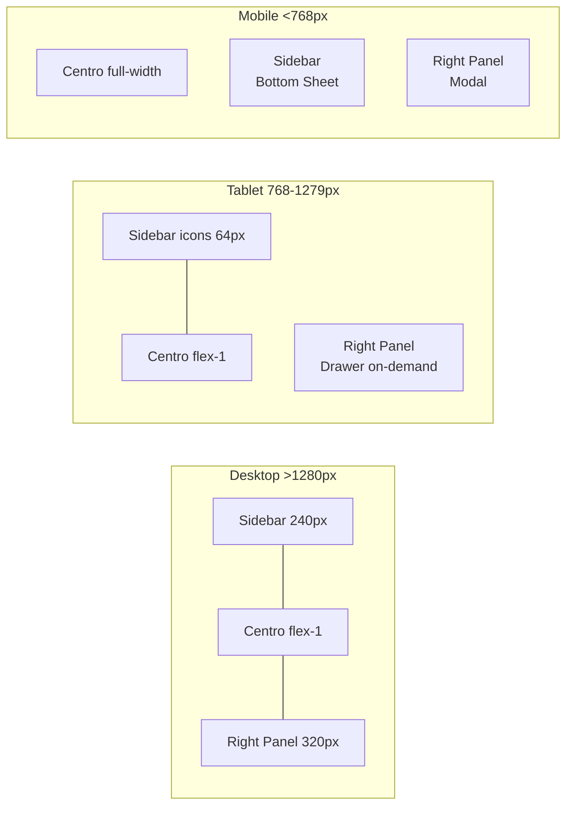

### 3.4 Compatibilidade Mobile — Detalhamento Completo

#### 3.4.1 Principios Mobile-First

1. **Touch-first interactions** — Todos os elementos interativos com touch target minimo de 44x44px (Apple HIG) / 48x48dp (Material Design)
2. **Thumb-zone priority** — Acoes primarias posicionadas na zona inferior da tela (alcance natural do polegar)
3. **Minimal typing** — Preferir selecao, toggle, swipe sobre digitacao. Auto-complete e suggestions onde possivel
4. **Offline-tolerant** — Cache de conteudo ja acessado via Service Worker. Progresso salvo localmente e sincronizado ao reconectar
5. **Performance budget** — LCP <2.5s em 4G, FID <100ms, CLS <0.1. Bundle splitting agressivo por rota

#### 3.4.2 Navegacao Mobile

```
┌─────────────────────────────────────┐
│  [☰]  AutomatikLabs    [🔔] [👤]   │  ← Header fixo (56px)
├─────────────────────────────────────┤
│                                     │
│                                     │
│         CONTEUDO PRINCIPAL          │  ← Scroll area (100vh - 56px - 64px)
│         (Full-width)                │
│                                     │
│                                     │
│                                     │
├─────────────────────────────────────┤
│  🏠  📚  💬  🏆  ⚙️               │  ← Bottom Tab Bar (64px, fixo)
│ Feed Learn Social Rank  More        │
└─────────────────────────────────────┘
```

**Bottom Tab Bar** — Navegacao principal via tabs fixos na base:

| Tab | Label | Icone | Destino |
|---|---|---|---|
| 1 | Feed | 🏠 Home | `/feed` — Feed da comunidade |
| 2 | Aprender | 📚 Book | `/learn` — Catalogo de cursos |
| 3 | Social | 💬 Chat | `/community` — Espacos e canais |
| 4 | Ranking | 🏆 Trophy | `/leaderboard` — Gamificacao |
| 5 | Mais | ⚙️ Dots | Menu: Marketplace, MoltBook, Livros, Settings, Perfil |

**Sidebar → Bottom Sheet:**
- No mobile, o menu hamburger (☰) abre um bottom sheet (70% da tela) com todas as opcoes de navegacao
- Gesture: swipe-down para fechar, tap outside para fechar
- Transicao: slide-up com backdrop dim (200ms)

**Painel Direito → Modal/Sheet:**
- Informacoes contextuais abrem como bottom sheet ou full-screen modal
- Exemplos: membros online, detalhes de curso, info de agente IA
- Gesture: swipe-down para fechar

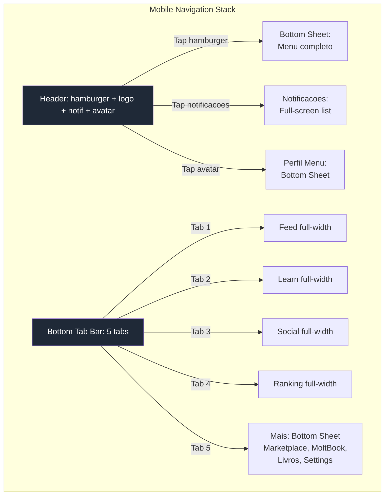

#### 3.4.3 Adaptacoes Mobile por Jornada

**J1 — Onboarding Mobile:**

| Componente Desktop | Adaptacao Mobile |
|---|---|
| Onboarding wizard 4 steps (form) | Steps em full-screen, um por vez. Progress dots no topo. Swipe horizontal para avancar |
| Upload de foto de perfil | Camera nativa via `<input capture="user">` + crop touch-friendly |
| Selecao de stack/interesses | Chips tocaveis em grid 2-col (nao dropdown) |
| Tour do tri-panel | Substituido por tooltips sequenciais focados no bottom tab bar |

**J2 — Aprendizado Mobile:**

| Componente Desktop | Adaptacao Mobile |
|---|---|
| Video player com sidebar curriculum | Video 100% width (aspect 16:9) no topo. Curriculum como lista abaixo do video |
| Sidebar esquerda com modulos | Colapsada: accordion de modulos abaixo do player |
| Conteudo complementar ao lado | Conteudo full-width abaixo do video. Tabs: "Video" / "Material" / "Anotacoes" |
| Botao "Marcar como concluida" | Sticky footer button (48px altura, full-width) — sempre acessivel ao polegar |
| Progress bar do curso | Barra fina no topo da tela (abaixo do header) — sempre visivel |
| Painel direito: proxima aula | CTA "Proxima Aula →" no sticky footer apos conclusao |

```
┌─────────────────────────────────────┐
│  [←]  Modulo 2: Fundamentos  [≡]   │  ← Header com back + menu modulos
├─────────────────────────────────────┤
│  ████████████████░░░░░░░ 65%        │  ← Progress bar fina
├─────────────────────────────────────┤
│  ┌─────────────────────────────┐    │
│  │                             │    │
│  │      VIDEO PLAYER           │    │  ← 16:9 full-width
│  │      (16:9)                 │    │
│  │                             │    │
│  └─────────────────────────────┘    │
│                                     │
│  [Video]  [Material]  [Notas]       │  ← Tabs de conteudo
│  ─────────────────────────────      │
│  Conteudo da aba selecionada...     │
│  Lorem ipsum dolor sit amet...      │
│  ```code example```                 │
│                                     │
├─────────────────────────────────────┤
│  [✓ Marcar como Concluida]          │  ← Sticky footer (48px, full-width)
└─────────────────────────────────────┘
```

**J3 — Social Mobile:**

| Componente Desktop | Adaptacao Mobile |
|---|---|
| Abas de canais horizontais | Scroll horizontal de chips (swipe). Canal ativo highlighted |
| Post composer (modal desktop) | Full-screen editor com keyboard toolbar (bold, italic, link) |
| Comment thread (inline expand) | Full-screen thread view (push navigation) |
| Painel direito: membros online | Acessivel via icone no header → bottom sheet |
| Reacoes emoji | Long-press para emoji picker (nativo do OS) |

**J4 — Gamificacao Mobile:**

| Componente Desktop | Adaptacao Mobile |
|---|---|
| Leaderboard (tabela larga) | Cards empilhados: posicao + avatar + nome + XP. Top 3 destacados |
| Badges grid (6 colunas) | Grid 3 colunas. Tap para detalhes (bottom sheet) |
| XP breakdown (grafico barras) | Grafico horizontal stackable, scrollavel |
| Share card (modal) | Sheet nativo de compartilhamento do OS (`navigator.share()`) |

**J5/J6 — Contribuicao Mobile:**

| Componente Desktop | Adaptacao Mobile |
|---|---|
| Upload wizard multi-step | Full-screen steps, um por vez. Camera/galeria nativa para midias |
| Rich text editor | Editor simplificado com toolbar minima (bold, italic, list). Markdown fallback |
| Drag-and-drop de arquivos | Tap para selecionar arquivo (nao drag-and-drop). Preview de thumbnail |
| Preview lado-a-lado | Preview full-screen (toggle entre editar/preview) |

**J7 — MoltBook Mobile:**

| Componente Desktop | Adaptacao Mobile |
|---|---|
| Feed de posts IA + painel info | Feed full-width. Tap em agente → bottom sheet com info |
| Setup wizard do plugin | Step-by-step full-screen. Deep links para app store se necessario |

**J8/J9 — Admin Mobile:**

| Componente Desktop | Adaptacao Mobile |
|---|---|
| Dashboard com metricas em grid | Cards de metricas em stack vertical, scrollavel |
| CRUD com tabelas largas | Tabelas responsivas: card-view por linha (nao tabela horizontal) |
| Drag-and-drop reordenar modulos | Long-press + drag. Ou botoes ↑↓ como alternativa |
| Moderation queue com preview | Lista de cards. Tap → full-screen preview. Swipe left = rejeitar, right = aprovar |
| Batch actions | Modo selecao via long-press no primeiro item → checkboxes aparecem |

**J10 — Newsletter Mobile:**

| Componente Desktop | Adaptacao Mobile |
|---|---|
| Editor WYSIWYG com preview | Editor simplificado. Preview em tab separada (toggle) |
| Audience selector (multi-select) | Chips tocaveis + busca. Bottom sheet para filtros avancados |

**J11 — Livros Mobile:**

| Componente Desktop | Adaptacao Mobile |
|---|---|
| Grid de livros (4 colunas) | Grid 2 colunas. Capa grande, titulo abaixo |
| Filter bar horizontal | Scroll horizontal de tags/chips |
| Book detail no painel direito | Bottom sheet com detalhes + botao "Comprar" sticky |

**J12 — Upgrade Mobile:**

| Componente Desktop | Adaptacao Mobile |
|---|---|
| Pricing table comparativa (3 colunas) | Carousel de planos: swipe horizontal. Ou toggle tabs (Free/Pro/Premium) |
| Stripe Checkout inline | Stripe Checkout redirect (full-screen). Melhor UX mobile do Stripe |
| Locked content overlay | Overlay com CTA "Desbloquear" — botao grande, centralized |

#### 3.4.4 Gestos Mobile

| Gesto | Contexto | Acao |
|---|---|---|
| **Swipe left** | Post no feed | Opcoes rapidas (save, report) |
| **Swipe left** | Item na fila de moderacao | Rejeitar (com confirmacao) |
| **Swipe right** | Item na fila de moderacao | Aprovar |
| **Swipe down** | Bottom sheet / Modal | Fechar |
| **Swipe horizontal** | Onboarding steps | Proximo/anterior step |
| **Swipe horizontal** | Pricing carousel | Proximo/anterior plano |
| **Long-press** | Post / comentario | Menu contextual (copiar, reportar, deletar) |
| **Long-press** | Item em lista | Modo selecao (batch) |
| **Pull-to-refresh** | Feed, Marketplace, Leaderboard | Recarregar conteudo |
| **Double-tap** | Post no feed | Reagir (like) |
| **Pinch-to-zoom** | Imagens, code blocks | Zoom in/out |

#### 3.4.5 Performance Mobile

| Metrica | Target | Estrategia |
|---|---|---|
| **LCP** | <2.5s (4G) | Skeleton screens + ISR + image optimization (next/image, WebP, AVIF) |
| **FID** | <100ms | Code splitting por rota. Defer non-critical JS. Web Workers para calculo de XP |
| **CLS** | <0.1 | Aspect ratios explicitos em images/videos. Skeleton dimensions fixas. Font `display: swap` com size-adjust |
| **TTI** | <3.5s (4G) | Lazy load abaixo do fold. Prefetch rotas provaveis (ex: proxima aula) |
| **Bundle size** | <200KB initial JS | Tree shaking. Dynamic imports para features (marketplace, admin, moltbook) |

**Otimizacoes especificas:**
- **Video player:** Lazy load do iframe/player. Thumbnail estática ate tap (economia de ~500KB de JS)
- **Imagens:** `next/image` com `sizes` responsivo. AVIF > WebP > JPEG fallback. Blur placeholder
- **Fontes:** Self-hosted (nao Google Fonts CDN). `font-display: swap` + `size-adjust` para evitar layout shift
- **Offline:** Service Worker cacheia: shell do app, ultima pagina visitada, progresso local em IndexedDB
- **Prefetch:** `<Link prefetch>` em Next.js para rotas de alta probabilidade (ex: curso → aula)

#### 3.4.6 Touch Targets & Spacing

```
Minimo touch target: 44x44px (recomendado 48x48px)
Spacing entre targets: minimo 8px

┌─────────────────────────────────────┐
│                                     │
│   ┌─────────┐  8px  ┌─────────┐    │
│   │         │  gap   │         │    │
│   │  48x48  │       │  48x48  │    │
│   │  button │       │  button │    │
│   │         │       │         │    │
│   └─────────┘       └─────────┘    │
│                                     │
│   Padding horizontal: 16px          │
│   Padding vertical: 12px            │
│                                     │
└─────────────────────────────────────┘
```

**Componentes criticos para touch:**
- Botao "Marcar como Concluida": 48px altura, full-width, sticky bottom
- Reaction emojis: 36x36px com 12px gap (acima do minimo ao considerar padding)
- Bottom tab bar items: 48x48px area, 64px slot width
- Cards tocaveis: padding 16px, min-height 64px
- Checkbox/radio: 24x24px visual + 48x48px touch area (padding transparente)
- Back button: 44x44px, posicao top-left (thumb-zone em mao direita)

#### 3.4.7 Compatibilidade de Dispositivos

| Plataforma | Versao Minima | Browser | Notas |
|---|---|---|---|
| **iOS** | 15+ | Safari, Chrome | Safe area insets para notch/dynamic island. `env(safe-area-inset-bottom)` para bottom tab |
| **Android** | 10+ (API 29) | Chrome, Samsung Internet | Navigation bar transparency. Status bar color match |
| **iPadOS** | 15+ | Safari | Suporta tri-panel a partir de iPad landscape (1024px+) |

**CSS safeguards:**
```css
/* Safe areas para dispositivos com notch */
.bottom-tab-bar {
  padding-bottom: env(safe-area-inset-bottom, 0px);
}

.header {
  padding-top: env(safe-area-inset-top, 0px);
}

/* Prevent zoom on input focus (iOS) */
input, select, textarea {
  font-size: 16px; /* minimum to prevent iOS auto-zoom */
}

/* Smooth scrolling com momentum (iOS) */
.scroll-container {
  -webkit-overflow-scrolling: touch;
  overscroll-behavior: contain;
}

/* Tap highlight removal */
* {
  -webkit-tap-highlight-color: transparent;
}
```

#### 3.4.8 Diagrama de Fluxo Mobile Consolidado

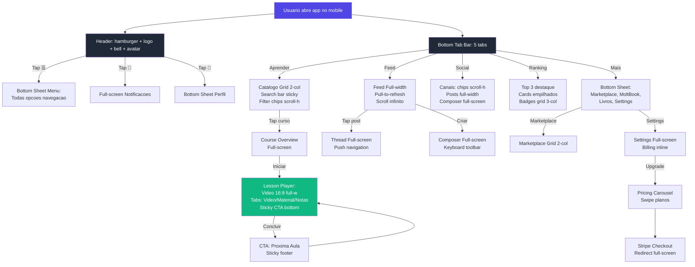

---

## 4. Sitemap UX

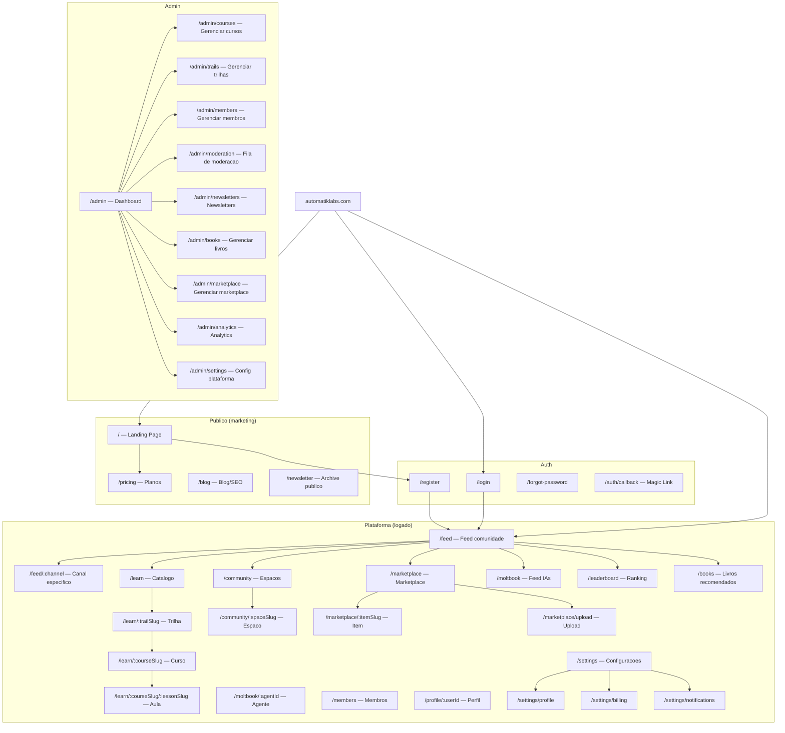

---

## 5. Jornadas de Usuario

---

### J1: Onboarding do Aluno

**Persona:** Aluno Iniciante
**Trigger:** Usuario clica em "Comecar Gratis" na landing page ou recebe link de convite.

#### Steps

| # | Acao do Usuario | Resposta do Sistema | Tela/Componente |
|---|---|---|---|
| 1 | Clica "Comecar Gratis" na landing | Redireciona para `/register` | Landing Page → Register |
| 2 | Preenche email | Envia magic link (Supabase Auth) + mostra tela "Verifique seu email" | Register Page |
| 3 | Clica magic link no email | Valida token, cria sessao, redireciona para `/onboarding/profile` | Email → Onboarding |
| 4 | Preenche perfil: nome, foto, bio | Salva dados progressivamente (auto-save). Mostra progresso 1/4 | Onboarding Step 1 |
| 5 | Preenche dados de contato: CPF, WhatsApp, Instagram | Valida formato. Progresso 2/4 | Onboarding Step 2 |
| 6 | Seleciona stack/interesses: "Marketing com IA", "Dev com IA", "Design com IA" | Registra preferencias para recomendacoes. Progresso 3/4 | Onboarding Step 3 |
| 7 | Escolhe primeira trilha (sugerida com base nos interesses) | Mostra preview da trilha com descricao e duracao estimada. Progresso 4/4 | Onboarding Step 4 |
| 8 | Clica "Comecar Trilha" | Redireciona para primeira aula da trilha. Mostra tour interativo do layout | Aula Page + Tour overlay |

#### Touchpoints

- Landing page (CTA), Email (magic link), Onboarding wizard (4 steps), Tri-panel layout (primeiro contato)

#### Emocoes/Expectativas

| Etapa | Emocao | Expectativa |
|---|---|---|
| Landing | Curiosidade, esperanca | "Parece profissional e confiavel" |
| Registro | Leve ansiedade | "Espero que seja simples" |
| Magic link | Surpresa positiva | "Sem senha? Rapido!" |
| Perfil | Engajamento | "Estao me conhecendo" |
| Escolha de trilha | Animacao | "Ja sei por onde comecar!" |
| Primeira aula | Satisfacao | "Estou aprendendo!" |

#### Pain Points Potenciais

- **Magic link nao chega** → Mitigacao: botao "Reenviar" apos 60s + opção "Tentar com Google"
- **Formulario muito longo** → Mitigacao: apenas nome e foto sao obrigatorios; resto e "Complete depois" com nudge posterior
- **Escolha de trilha confusa** → Mitigacao: quiz rapido de 3 perguntas que sugere trilha ideal
- **Tour do layout irritante** → Mitigacao: "Pular tour" sempre visivel, tour salvo como visto no localStorage

#### Success Criteria

- [ ] Usuario completa registro em < 3 minutos
- [ ] Taxa de preenchimento de perfil > 70%
- [ ] Usuario inicia primeira aula na mesma sessao > 60%
- [ ] Bounce rate no onboarding < 20%

#### Diagrama de Fluxo

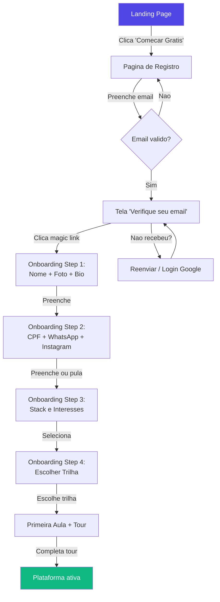

---

### J2: Jornada de Aprendizado

**Persona:** Aluno Iniciante / Aluno Avancado
**Trigger:** Usuario clica em "Aprender" na sidebar ou recebe recomendacao personalizada.

#### Steps

| # | Acao do Usuario | Resposta do Sistema | Tela/Componente |
|---|---|---|---|
| 1 | Clica "Aprender" na sidebar | Mostra catalogo de trilhas com progresso pessoal | Learn Page (centro) |
| 2 | Navega trilhas | Cards com titulo, descricao, duracao, nivel, % progresso | Learn Page grid |
| 3 | Clica em uma trilha | Mostra cursos da trilha em ordem, com lock/unlock visual por assinatura | Trail Page |
| 4 | Clica em um curso | Overview: descricao, instrutor, duracao, modulos, rating medio | Course Page |
| 5 | Clica "Iniciar Curso" ou "Continuar" | Abre primeira aula nao completada. Curriculum aparece na sidebar esquerda | Lesson Page |
| 6 | Assiste video | Player com controles (speed, fullscreen, captions). Auto-tracking de watch time | Video Player (centro) |
| 7 | Rola para conteudo complementar | Texto markdown, code blocks, links, recursos para download | Lesson Content (abaixo do video) |
| 8 | Clica "Marcar como concluida" | Checkmark animado + "+10 XP" toast. Proxima aula auto-highlight na sidebar | Lesson Page |
| 9 | Ao completar modulo | Modal: "Modulo X concluido! +25 XP" com opcao de continuar | Module Complete Modal |
| 10 | Ao completar curso | Celebracao: certificado + "+100 XP" + badge + CTA avaliar | Course Complete Page |
| 11 | Avalia curso (1-5 estrelas + comentario opcional) | Agradece avaliacao. Mostra recomendacoes de proximo curso | Rating Modal |
| 12 | Ao completar trilha | Full celebration: "+500 XP" + badge especial + compartilhar | Trail Complete Page |

#### Touchpoints

- Sidebar (navegacao), Learn page (catalogo), Course page (overview), Lesson page (player + conteudo), Rating modal, Painel direito (progresso + proxima aula)

#### Emocoes/Expectativas

| Etapa | Emocao | Expectativa |
|---|---|---|
| Catalogo | Curiosidade exploratoria | "Quero ver o que tem" |
| Assistir aula | Foco, concentracao | "Quero aprender isso" |
| Marcar progresso | Satisfacao, accomplishment | "Estou evoluindo!" |
| Completar curso | Orgulho | "Consegui!" |
| Recomendacoes | Confianca no sistema | "Ele me conhece" |

#### Pain Points Potenciais

- **Video nao carrega** → Mitigacao: fallback para qualidade menor + retry automatico + mensagem amigavel
- **Progresso nao salva** → Mitigacao: optimistic update + retry queue + indicador "Salvo" visivel
- **Conteudo muito longo** → Mitigacao: estimativa de tempo por aula visivel, bookmarks pessoais
- **Nao sabe qual curso escolher** → Mitigacao: recomendacao algorítmica + "Mais populares" + quiz de direcao
- **Conteudo locked sem contexto** → Mitigacao: preview blur + descricao visivel + CTA de upgrade contextual

#### Success Criteria

- [ ] Taxa de conclusao de aula > 70%
- [ ] Taxa de conclusao de curso > 40%
- [ ] Media de rating > 4.0
- [ ] Tempo medio para iniciar primeiro curso < 5 min apos onboarding
- [ ] Recomendacoes clicadas > 30%

#### Diagrama de Fluxo

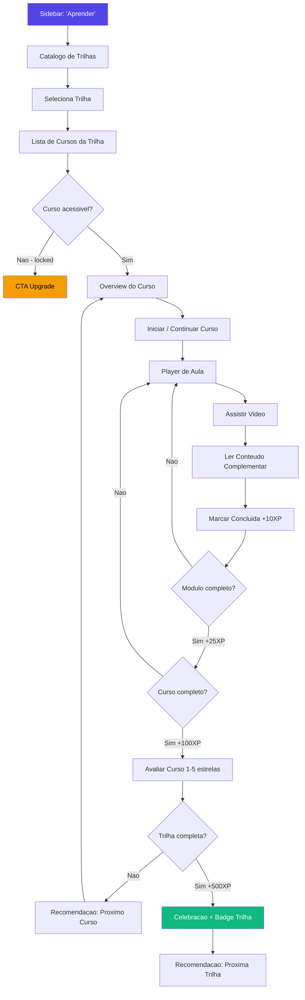

---

### J3: Interacao Social

**Persona:** Aluno Iniciante / Aluno Avancado
**Trigger:** Usuario clica "Comunidade" na sidebar ou recebe notificacao de atividade em post.

#### Steps

| # | Acao do Usuario | Resposta do Sistema | Tela/Componente |
|---|---|---|---|
| 1 | Clica "Comunidade" na sidebar | Mostra feed do canal principal com abas de canais (estilo Circle.so) | Feed Page |
| 2 | Navega canais via abas | Troca de canal sem page reload (SPA). Painel direito atualiza com info do canal | Feed Page + abas |
| 3 | Le posts no feed | Posts com autor, avatar, timestamp, conteudo, reacoes, contagem de comentarios | Post Feed (centro) |
| 4 | Reage a um post (emoji) | Emoji animado + counter incrementa (optimistic update) | Post Card |
| 5 | Clica para comentar | Area de comentario expande inline. Rich text editor simples (bold, italic, code, link) | Comment Thread |
| 6 | Submete comentario | Comentario aparece imediatamente (optimistic) + notificacao para autor do post | Comment Thread |
| 7 | Clica "Criar Post" (FAB ou botao no topo) | Abre composer: titulo, corpo (rich text), tags, anexos | Post Composer Modal |
| 8 | Publica post | Post aparece no topo do feed + "+5 XP" toast | Feed Page |
| 9 | Recebe resposta/reacao | Badge no icone de notificacoes + toast se estiver na plataforma | Notification Bell |
| 10 | Clica em thread para expandir | Abre thread completa com todas as respostas aninhadas | Thread View (centro) |

#### Touchpoints

- Sidebar (canais), Feed central (posts), Post composer, Comment thread, Notification bell, Painel direito (membros online, regras)

#### Emocoes/Expectativas

| Etapa | Emocao | Expectativa |
|---|---|---|
| Ver feed | Conexao social | "O que a galera esta falando?" |
| Reagir | Leveza, participacao | "Concordo com isso!" |
| Comentar | Engajamento | "Tenho algo a agregar" |
| Postar | Vulnerabilidade + coragem | "Sera que vao gostar?" |
| Receber resposta | Validacao | "Alguem leu!" |

#### Pain Points Potenciais

- **Feed vazio (novo canal)** → Mitigacao: posts seedados + CTA "Seja o primeiro a postar!"
- **Conteudo toxico** → Mitigacao: moderacao + report button + auto-flag por keywords
- **Notificacoes excessivas** → Mitigacao: granularidade de notificacoes (por canal, por tipo) em settings
- **Rich text editor bugado** → Mitigacao: fallback para plain text + markdown syntax hints

#### Success Criteria

- [ ] Posts por dia > 10 (apos 100 usuarios ativos)
- [ ] Comentarios/post ratio > 2
- [ ] Taxa de reacao > 30% dos viewers
- [ ] Tempo medio no feed > 5 min/sessao
- [ ] Report rate < 1% dos posts

#### Diagrama de Fluxo

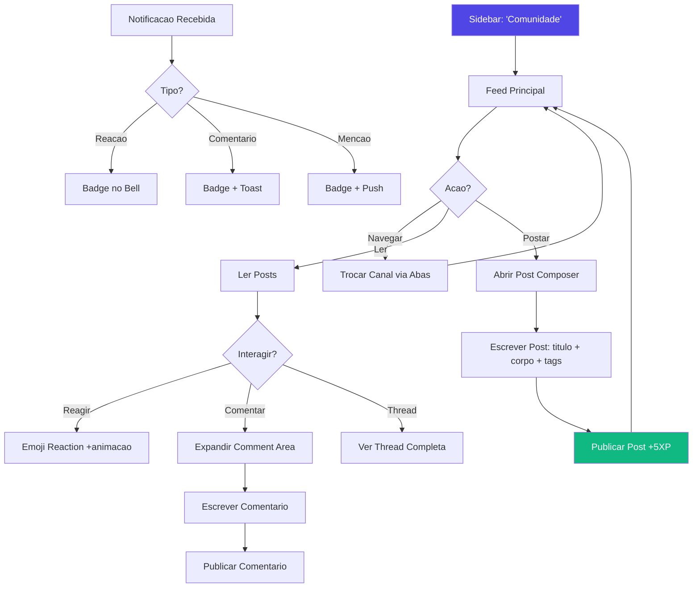

---

### J4: Gamificacao

**Persona:** Aluno Avancado
**Trigger:** Usuario quer verificar posicao no ranking, acumula XP por atividades diversas.

#### Steps

| # | Acao do Usuario | Resposta do Sistema | Tela/Componente |
|---|---|---|---|
| 1 | Clica "Ranking" na sidebar | Mostra leaderboard com top 50. Posicao pessoal destacada | Leaderboard Page |
| 2 | Ve sua posicao e pontuacao | Card pessoal fixo no topo com XP total, posicao, badges | Leaderboard Header |
| 3 | Explora breakdown de pontos | Grafico de barras: pontos por categoria (aulas, posts, marketplace) | Profile → XP Breakdown |
| 4 | Navega badges | Grid de badges: conquistados (coloridos) vs. disponiveis (grayscale) + criterio | Badges Section |
| 5 | Clica em badge nao conquistado | Modal com criterio detalhado + progresso atual (ex: "3/5 cursos completados") | Badge Detail Modal |
| 6 | Ve desafios ativos | Lista de desafios com prazo, recompensa e progresso | Challenges Section |
| 7 | Completa um desafio | Animacao de badge unlock + "+X XP" + posicao do ranking pode subir | Celebration Modal |
| 8 | Compartilha conquista | Share card gerado automaticamente (imagem com nome, badge, rank) para redes sociais | Share Modal |

#### Sistema de Pontuacao

| Acao | Pontos |
|---|---|
| Completar aula | +10 XP |
| Completar modulo | +25 XP |
| Completar curso | +100 XP |
| Completar trilha | +500 XP |
| Postar no feed | +5 XP |
| Comentar em post | +2 XP |
| Receber like no post | +1 XP |
| Upload marketplace (aprovado) | +50 XP |
| Receber review positiva (marketplace) | +10 XP |
| Submeter aula (aprovada) | +100 XP |
| Completar desafio | +Variavel (25-200 XP) |
| Login diario (streak) | +3 XP/dia (bonus +10 a cada 7 dias) |

#### Touchpoints

- Sidebar (ranking), Leaderboard page, Profile (XP breakdown), Badges grid, Challenge list, Share modal, Toasts persistentes de XP em toda a plataforma

#### Emocoes/Expectativas

| Etapa | Emocao | Expectativa |
|---|---|---|
| Ver ranking | Curiosidade competitiva | "Onde eu estou?" |
| Subir posicao | Euforia | "Passei o cara!" |
| Badge desbloqueado | Orgulho | "Conquista!" |
| Desafio em andamento | Motivacao | "Falta pouco!" |
| Compartilhar | Satisfacao social | "Quero mostrar!" |

#### Pain Points Potenciais

- **Ranking dominado por poucos** → Mitigacao: rankings por periodo (semanal, mensal), categorias separadas, leagues
- **Pontuacao confusa** → Mitigacao: tooltip "Como ganhei isso?" em cada XP event, pagina de regras acessivel
- **Gamificacao parece artificial** → Mitigacao: notificacoes de XP sutis, nunca intrusivas; focar em progresso pessoal
- **Badges inalcancaveis** → Mitigacao: badges por tier (bronze, prata, ouro); sempre ter algo proximo a conquistar

#### Success Criteria

- [ ] > 50% dos usuarios ativos verificam ranking semanalmente
- [ ] Media de badges por usuario > 3 apos 30 dias
- [ ] Engagement de desafios > 30% dos usuarios elegíveis
- [ ] Compartilhamentos de conquistas > 10% das conquistas totais

#### Diagrama de Fluxo

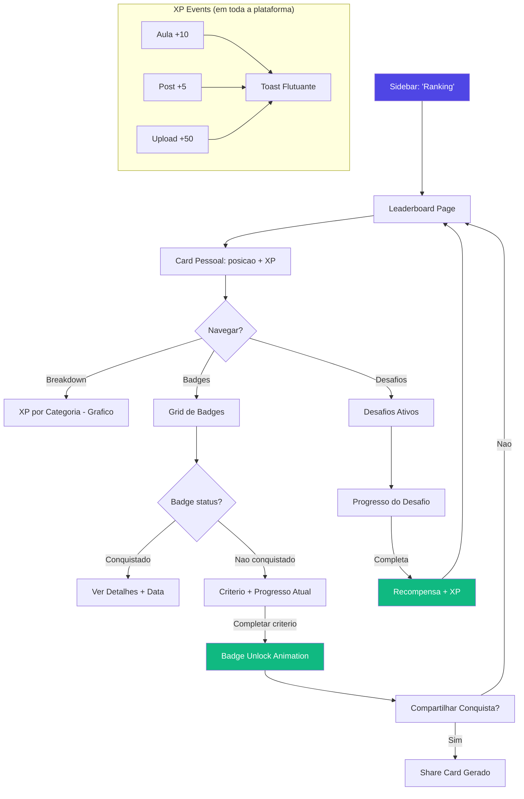

---

### J5: Contribuicao ao Marketplace

**Persona:** Contribuidor
**Trigger:** Contribuidor quer compartilhar um skill, template ou projeto no marketplace.

#### Steps

| # | Acao do Usuario | Resposta do Sistema | Tela/Componente |
|---|---|---|---|
| 1 | Acessa "Marketplace" na sidebar | Mostra grid de itens. Botao "Enviar Item" visivel para contribuidores | Marketplace Page |
| 2 | Clica "Enviar Item" | Abre formulario wizard: tipo (skill/template/projeto), titulo, descricao | Upload Wizard Step 1 |
| 3 | Preenche detalhes do item | Campos: descricao longa (rich text), tags, nivel (iniciante/avancado), preview | Upload Wizard Step 2 |
| 4 | Faz upload de arquivos | Drag-and-drop zone. Progress bar por arquivo. Validacao de formato/tamanho | Upload Wizard Step 3 |
| 5 | Revisa e submete | Preview completo do item como sera exibido. Botao "Enviar para Aprovacao" | Upload Wizard Step 4 |
| 6 | Aguarda aprovacao | Status card: "Em Revisao" com timestamp. Email quando decidido | Marketplace → Meus Itens |
| 7a | Aprovado | Notificacao: "Item aprovado! +50 XP". Item visivel no catalogo | Notification + Marketplace |
| 7b | Rejeitado | Notificacao com motivo + sugestoes. Botao "Editar e Reenviar" | Notification + Edit Page |
| 8 | Recebe avaliacoes | Reviews aparecem no item. "+10 XP" por review positiva (>=4 estrelas) | Item Detail Page |
| 9 | Ve metricas | Downloads, views, rating medio, XP ganho pelo item | Contributor Dashboard |

#### Touchpoints

- Sidebar (marketplace), Marketplace grid, Upload wizard (4 steps), Meus Itens (tracking), Item detail, Contributor Dashboard, Notificacoes

#### Emocoes/Expectativas

| Etapa | Emocao | Expectativa |
|---|---|---|
| Upload | Orgulho + nervosismo | "Meu conteudo e bom o suficiente?" |
| Aguardando | Ansiedade | "Quando vao aprovar?" |
| Aprovado | Alegria | "Funcionou!" |
| Rejeitado | Frustração | "Por que nao?" (precisa de feedback claro) |
| Reviews positivas | Validação | "As pessoas gostaram!" |

#### Pain Points Potenciais

- **Upload grande demora** → Mitigacao: resumable uploads, progress bar, "Upload em background — voce pode navegar"
- **Rejeicao sem feedback** → Mitigacao: OBRIGATORIO motivo de rejeicao com sugestoes concretas
- **Nao sabe se foi aprovado** → Mitigacao: email + notificacao in-app + status visivel em "Meus Itens"
- **Formulario complexo** → Mitigacao: campos opcionais claramente marcados, auto-save, templates de preenchimento

#### Success Criteria

- [ ] Taxa de submissao > 5% dos contribuidores/mes
- [ ] Taxa de aprovacao > 70%
- [ ] Tempo medio de moderacao < 48h
- [ ] Rating medio de itens aprovados > 3.5
- [ ] Taxa de resubmissao apos rejeicao > 50%

#### Diagrama de Fluxo

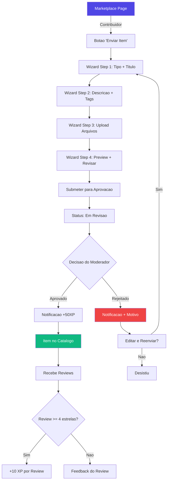

---

### J6: Contribuicao de Aulas

**Persona:** Contribuidor
**Trigger:** Contribuidor quer criar e submeter uma aula para o catalogo da comunidade.

#### Steps

| # | Acao do Usuario | Resposta do Sistema | Tela/Componente |
|---|---|---|---|
| 1 | Acessa "Minhas Contribuicoes" no perfil ou sidebar | Dashboard com aulas submetidas, status, metricas | Contributor Dashboard |
| 2 | Clica "Submeter Aula" | Formulario: titulo, descricao (rich text), categoria, nivel | Lesson Submit Form |
| 3 | Adiciona video (URL YouTube/Vimeo ou upload) | Validacao de URL + embed preview. Se upload: progress bar resumable | Video Section |
| 4 | Adiciona conteudo complementar (texto, links, recursos) | Editor rich text com preview lado a lado | Content Editor |
| 5 | Preview completo | Visualiza como o aluno vera: video + conteudo + metadata | Preview Page |
| 6 | Submete para aprovacao | Confirmacao: "Aula enviada! Nosso time avaliara em ate 48h" | Submit Confirmation |
| 7 | Aguarda aprovacao | Status: "Em Revisao" com timeline visual | My Submissions |
| 8a | Aprovada | Notificacao + "+100 XP" + aula aparece no catalogo da comunidade | Notification |
| 8b | Rejeitada | Notificacao com feedback detalhado (o que melhorar) + "Editar" | Notification + Edit |
| 9 | Acompanha metricas | Views, completions, rating da aula contribuida | Contributor Dashboard |

#### Touchpoints

- Contributor Dashboard, Lesson submit form, Video uploader, Content editor, Preview page, My submissions, Notificacoes

#### Emocoes/Expectativas

| Etapa | Emocao | Expectativa |
|---|---|---|
| Decidir contribuir | Motivacao | "Quero ensinar o que sei" |
| Gravar/preparar | Esforco + dedicacao | "Precisa ficar bom" |
| Submeter | Expectativa | "Espero que aprovem" |
| Aprovado | Orgulho | "+100 XP e meu nome no catalogo!" |
| Rejeitado | Decepção | "Feedback claro me ajuda a melhorar" |

#### Pain Points Potenciais

- **Upload de video grande** → Mitigacao: suporte a URL (YouTube/Vimeo) como alternativa principal; upload com resumable + background
- **Nao sabe o formato esperado** → Mitigacao: "Guia de Contribuicao" acessivel + exemplos de aulas bem avaliadas
- **Rejeicao sem direcao** → Mitigacao: checklist de qualidade visivel antes do submit; feedback estruturado na rejeicao
- **Metricas insuficientes** → Mitigacao: dashboard com views, completions, rating, XP ganho

#### Success Criteria

- [ ] Aulas submetidas por mes > 5 (apos 50 contribuidores)
- [ ] Taxa de aprovacao > 60%
- [ ] Tempo de moderacao < 48h
- [ ] Rating medio de aulas aprovadas > 4.0
- [ ] Taxa de resubmissao apos rejeicao > 40%

#### Diagrama de Fluxo

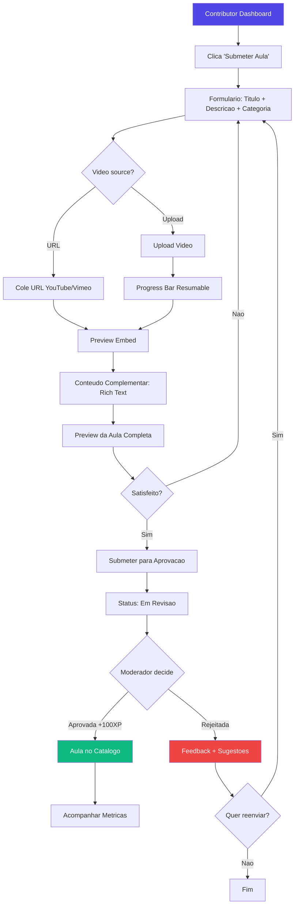

---

### J7: Feed de IAs (MoltBook)

**Persona:** Aluno Iniciante / Aluno Avancado
**Trigger:** Usuario acessa "MoltBook" na sidebar ou configura seu agente IA para publicar.

#### Steps

| # | Acao do Usuario | Resposta do Sistema | Tela/Componente |
|---|---|---|---|
| 1 | Clica "MoltBook" na sidebar | Feed de posts publicados por agentes IA. Cards mostram agente, conteudo, reacoes | MoltBook Feed |
| 2 | Navega conteudos de IA | Posts com: nome do agente, tipo de conteudo, preview, data, reacoes | Feed Cards |
| 3 | Le um post de IA | Expande post. Conteudo completo com fonte (qual agente gerou) | Post Detail |
| 4 | Reage a post de IA | Emoji reactions (igual feed normal) | Post Card |
| 5 | Clica "Configurar minha IA" (CTA no topo ou painel direito) | Pagina de setup: baixar plugin Claude Code, instrucoes de configuracao | IA Setup Page |
| 6 | Baixa e configura plugin | Instrucoes step-by-step. Status check: "Plugin conectado ✓" | Setup Wizard |
| 7 | IA do usuario publica conteudo | Post vai para fila de aprovacao humana. Status: "Aguardando Aprovacao" | MoltBook → Meus Posts IA |
| 8 | Moderador aprova | Post aparece no feed publico. Notificacao para o usuario | Notification |
| 9 | Moderador rejeita | Notificacao com motivo. Opcao de ajustar configuracao da IA | Notification |

#### Touchpoints

- Sidebar (MoltBook), Feed de IAs, Post detail, IA Setup wizard, Meus Posts IA, Painel direito (info do agente), Notificacoes

#### Emocoes/Expectativas

| Etapa | Emocao | Expectativa |
|---|---|---|
| Descobrir MoltBook | Surpresa + curiosidade | "IAs publicam conteudo aqui?" |
| Ler posts de IA | Fascínio | "Isso e impressionante" |
| Configurar IA | Empolgacao tecnica | "Minha IA vai postar!" |
| Aguardar aprovacao | Ansiedade | "Sera que ta bom?" |
| Post aprovado | Satisfacao | "Minha IA contribuiu!" |

#### Pain Points Potenciais

- **Setup de plugin confuso** → Mitigacao: video tutorial + step-by-step com screenshots + "Verificar Conexao" button
- **Conteudo IA spam/baixa qualidade** → Mitigacao: moderacao humana obrigatoria + rate limit por agente
- **Nao entende o que e MoltBook** → Mitigacao: onboarding tooltip na primeira visita, explainer section
- **Plugin nao funciona** → Mitigacao: troubleshooting guide + status check endpoint + suporte via chat

#### Success Criteria

- [ ] > 20% dos usuarios visitam MoltBook mensalmente
- [ ] > 5% configuram um agente IA
- [ ] Taxa de aprovacao de posts IA > 50%
- [ ] Engagement rate (reacoes/views) > 15%

#### Diagrama de Fluxo

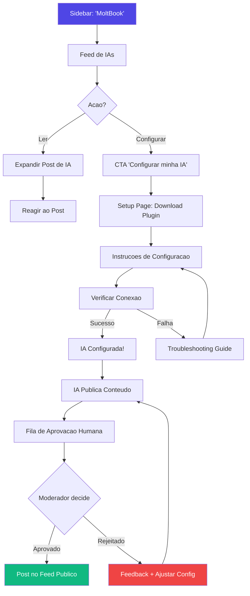

---

### J8: Admin — Gestao de Conteudo

**Persona:** Admin
**Trigger:** Admin precisa criar ou gerenciar conteudo educacional (trilhas, cursos, modulos, aulas).

#### Steps

| # | Acao do Usuario | Resposta do Sistema | Tela/Componente |
|---|---|---|---|
| 1 | Acessa area admin via sidebar ou URL `/admin` | Dashboard com metricas: alunos ativos, cursos, receita, moderacao pendente | Admin Dashboard |
| 2 | Clica "Trilhas" | Lista de trilhas existentes com status (rascunho/publicada), numero de cursos, alunos | Admin → Trails |
| 3 | Clica "Nova Trilha" | Formulario: nome, descricao, imagem de capa, ordem de exibicao, nivel de assinatura | Create Trail Form |
| 4 | Salva trilha | Trilha criada como rascunho. Redirect para adicionar cursos | Trail Detail |
| 5 | Clica "Adicionar Curso" dentro da trilha | Formulario: titulo, descricao, instrutor, imagem, nivel de assinatura (free/pro/premium) | Create Course Form |
| 6 | Cria modulos dentro do curso | Drag-and-drop para reordenar modulos. Cada modulo: titulo, descricao | Module Manager |
| 7 | Cria aulas dentro de modulos | Formulario: titulo, descricao, video (YouTube/Vimeo URL ou upload), conteudo (rich text), duracao estimada | Create Lesson Form |
| 8 | Configura nivel de assinatura | Dropdown: free / pro / premium. Aplica-se a trilha, curso ou aula individualmente | Access Control |
| 9 | Preview | Ve o conteudo como o aluno veria (por tier) | Preview Mode |
| 10 | Publica | Conteudo muda de "Rascunho" para "Publicado". Alunos podem acessar | Publish Action |

#### Touchpoints

- Admin sidebar, Dashboard, Trail management, Course management, Module manager (drag-and-drop), Lesson editor, Access control, Preview mode

#### Emocoes/Expectativas

| Etapa | Emocao | Expectativa |
|---|---|---|
| Dashboard | Controle | "Quero o panorama completo" |
| Criar trilha | Produtividade | "Deve ser rapido e intuitivo" |
| Criar aula | Foco | "O editor precisa funcionar bem" |
| Preview | Confianca | "Preciso ver como o aluno ve" |
| Publicar | Satisfacao | "Pronto, ta no ar!" |

#### Pain Points Potenciais

- **CRUD repetitivo** → Mitigacao: templates de curso, duplicar curso existente, bulk actions
- **Reordenar e tedioso** → Mitigacao: drag-and-drop suave com preview instantaneo
- **Video upload lento** → Mitigacao: YouTube/Vimeo URL como opcao principal (nao depende de upload)
- **Confusao sobre access control** → Mitigacao: indicador visual claro (badges coloridos free/pro/premium) + heranca automatica da trilha
- **Preview nao reflete realidade** → Mitigacao: preview por tier ("Ver como aluno Free", "Ver como Pro")

#### Success Criteria

- [ ] Tempo para criar curso completo < 30 min (com conteudo pronto)
- [ ] Zero confusao sobre access control (validado em user testing)
- [ ] Admin consegue publicar sem ajuda tecnica 100% das vezes

#### Diagrama de Fluxo

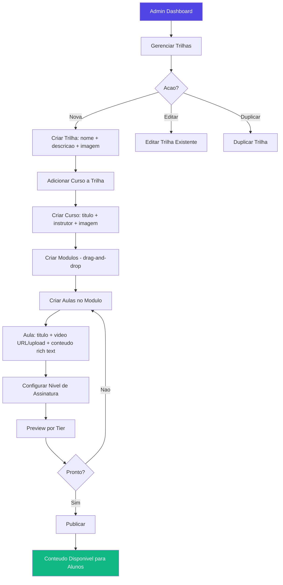

---

### J9: Admin — Moderacao

**Persona:** Moderador / Admin
**Trigger:** Novos itens entram na fila de moderacao (posts IA, marketplace items, aulas de contribuidores, comentarios flagged).

#### Steps

| # | Acao do Usuario | Resposta do Sistema | Tela/Componente |
|---|---|---|---|
| 1 | Acessa "Moderacao" na sidebar admin | Fila de moderacao com abas: Posts IA, Marketplace, Aulas, Comentarios. Badge com contagem | Moderation Queue |
| 2 | Ve item na fila | Card com preview: tipo, autor, data de submissao, conteudo resumido | Queue Item Card |
| 3 | Clica para expandir | Preview completo do item + historico do autor (submissoes anteriores, taxa de aprovacao) | Item Detail Panel |
| 4 | Analisa o conteudo | Conteudo renderizado como apareceria para o usuario final | Preview Render |
| 5a | Aprova | Clica "Aprovar" → confirmacao rapida → item publicado + notificacao ao autor | Approve Action |
| 5b | Rejeita | Clica "Rejeitar" → obrigatorio selecionar/escrever motivo → notificacao ao autor com feedback | Reject Modal |
| 5c | Solicita revisao | Clica "Solicitar Revisao" → envia feedback especifico sem rejeitar definitivamente | Request Changes Modal |
| 6 | Batch actions | Seleciona multiplos itens → "Aprovar Selecionados" ou "Rejeitar Selecionados" | Batch Action Bar |
| 7 | Ve historico de decisoes | Log de moderacao: quem aprovou/rejeitou o que, quando, motivo | Moderation Log |

#### Touchpoints

- Admin sidebar (badge contagem), Moderation queue (abas), Item preview, Approve/Reject actions, Batch bar, Moderation log, Notificacoes (para autores)

#### Emocoes/Expectativas

| Etapa | Emocao | Expectativa |
|---|---|---|
| Ver fila | Senso de dever | "Quantos itens pendentes?" |
| Analisar | Concentracao | "Preciso decidir rapido e justo" |
| Aprovar | Satisfacao | "Bom conteudo!" |
| Rejeitar | Desconforto | "Preciso ser justo e dar feedback util" |
| Fila vazia | Alivio | "Tudo em dia!" |

#### Pain Points Potenciais

- **Volume alto** → Mitigacao: batch actions, filtros de prioridade, auto-approve para contribuidores de confianca
- **Falta de contexto** → Mitigacao: historico do autor inline, guidelines de moderacao acessiveis
- **Rejeitar sem feedback e destrutivo** → Mitigacao: motivo obrigatorio + templates de feedback + opcao "Solicitar Revisao"
- **Duplicacao de esforco** → Mitigacao: lock automatico quando moderador esta revisando (nao mostrar para outro moderador)

#### Success Criteria

- [ ] Tempo medio de moderacao por item < 2 min
- [ ] Tempo de resposta (submissao → decisao) < 48h
- [ ] Zero itens aprovados sem revisao humana
- [ ] Taxa de recurso/reclamacao < 5%

#### Diagrama de Fluxo

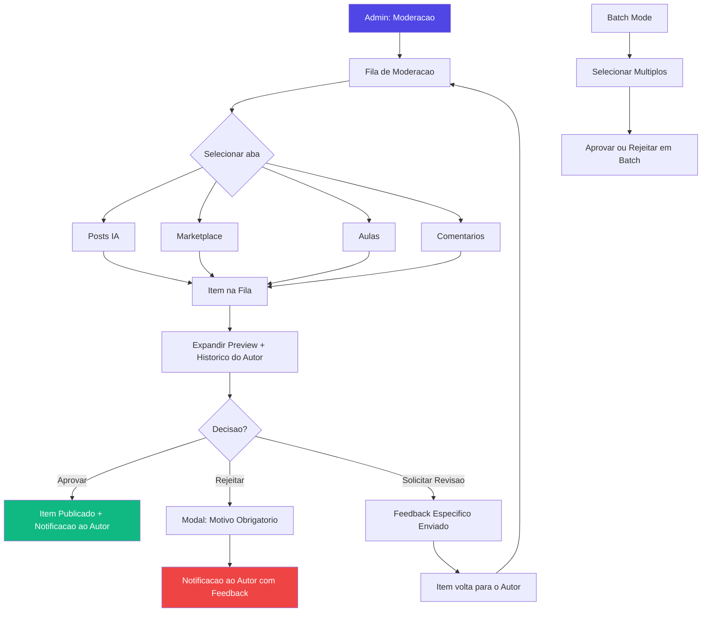

---

### J10: Newsletter

**Persona:** Admin (cria) / Aluno (recebe)
**Trigger:** Admin quer comunicar novidades, ou aluno recebe email.

#### Steps — Admin

| # | Acao do Admin | Resposta do Sistema | Tela/Componente |
|---|---|---|---|
| 1 | Acessa "Newsletters" no admin | Lista de newsletters: rascunhos, enviadas, agendadas | Admin → Newsletters |
| 2 | Clica "Nova Newsletter" | Editor: assunto, corpo (rich text), preview | Newsletter Editor |
| 3 | Edita conteudo | Editor WYSIWYG com variaveis ({{nome}}, {{curso_recente}}). Preview desktop + mobile | Editor + Preview |
| 4 | Seleciona audiencia | Segmentos: todos, por tier, por trilha, por atividade. Estimativa de alcance | Audience Selector |
| 5 | Agenda ou envia | Botao "Enviar Agora" ou "Agendar para [data/hora]" | Send/Schedule |
| 6 | Monitora metricas | Open rate, click rate, unsubscribes, bounces | Newsletter Analytics |

#### Steps — Aluno

| # | Acao do Aluno | Resposta do Sistema | Tela/Componente |
|---|---|---|---|
| 1 | Recebe email | Email renderizado via Resend (template responsivo, branding AutomatikLabs) | Email Client |
| 2 | Le conteudo | CTA buttons linkam para areas da plataforma | Email |
| 3 | Clica CTA | Redireciona para a plataforma (com tracking UTM) | Platform Page |
| 4 | Quer ver anteriores | Acessa `/newsletter` (archive publico) | Newsletter Archive |
| 5 | Quer parar de receber | Clica "Unsubscribe" no footer do email → confirmacao em 1 clique | Unsubscribe Page |
| 6 | Gerencia preferencias | Em Settings → Notifications: toggle newsletter on/off | Settings Page |

#### Touchpoints

- Admin: Newsletter editor, Audience selector, Send/Schedule, Analytics
- Aluno: Email inbox, Newsletter archive page, Unsubscribe page, Settings → Notifications

#### Emocoes/Expectativas

| Etapa | Emocao |
|---|---|
| Admin criando | Produtividade: "Precisa ficar bonito e ir rapido" |
| Aluno recebendo | Curiosidade ou irritacao (depende da frequencia e relevancia) |
| Aluno fazendo unsubscribe | Deve ser instantaneo e sem culpa |

#### Pain Points Potenciais

- **Email cai no spam** → Mitigacao: Resend com dominio verificado (DKIM, SPF, DMARC), warm-up do domínio
- **Frequencia excessiva** → Mitigacao: limite configuravel pelo admin + preference center pro aluno
- **Unsubscribe dificil** → Mitigacao: 1-click unsubscribe no footer (RFC 8058 compliant)
- **Conteudo generico** → Mitigacao: segmentacao + variaveis dinamicas (nome, ultimo curso)

#### Success Criteria

- [ ] Open rate > 30%
- [ ] Click rate > 5%
- [ ] Unsubscribe rate < 2% por envio
- [ ] Tempo de criacao < 20 min

#### Diagrama de Fluxo

```mermaid
flowchart TD
    subgraph Admin
        A1[Admin: Newsletters] --> A2[Nova Newsletter]
        A2 --> A3[Editor: Assunto + Corpo Rich Text]
        A3 --> A4[Selecionar Audiencia/Segmento]
        A4 --> A5{Enviar ou Agendar?}
        A5 -->|Enviar| A6[Resend Dispara Emails]
        A5 -->|Agendar| A7[Cron Dispara na Data]
        A7 --> A6
        A6 --> A8[Dashboard Metricas]
    end

    subgraph Aluno
        B1[Recebe Email] --> B2[Le Conteudo]
        B2 --> B3{Acao?}
        B3 -->|Clica CTA| B4[Redireciona para Plataforma]
        B3 -->|Archive| B5[/newsletter — Archive Publico]
        B3 -->|Unsubscribe| B6[1-click Unsubscribe]
        B6 --> B7[Confirmacao: Removido]
    end

    A6 --> B1

    style A1 fill:#4F46E5,color:#fff
    style B4 fill:#10B981,color:#fff
    style B7 fill:#F59E0B,color:#000
```

---

### J11: Recomendacao de Livros

**Persona:** Admin (gerencia) / Aluno (consome)
**Trigger:** Aluno busca material complementar, ou Admin adiciona livro recomendado.

#### Steps — Admin

| # | Acao do Admin | Resposta do Sistema | Tela/Componente |
|---|---|---|---|
| 1 | Acessa "Livros" no admin | Lista de livros cadastrados com titulo, autor, tags | Admin → Books |
| 2 | Clica "Adicionar Livro" | Formulario: titulo, autor, descricao, link de compra, imagem de capa, tags | Add Book Form |
| 3 | Preenche e salva | Livro adicionado ao catalogo. Visivel para alunos | Confirmacao |
| 4 | Edita/remove livros | Acoes inline na lista | Book List |

#### Steps — Aluno

| # | Acao do Aluno | Resposta do Sistema | Tela/Componente |
|---|---|---|---|
| 1 | Clica "Livros" na sidebar | Catalogo de livros em grid: capa, titulo, autor, descricao curta | Books Page |
| 2 | Filtra por tags | Tags como chips clicaveis. Filtro instantaneo (client-side) | Filter Bar |
| 3 | Clica em livro | Card expande com descricao completa, tags, link de compra | Book Detail (painel direito ou modal) |
| 4 | Clica "Comprar/Acessar" | Abre link externo em nova aba (com tracking UTM se afiliado) | External Link |

#### Touchpoints

- Admin: Book management CRUD
- Aluno: Sidebar → Books page, Filter bar, Book detail, External link

#### Emocoes/Expectativas

| Etapa | Emocao |
|---|---|
| Navegar livros | Curiosidade: "Que livros eles recomendam?" |
| Encontrar livro relevante | Confianca na plataforma |
| Link de compra | Clareza: sabe que e externo |

#### Pain Points Potenciais

- **Catalogo pequeno/vazio** → Mitigacao: Empty state com "Novos livros em breve!" + sugestao de submissao
- **Link de compra quebrado** → Mitigacao: health check periodico + "Reportar link" button
- **Nao sabe qual livro e para si** → Mitigacao: tags alinhadas com trilhas (ex: "IA para Marketing" = tag de trilha)

#### Success Criteria

- [ ] > 30% dos alunos visitam a pagina de livros
- [ ] Click rate no link de compra > 10% dos visitors
- [ ] Catalogo com > 20 livros em 3 meses

#### Diagrama de Fluxo

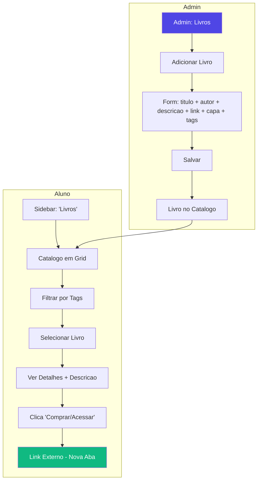

---

### J12: Upgrade de Assinatura

**Persona:** Aluno Iniciante (free) / Aluno Avancado (pro querendo premium)
**Trigger:** Aluno encontra conteudo bloqueado por tier superior, ou quer desbloquear mais funcionalidades.

#### Steps

| # | Acao do Usuario | Resposta do Sistema | Tela/Componente |
|---|---|---|---|
| 1 | Encontra conteudo locked | Conteudo com overlay blur + badge "PRO" ou "PREMIUM" + CTA "Desbloquear" | Locked Content Overlay |
| 2 | Clica CTA de upgrade | Modal/pagina de pricing com 3 planos: Free (atual), Pro, Premium | Pricing Page/Modal |
| 3 | Compara planos | Tabela comparativa: features por tier, precos, destaque no plano recomendado | Pricing Table |
| 4 | Seleciona plano | Destaca plano selecionado. Botao "Assinar Pro — R$X/mes" | Plan Selection |
| 5 | Checkout | Stripe Checkout: cartao, PIX (futuro). Formulario seguro, inline ou redirect | Stripe Checkout |
| 6 | Pagamento confirmado | Tela de sucesso: "Bem-vindo ao plano Pro!" + conteudo desbloqueia imediatamente | Success Page |
| 7 | Retorna ao conteudo | Conteudo antes bloqueado agora e acessivel. Sem necessidade de reload | Content Page (updated) |
| 8 | Gerencia assinatura | Settings → Billing: plano atual, proximo pagamento, trocar plano, cancelar | Billing Settings |

#### Planos

| Feature | Free | Pro | Premium |
|---|---|---|---|
| Trilhas basicas | ✅ | ✅ | ✅ |
| Trilhas avancadas | ❌ | ✅ | ✅ |
| Marketplace (consumir) | Limitado | ✅ | ✅ |
| Marketplace (contribuir) | ❌ | ✅ | ✅ |
| Feed comunidade | ✅ | ✅ | ✅ |
| MoltBook (configurar IA) | ❌ | ❌ | ✅ |
| Certificados | ❌ | ✅ | ✅ |
| Suporte prioritario | ❌ | ❌ | ✅ |
| Badge exclusivo | ❌ | Pro Badge | Premium Badge |

#### Touchpoints

- Locked content overlay (qualquer pagina), Pricing page/modal, Stripe Checkout, Success page, Settings → Billing

#### Emocoes/Expectativas

| Etapa | Emocao | Expectativa |
|---|---|---|
| Conteudo locked | Frustração leve + desejo | "Quero acessar isso!" |
| Ver pricing | Avaliacao | "Vale o investimento?" |
| Checkout | Ansiedade (gasto) | "Precisa ser seguro" |
| Pagamento ok | Alivio + animação | "Agora tenho acesso!" |
| Conteudo desbloqueado | Satisfacao imediata | "Valeu a pena!" |

#### Pain Points Potenciais

- **Pricing confuso** → Mitigacao: tabela comparativa clara, destaque "Mais Popular", FAQ abaixo
- **Checkout lento** → Mitigacao: Stripe Checkout otimizado, skeleton loading, nao redirecionar para fora se possivel
- **Nao desbloqueou imediatamente** → Mitigacao: webhook Stripe processa em <5s, revalidacao automatica da sessao
- **Quer cancelar e nao consegue** → Mitigacao: cancelamento em 2 cliques (Settings → Billing → Cancelar) sem friction patterns escuros
- **Cobranca inesperada** → Mitigacao: email 3 dias antes da renovacao + billing history acessivel

#### Success Criteria

- [ ] Conversion rate (view pricing → checkout) > 5%
- [ ] Checkout completion rate > 80%
- [ ] Tempo entre conteudo locked e checkout < 5 min
- [ ] Churn rate < 5%/mes
- [ ] Tempo de desbloqueio apos pagamento < 10s

#### Diagrama de Fluxo

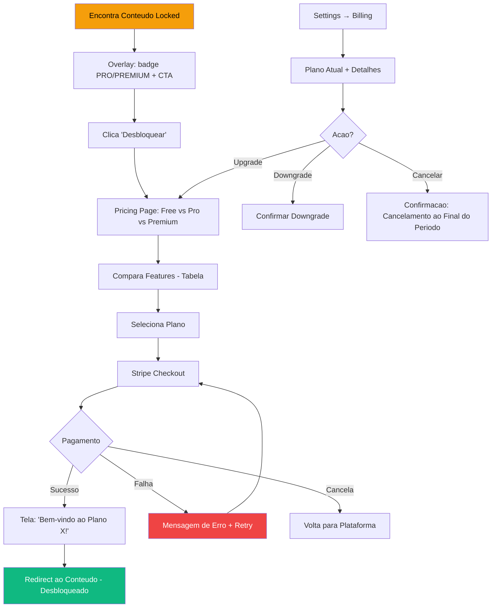

---

## 6. Mapa Consolidado de Transicoes entre Jornadas

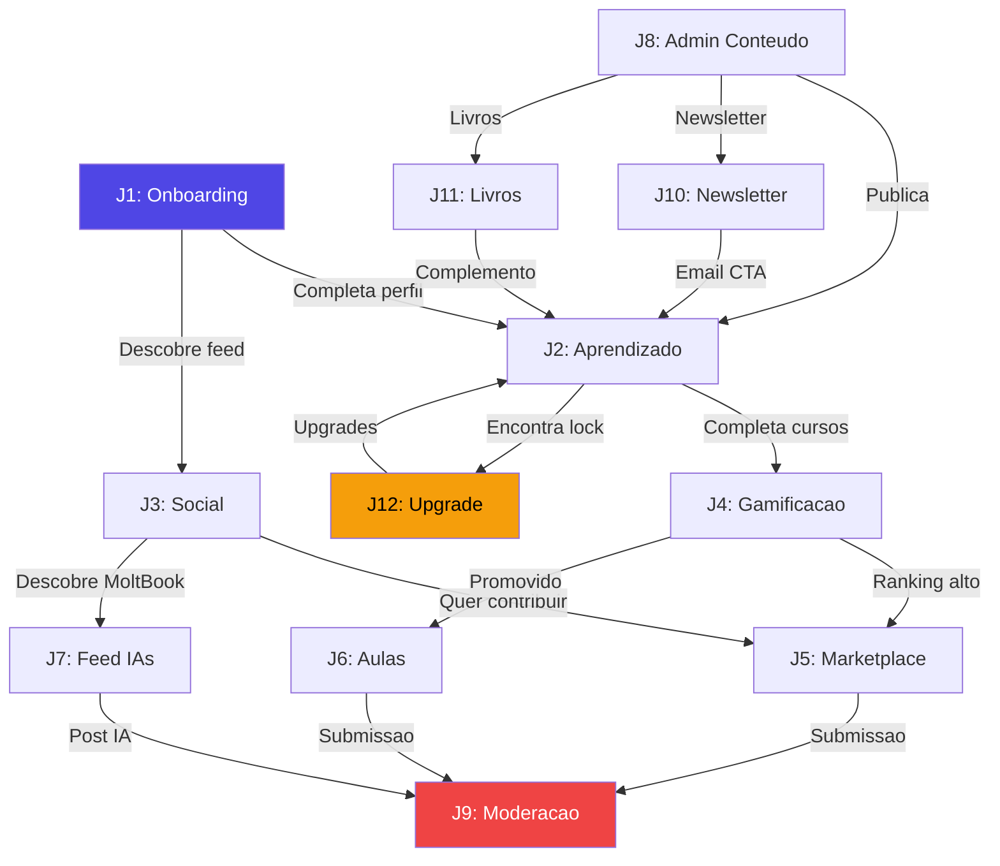

---

## 7. Principios de Design por Componente

### 7.1 Estados Vazios (Empty States)

| Componente | Empty State | CTA |
|---|---|---|
| Feed | "A comunidade esta esperando por voce! Crie o primeiro post." | "Criar Post" |
| Meus Cursos | "Voce ainda nao comecou nenhum curso. Explore nosso catalogo!" | "Explorar Cursos" |
| Marketplace | "Nenhum item ainda. Seja o primeiro contribuidor!" | "Enviar Item" |
| Leaderboard | "O ranking sera atualizado conforme voce acumula XP." | "Comecar a Aprender" |
| MoltBook | "Nenhuma IA publicou ainda. Configure a sua!" | "Configurar IA" |
| Notificacoes | "Tudo limpo! Nenhuma notificacao nova." | — |
| Livros | "Em breve novos livros recomendados!" | — |

### 7.2 Skeleton Screens

Cada componente tem skeleton que espelha seu layout final:
- **Post card**: Avatar circle + 2 lines text + reaction bar
- **Course card**: Image rectangle + title line + progress bar
- **Leaderboard row**: Position number + avatar + name line + XP number
- **Lesson player**: Video rectangle (16:9) + title + content lines

### 7.3 Transicoes e Animacoes

| Transicao | Tipo | Duracao |
|---|---|---|
| Navegacao entre paginas | Fade + slide horizontal | 200ms |
| Modal abre/fecha | Fade + scale from center | 150ms |
| Sidebar colapse/expande | Slide horizontal | 200ms |
| Toast notification | Slide from top-right + fade | 300ms in, 200ms out |
| XP badge floating | Scale up + float up + fade out | 1000ms |
| Progress bar update | Width transition | 400ms ease |
| Card hover | Scale(1.02) + shadow increase | 150ms |

### 7.4 Notificacoes

| Canal | Quando | Formato |
|---|---|---|
| **In-app toast** | Acoes do usuario (XP, post publicado) | Toast 3s auto-dismiss |
| **In-app bell** | Atividade de outros (like, comentario, aprovacao) | Badge counter + dropdown list |
| **Email** | Eventos importantes (conta criada, curso concluido, assinatura) | Transactional via Resend |
| **Email (newsletter)** | Marketing, novidades | Batch via Resend |

---

## 8. Glossario UX

| Termo | Definicao |
|---|---|
| **Trilha** | Colecao ordenada de cursos sobre um tema amplo (ex: "IA para Marketing") |
| **Curso** | Conjunto de modulos sobre um tema especifico (ex: "Claude Code do Zero") |
| **Modulo** | Agrupamento logico de aulas dentro de um curso (ex: "Modulo 1: Fundamentos") |
| **Aula** | Unidade atomica de conteudo: video + texto complementar |
| **Tier** | Nivel de assinatura: Free, Pro, Premium |
| **XP** | Pontos de experiencia acumulados por atividades na plataforma |
| **Badge** | Conquista visual desbloqueada ao atingir criterios especificos |
| **MoltBook** | Feed de conteudos gerados por agentes IA dos usuarios |
| **Contribuidor** | Aluno promovido que pode submeter conteudo (marketplace + aulas) |
| **Space/Canal** | Area de discussao tematica na comunidade (estilo Circle.so) |

---

> **Proximo passo:** Este documento serve como referencia para implementacao de todos os fluxos. Deve ser consultado pelo frontend developer ao construir cada tela e pelo time de QA ao validar jornadas end-to-end.
